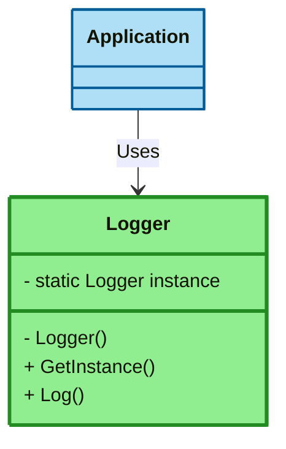
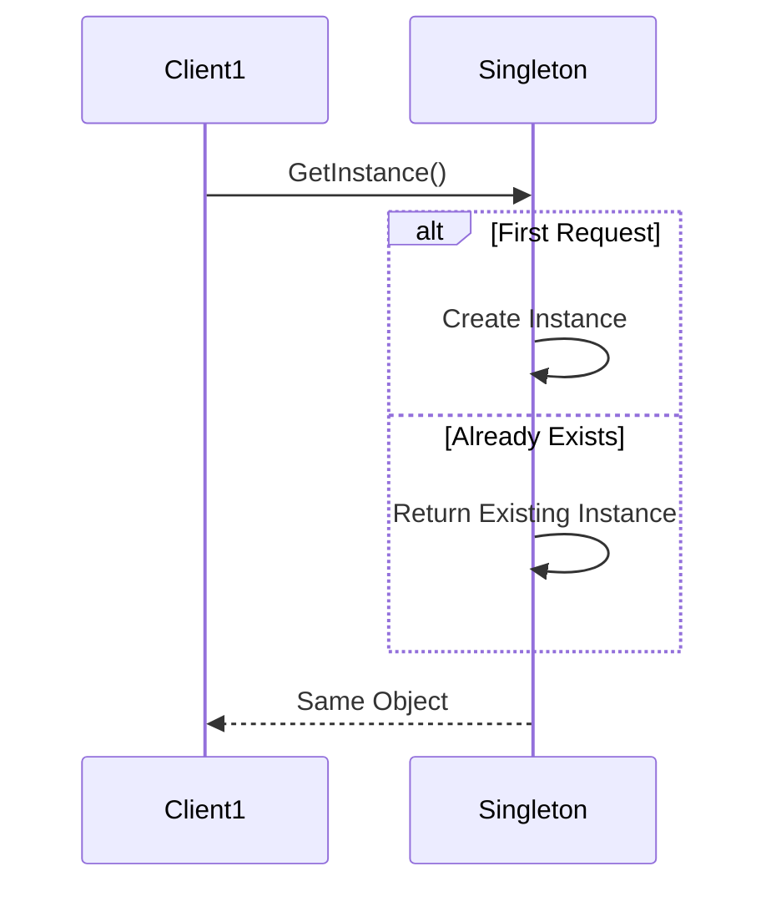
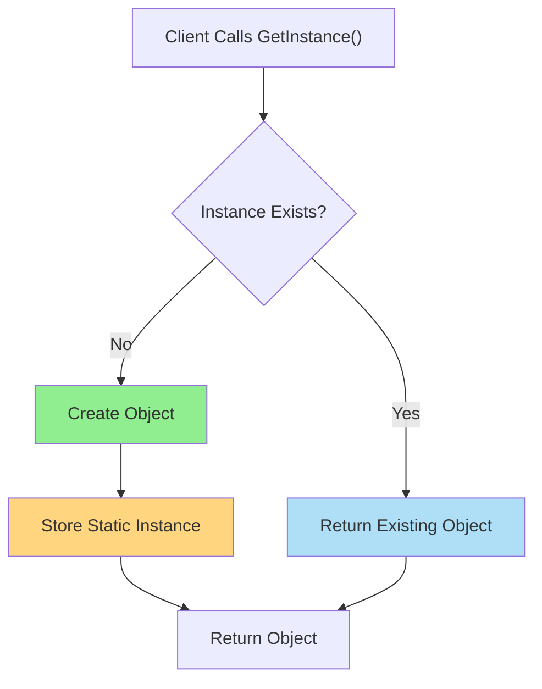

# 🔒 Singleton Design Pattern

---

# 🎯 Definition

The **Singleton Design Pattern** is a **Creational Design Pattern** that ensures:

1. Only **one instance** of a class exists throughout the application.
2. A **global access point** is provided to that instance.

### Intent

> Ensure a class has only one instance and provide a global point of access to it.

---

# 🤔 Problem Statement

Imagine a logging system:

```csharp
var logger1 = new Logger();
var logger2 = new Logger();
var logger3 = new Logger();
```

### Problems

❌ Multiple logger instances

❌ Inconsistent application state

❌ Extra memory usage

❌ Resource duplication

❌ Multiple file/database connections

---

# 🌍 Real World Example

## Prime Minister Analogy

A country should have:

```text
✅ One Prime Minister
```

Not:

```text
❌ Prime Minister 1
❌ Prime Minister 2
❌ Prime Minister 3
```

Similarly:

```text
Application
      |
      ▼
 Single Logger
```

Only one logger should exist.

---

# 🧩 Mermaid Architecture Diagram



---

# 🔄 Runtime Flow Diagram



---

# 🏗️ Core Components

| Component           | Purpose                   |
| ------------------- | ------------------------- |
| Private Constructor | Prevent external creation |
| Static Instance     | Stores single object      |
| Public Method       | Returns singleton object  |

---

# 💻 C# Example (Basic Singleton)

```csharp
public sealed class Logger
{
    private static Logger instance;

    private Logger()
    {
    }

    public static Logger GetInstance()
    {
        if(instance == null)
        {
            instance = new Logger();
        }

        return instance;
    }

    public void Log(string message)
    {
        Console.WriteLine(message);
    }
}
```

## Usage

```csharp
Logger logger1 = Logger.GetInstance();
Logger logger2 = Logger.GetInstance();

Console.WriteLine(
    ReferenceEquals(logger1, logger2));
```

### Output

```text
True
```

---

# 💻 C# Best Practice (Recommended)

### Lazy<T> Singleton

```csharp
public sealed class Logger
{
    private static readonly Lazy<Logger> instance =
        new Lazy<Logger>(() => new Logger());

    private Logger()
    {
    }

    public static Logger Instance =>
        instance.Value;
}
```

### Why Interviewers Like This

✅ Thread Safe

✅ Lazy Loaded

✅ Production Ready

✅ Cleanest Approach

---

# 💻 C++ Example (Modern C++11)

```cpp
class Logger
{
private:

    Logger() {}

public:

    static Logger& getInstance()
    {
        static Logger instance;
        return instance;
    }

    void log(const std::string& message)
    {
        std::cout << message << std::endl;
    }

    Logger(const Logger&) = delete;
    Logger& operator=(const Logger&) = delete;
};
```

---

## Usage

```cpp
Logger& logger =
    Logger::getInstance();

logger.log("Application Started");
```

---

# 🧠 How Singleton Works



---

# 🌍 Real World Use Cases

## Logging Service

```text
Entire App
    |
    ▼
 Single Logger
```

---

## Configuration Manager

```text
Read Config Once
Use Everywhere
```

---

## Cache Manager

```text
One Cache
Shared Across App
```

---

## Database Connection Pool

```text
One Pool Manager
Many Consumers
```

---

# ✅ Advantages

### Memory Efficient

Only one object.

---

### Global Access

Available anywhere.

---

### Shared State

All consumers use same instance.

---

### Lazy Loading

Can create object only when needed.

---

### Controlled Access

Object creation is centralized.

---

# ❌ Disadvantages

### Global State

Acts like global variable.

---

### Hidden Dependencies

Harder to identify dependencies.

---

### Difficult Unit Testing

Mocking becomes harder.

---

### Tight Coupling

Classes may directly depend on singleton.

---

# 🏆 SOLID Principle Mapping

## ✅ Supports

### DRY

Avoid duplicate object creation.

---

## ❌ Can Violate

### SRP

Handles:

```text
Object Creation
+
Business Logic
```

---

### DIP

Bad Example:

```csharp
Logger.Instance.Log();
```

Good Example:

```csharp
ILogger logger;
```

using Dependency Injection.

---

# 📊 Comparison Table

## Singleton vs Static Class

| Feature              | Singleton | Static Class |
| -------------------- | --------- | ------------ |
| Object Exists        | ✅         | ❌            |
| Supports Interfaces  | ✅         | ❌            |
| Dependency Injection | ✅         | ❌            |
| Mocking Possible     | ✅         | ❌            |
| Polymorphism         | ✅         | ❌            |

---

## Singleton vs Factory

| Singleton          | Factory              |
| ------------------ | -------------------- |
| Creates ONE object | Creates MANY objects |
| Global access      | Object creation      |
| State shared       | State independent    |

---

# ⚠️ Common Mistakes

## Mistake #1

```csharp
public class Logger
{
}
```

Constructor is public.

❌ Not Singleton

---

## Mistake #2

Ignoring thread safety.

```csharp
if(instance == null)
{
    instance = new Logger();
}
```

Multiple threads may create multiple objects.

---

## Mistake #3

Not deleting copy constructor in C++.

```cpp
Logger logger2 = logger1;
```

Creates another instance.

---

# 🧠 Memory Tricks

## Trick #1

```text
Singleton = One House Key
```

Many people can use it.

Only one key exists.

---

## Trick #2

```text
Factory = Creates Objects

Singleton = Restricts Objects
```

---

## Trick #3

```text
One Country
One Prime Minister

One App
One Logger
```

---

# 🎯 Pattern Recognition Clues

When you hear:

### Keywords

```text
Only One Instance

Global Access

Shared State

Single Configuration

Single Cache

Single Logger
```

Think:

```text
Singleton Pattern
```

---

# 🔥 Interview Questions & Answers

## Q1. What is Singleton Pattern?

### Answer

A Creational Design Pattern that guarantees only one instance of a class and provides a global access point to it.

---

## Q2. Why Constructor is Private?

### Answer

To prevent external object creation.

---

## Q3. How Do You Make Singleton Thread Safe?

### C#

```csharp
Lazy<T>
```

or

```csharp
lock
```

---

### C++

```cpp
static local variable
```

inside `getInstance()`.

---

## Q4. Best Singleton Implementation in C#?

### Answer

```csharp
Lazy<T>
```

because it is thread-safe and lazy-loaded.

---

## Q5. Best Singleton Implementation in C++?

### Answer

Meyers Singleton

```cpp
static Singleton instance;
```

---

## Q6. Why Do Some Developers Consider Singleton an Anti-Pattern?

### Answer

Because it introduces:

* Global state
* Hidden dependencies
* Tight coupling
* Difficult testing

---

## Q7. Singleton vs Static Class?

### Answer

Singleton creates one object.

Static class creates no object.

Singleton supports:

* Interfaces
* Polymorphism
* Dependency Injection

---

# 🎤 FAANG Follow-Up Questions

### What breaks Singleton?

Answer:

```text
Threading
Serialization
Reflection
Cloning
```

---

### How do you prevent cloning?

Override clone behavior.

---

### How do you prevent serialization issues?

Implement custom deserialization logic.

---

### How does Spring/.NET DI implement Singleton?

Container creates one instance and shares it.

---

### Can Singleton be garbage collected?

Normally No.

Static reference keeps object alive.

---

# ⚡ 30-Second Revision Sheet

```text
Pattern Type:
Creational

Intent:
One Instance Only

Key Components:
1. Private Constructor
2. Static Instance
3. Public Access Method

Best C#:
Lazy<T>

Best C++:
Meyers Singleton

Common Uses:
Logger
Cache
Configuration
Connection Pool

Pros:
Memory Efficient
Global Access

Cons:
Global State
Testing Difficulty

Interview Keywords:
One Instance
Shared State
Global Access
```

---

# 🚀 10-Second Interview Cheat Sheet

If interviewer asks:

"What is Singleton?"

Say:

> Singleton is a Creational Design Pattern that ensures exactly one instance of a class exists throughout the application and provides a global access point to that instance. Common examples include Logger, Configuration Manager, Cache Manager, and Connection Pool Manager.

---

# 🎯 Last-Minute Interview Revision

Remember only these 5 points:

```text
1. One Instance Only

2. Private Constructor

3. Static Instance

4. Public Access Method

5. Best Practice:
   C#  -> Lazy<T>
   C++ -> Meyers Singleton
```

If you remember these five points, you can answer 90% of Singleton interview questions.
