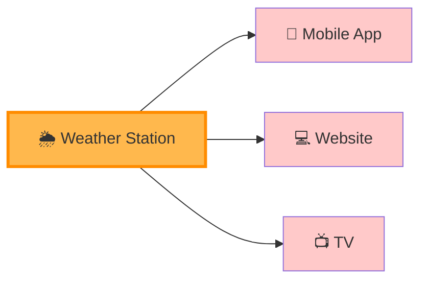
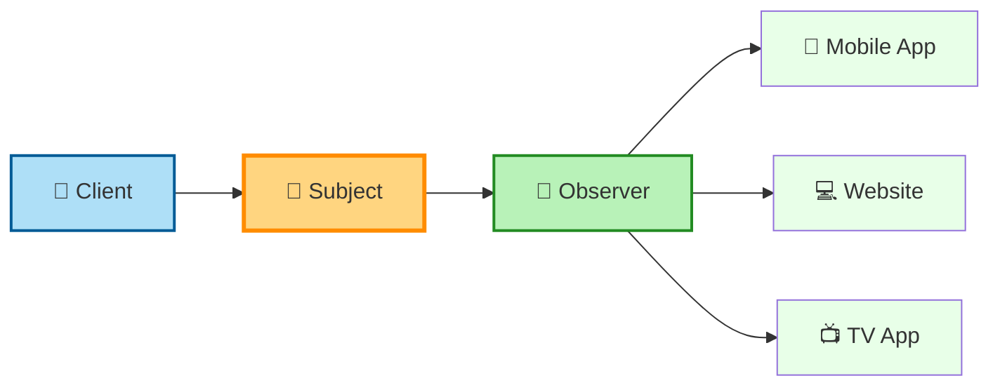
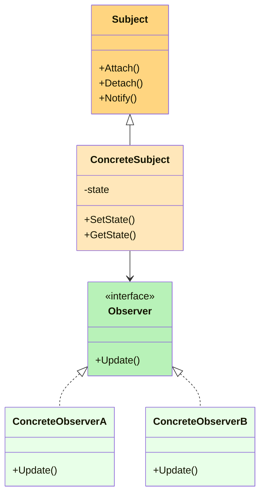
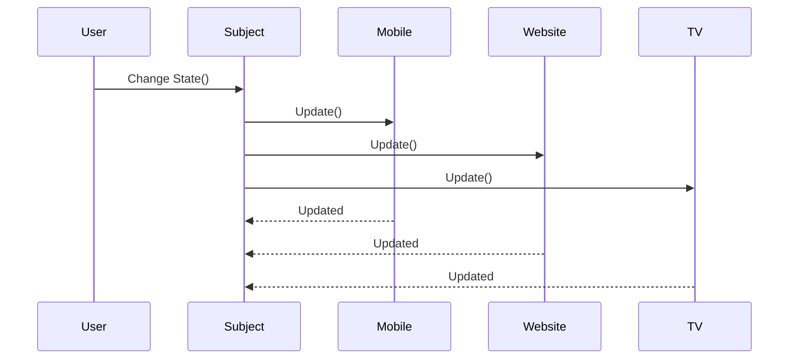
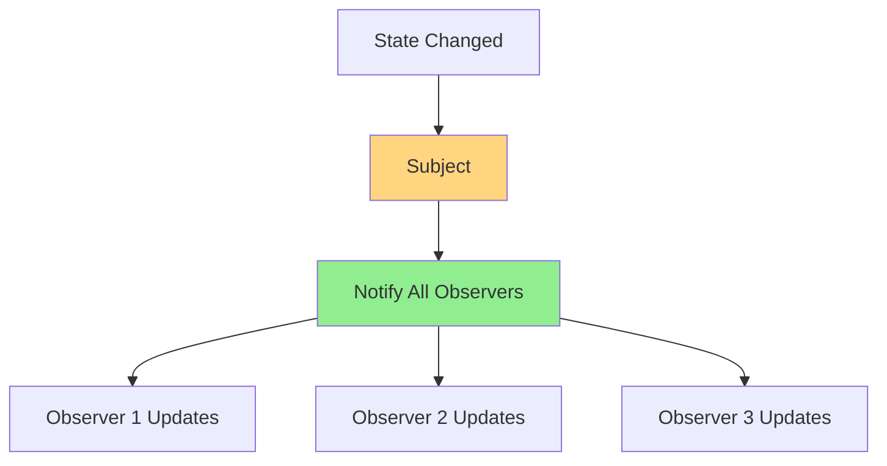
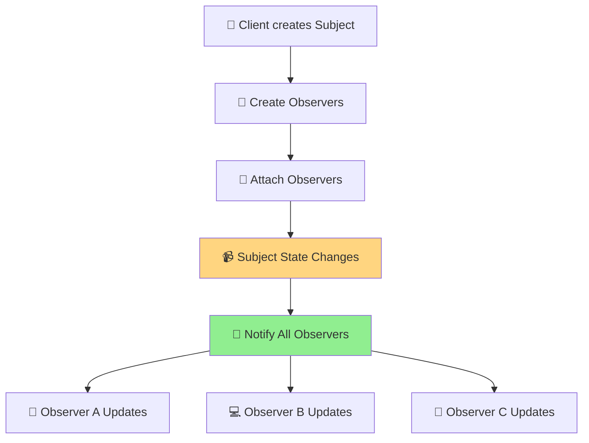
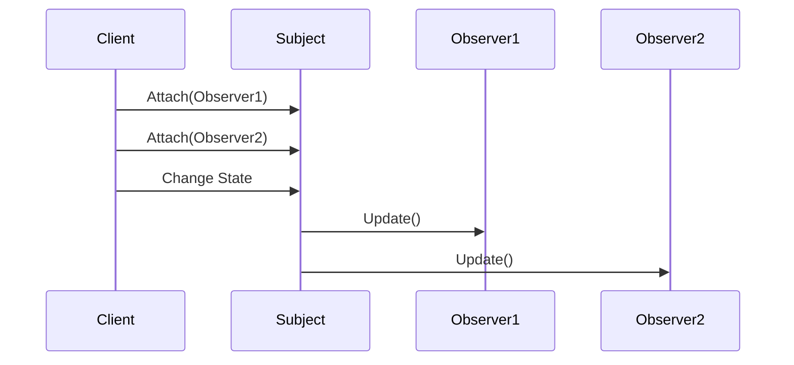

# 👀 Observer Design Pattern

> **Category:** Behavioral Design Pattern
> **Difficulty:** ⭐⭐⭐☆☆
> **Interview Frequency:** ⭐⭐⭐⭐⭐
> **Languages Covered:** C#, Modern C++ (C++17)

---

# 📖 Table of Contents

* 🎯 Definition
* 🤔 Problem Statement
* 🌍 Real-World Examples
* 🧠 Intuition Before Code
* 🧩 Architecture Diagram
* 🔄 Runtime Flow
* 🏗 Components
* 🔑 Key Characteristics
* 🎯 When to Use
* 🚫 When Not to Use
* 🧠 Pattern Recognition Clues

---

# 🎯 Definition

The **Observer Design Pattern** is a **Behavioral Design Pattern** that defines a **one-to-many dependency** between objects.

Whenever the **Subject** changes its state, **all registered Observers are automatically notified and updated**.

Instead of tightly coupling objects together, the Subject only knows that it has a list of Observers.

> 💡 **Intent**
>
> Define a one-to-many dependency between objects so that when one object changes state, all of its dependents are notified and updated automatically.

---

# 🤔 Problem Statement

Suppose you're building a **Weather Monitoring System**.

You have:

* 📱 Mobile App
* 💻 Website
* 📺 Smart TV App

All display the latest temperature.

Whenever the weather changes:

```text
Temperature: 30°C → 32°C
```

Every display must update automatically.

### ❌ Without Observer Pattern



The Weather Station directly knows about:

* Mobile App
* Website
* TV App
* Future Smart Watch
* Future Tablet
* Future Email Service

Every time a new display is added, the Weather Station code must change.

### Problems

* ❌ Tight Coupling
* ❌ Violates Open/Closed Principle
* ❌ Difficult to Maintain
* ❌ Difficult to Extend
* ❌ Lots of duplicated notification code

---

# 🌍 Real-World Examples

## 📺 YouTube Subscribers

```text
YouTube Channel uploads a new video

↓

Every Subscriber gets notified
```

The channel doesn't call each subscriber individually.

Subscribers register themselves.

---

## 🌦 Weather Station

```text
Weather Changes

↓

Mobile Updates

↓

TV Updates

↓

Website Updates
```

---

## 📈 Stock Market

```text
Stock Price Changes

↓

Trading Dashboard

↓

Mobile App

↓

Email Alerts
```

---

## 🛒 E-Commerce

```text
Product Back In Stock

↓

Notify Email Subscribers

↓

Notify Mobile Users

↓

Notify Wishlist Users
```

---

## 🏠 Smart Home

```text
Door Opens

↓

Security Camera Starts

↓

Lights Turn On

↓

Phone Notification
```

---

# 🧠 Intuition Before Code

Imagine you subscribe to a YouTube channel.

```text
Channel
    |
    |  Uploads Video
    ▼
Subscribers Get Notification
```

The channel doesn't know who you are personally.

It simply maintains a **list of subscribers**.

Whenever a new video is uploaded:

```text
Upload Video

↓

Notify All Subscribers
```

This is exactly how the Observer Pattern works.

---

# 🧩 Architecture Diagram



---

# 🏛 Class Diagram



---

# 🔄 Runtime Flow



---

# ⚙️ Execution Flow



---

# 🏗 Components

| Component            | Responsibility                  |
| -------------------- | ------------------------------- |
| 📢 Subject           | Maintains the list of observers |
| 📌 Concrete Subject  | Stores the actual state         |
| 👀 Observer          | Defines the update interface    |
| 📱 Concrete Observer | Implements update logic         |

---

# 🔑 Key Characteristics

✅ One Subject

✅ Multiple Observers

✅ Loose Coupling

✅ Automatic Notification

✅ Event Driven

✅ Runtime Registration

---

# 🎯 When to Use

Use Observer Pattern when:

* One object changes state frequently.
* Multiple objects must stay synchronized.
* Objects should remain loosely coupled.
* New listeners may be added without modifying existing code.
* Building event-driven systems.

Examples:

* Notifications
* Chat Applications
* Stock Market
* Weather Systems
* GUI Event Handling
* Game Events

---

# 🚫 When NOT to Use

Avoid Observer Pattern when:

* There is only one dependent object.
* Notifications are extremely expensive.
* Order of execution is critical.
* Updates are very infrequent.
* Simpler direct method calls are sufficient.

---

# 🎯 Pattern Recognition Clues

If the interviewer says:

> "Whenever one object changes, many other objects should automatically update..."

Think immediately:

# 👀 Observer Pattern

Common keywords:

```text
Notify

Subscribe

Listener

Event

Broadcast

Publish

Update

Dependency
```

---

# 📝 Part 1 Summary

You should now understand:

* ✅ What Observer Pattern is
* ✅ Why it exists
* ✅ Real-world intuition
* ✅ Architecture
* ✅ Components
* ✅ Runtime flow
* ✅ When to use it
* ✅ How to recognize it in interviews

---

➡️ **Part 2** will cover:

* 💻 Complete C# Implementation
* 💻 Complete Modern C++ Implementation
* ⚙️ Step-by-step execution with code
* 🔍 Code walkthrough
* 🎨 Execution diagrams

---

# 💻 C# Implementation

## Step 1: Observer Interface

```csharp
public interface IObserver
{
    void Update(string message);
}
```

---

## Step 2: Subject Interface

```csharp
public interface ISubject
{
    void Attach(IObserver observer);
    void Detach(IObserver observer);
    void Notify();
}
```

---

## Step 3: Concrete Subject

```csharp
public class YouTubeChannel : ISubject
{
    private readonly List<IObserver> observers = new();
    private string latestVideo;

    public void Attach(IObserver observer)
    {
        observers.Add(observer);
    }

    public void Detach(IObserver observer)
    {
        observers.Remove(observer);
    }

    public void UploadVideo(string videoTitle)
    {
        latestVideo = videoTitle;
        Console.WriteLine($"\n📹 Uploaded: {videoTitle}\n");

        Notify();
    }

    public void Notify()
    {
        foreach (var observer in observers)
        {
            observer.Update(latestVideo);
        }
    }
}
```

---

## Step 4: Concrete Observer

```csharp
public class Subscriber : IObserver
{
    private readonly string name;

    public Subscriber(string name)
    {
        this.name = name;
    }

    public void Update(string message)
    {
        Console.WriteLine($"{name} received notification: {message}");
    }
}
```

---

## Step 5: Client

```csharp
class Program
{
    static void Main()
    {
        YouTubeChannel channel = new();

        Subscriber sunil = new("Sunil");
        Subscriber rahul = new("Rahul");
        Subscriber ankit = new("Ankit");

        channel.Attach(sunil);
        channel.Attach(rahul);
        channel.Attach(ankit);

        channel.UploadVideo("Observer Design Pattern Explained");
    }
}
```

---

### ✅ Output

```text
📹 Uploaded: Observer Design Pattern Explained

Sunil received notification: Observer Design Pattern Explained
Rahul received notification: Observer Design Pattern Explained
Ankit received notification: Observer Design Pattern Explained
```

---

# 💻 Modern C++17 Implementation

## Observer Interface

```cpp
class Observer
{
public:
    virtual void update(const std::string& message) = 0;
    virtual ~Observer() = default;
};
```

---

## Subject Interface

```cpp
class Subject
{
public:
    virtual void attach(Observer* observer) = 0;
    virtual void detach(Observer* observer) = 0;
    virtual void notify() = 0;
    virtual ~Subject() = default;
};
```

---

## Concrete Subject

```cpp
#include <iostream>
#include <vector>
#include <algorithm>

class YouTubeChannel : public Subject
{
private:
    std::vector<Observer*> observers;
    std::string latestVideo;

public:

    void attach(Observer* observer) override
    {
        observers.push_back(observer);
    }

    void detach(Observer* observer) override
    {
        observers.erase(
            std::remove(observers.begin(), observers.end(), observer),
            observers.end());
    }

    void uploadVideo(const std::string& title)
    {
        latestVideo = title;

        std::cout << "\n📹 Uploaded: "
                  << title << "\n\n";

        notify();
    }

    void notify() override
    {
        for(auto observer : observers)
        {
            observer->update(latestVideo);
        }
    }
};
```

---

## Concrete Observer

```cpp
class Subscriber : public Observer
{
private:
    std::string name;

public:

    Subscriber(const std::string& name)
        : name(name)
    {
    }

    void update(const std::string& message) override
    {
        std::cout
            << name
            << " received notification: "
            << message
            << std::endl;
    }
};
```

---

## Client

```cpp
int main()
{
    YouTubeChannel channel;

    Subscriber sunil("Sunil");
    Subscriber rahul("Rahul");
    Subscriber ankit("Ankit");

    channel.attach(&sunil);
    channel.attach(&rahul);
    channel.attach(&ankit);

    channel.uploadVideo(
        "Observer Design Pattern Explained");

    return 0;
}
```

---

### ✅ Output

```text
📹 Uploaded: Observer Design Pattern Explained

Sunil received notification: Observer Design Pattern Explained
Rahul received notification: Observer Design Pattern Explained
Ankit received notification: Observer Design Pattern Explained
```

---

# ⚙️ Step-by-Step Execution



---

# 🧠 Execution Flow

1. Client creates the **Subject**.
2. Client creates multiple **Observers**.
3. Observers subscribe using **Attach()**.
4. Subject's state changes.
5. Subject calls **Notify()**.
6. Every registered Observer receives **Update()**.
7. All observers stay synchronized automatically.

---

# 🎯 Code Flow Visualization



---

# 💡 Interview Tips

> **Remember this relationship:**

```text
One Subject
        ↓
Many Observers
        ↓
State Changes
        ↓
Notify Everyone
```

---

> **Common Framework Examples**

### .NET

* Events & Delegates
* `INotifyPropertyChanged`
* UI Event Handling (WinForms/WPF)

### Java

* Event Listeners
* Swing Listeners

### JavaScript

* EventEmitter
* DOM Events

### React

* State updates
* Context subscriptions (conceptually similar)

---

# 📝 Part 2 Summary

By now you should know:

* ✅ Complete C# implementation
* ✅ Complete Modern C++ implementation
* ✅ How observers register/unregister
* ✅ How notifications are sent
* ✅ Runtime execution flow
* ✅ Common framework examples

➡️ **Part 3** will cover interview questions, SOLID mapping, advantages/disadvantages, comparison with Pub/Sub & Mediator, memory tricks, common mistakes, and a final revision sheet.

---

# 🏆 SOLID Principle Mapping

| SOLID Principle | How Observer Supports It                                                       |
| --------------- | ------------------------------------------------------------------------------ |
| **SRP**         | ✅ Subject manages state, Observer manages update behavior.                     |
| **OCP**         | ✅ New observers can be added without modifying the Subject.                    |
| **LSP**         | ✅ Any concrete observer can replace another through the `IObserver` interface. |
| **ISP**         | ✅ Observer interface contains only the required `Update()` method.             |
| **DIP**         | ✅ Subject depends on the `IObserver` abstraction, not concrete observers.      |

---

# ✅ Advantages

* Loose coupling between Subject and Observers.
* Easy to add or remove observers.
* Supports the Open/Closed Principle.
* Excellent for event-driven applications.
* Easy to extend without changing existing code.
* Promotes code reusability.

---

# ❌ Disadvantages

* Notification order is usually not guaranteed.
* Too many observers may affect performance.
* Debugging notification chains can become difficult.
* Circular updates can lead to infinite loops if not handled properly.

---

# ⚠️ Common Mistakes

### ❌ Forgetting to Unsubscribe

If an observer is no longer needed but remains attached, it may still receive updates and even cause memory leaks.

---

### ❌ Tight Coupling

```csharp
MobileApp mobile = new MobileApp();
mobile.Update();
```

Instead, always communicate through the `IObserver` interface.

---

### ❌ Expensive Updates

Avoid placing heavy computations inside `Update()`. A single notification may trigger dozens or hundreds of observers.

---

### ❌ Infinite Notification Loops

```text
Subject A updates Subject B

↓

Subject B updates Subject A

↓

Infinite Loop
```

Be careful when observers also act as subjects.

---

# 📊 Observer vs Other Design Patterns

## Observer vs Strategy

| Observer                   | Strategy                              |
| -------------------------- | ------------------------------------- |
| One → Many communication   | One algorithm selected at runtime     |
| Event driven               | Behavior selection                    |
| Automatic notification     | Manual strategy selection             |
| Focuses on synchronization | Focuses on interchangeable algorithms |

---

## Observer vs Mediator

| Observer                    | Mediator                        |
| --------------------------- | ------------------------------- |
| Subject broadcasts updates  | Mediator controls communication |
| Decentralized communication | Centralized communication       |
| One → Many                  | Many ↔ Many                     |

---

## Observer vs Publish/Subscribe

| Observer                | Publish/Subscribe                  |
| ----------------------- | ---------------------------------- |
| Subject knows observers | Publisher doesn't know subscribers |
| Direct references       | Message Broker / Event Bus         |
| Usually in-process      | Often distributed systems          |

---

# 🧠 Memory Tricks

## 🎥 YouTube

```text
YouTube Channel

↓

Uploads Video

↓

Subscribers Receive Notification
```

Think:

**Channel = Subject**

**Subscribers = Observers**

---

## 🌦 Weather App

```text
Weather Changes

↓

Mobile

↓

Website

↓

TV
```

Whenever **one source updates many listeners**, think **Observer Pattern**.

---

## 🔑 One-Line Memory Trick

```text
Observer = One object changes

↓

Many objects automatically update
```

---

# 🎯 Pattern Recognition Clues

If the interviewer says:

* Notify everyone
* Subscribers
* Listeners
* Events
* State changes
* Auto update
* One-to-many dependency
* Broadcast changes

👉 **Think Observer Pattern immediately.**

---

# 🌍 Real-World Use Cases

* YouTube Notifications
* Weather Monitoring System
* Stock Market Dashboards
* Chat Applications
* News Subscription Systems
* GUI Event Handling
* File System Watchers
* IoT Devices
* Smart Home Automation
* Email Notification Services

---

# 🔥 Interview Questions

## Q1. What is the Observer Pattern?

**Answer:**

Observer is a **Behavioral Design Pattern** where one object (Subject) automatically notifies multiple dependent objects (Observers) whenever its state changes.

---

## Q2. Why do we use Observer Pattern?

**Answer:**

To achieve **loose coupling** between objects while allowing automatic notifications when the Subject changes.

---

## Q3. Which SOLID principle does Observer mainly support?

**Answer:**

* Open/Closed Principle
* Dependency Inversion Principle

---

## Q4. Give real-world examples.

* YouTube Subscribers
* Weather Station
* Stock Price Alerts
* Email Notifications
* GUI Events

---

## Q5. How is Observer different from Strategy?

**Answer:**

Observer is about **communication** between objects.

Strategy is about **changing algorithms**.

---

## Q6. Can an Observer also be a Subject?

**Answer:**

Yes.

This creates **Observer Chains**, but care must be taken to avoid circular updates.

---

## Q7. What are the drawbacks of Observer?

* Performance issues with many observers.
* Notification ordering.
* Difficult debugging.
* Possible memory leaks if observers aren't detached.

---

## Q8. Where is Observer used in .NET?

* Events & Delegates
* `INotifyPropertyChanged`
* WinForms Events
* WPF Data Binding

---

# 🎤 FAANG Follow-Up Questions

### What if there are one million observers?

Possible optimizations:

* Async notifications
* Event queues
* Batch processing
* Parallel execution
* Filtering observers

---

### Is Observer thread-safe?

Not automatically.

Protect shared observer collections using synchronization (locks, concurrent collections, etc.) when multiple threads may attach, detach, or notify simultaneously.

---

### How would you prevent memory leaks?

* Unsubscribe observers.
* Use weak references if appropriate.
* Dispose observers correctly.

---

### Can notifications be asynchronous?

Yes.

Many frameworks notify observers asynchronously using tasks, message queues, or event buses.

---

# ⚡ 30-Second Revision Sheet

| Item            | Remember                       |
| --------------- | ------------------------------ |
| Pattern Type    | Behavioral                     |
| Intent          | One → Many Notification        |
| Main Components | Subject, Observer              |
| Relationship    | Loose Coupling                 |
| Best Use        | Event-driven systems           |
| SOLID           | OCP + DIP                      |
| Common Examples | YouTube, Weather, Stock Market |

---

# 🚀 10-Second Interview Answer

> **Observer Pattern** is a Behavioral Design Pattern that establishes a **one-to-many relationship** between a Subject and its Observers. Whenever the Subject changes its state, all registered Observers are automatically notified and updated. It promotes **loose coupling** and is widely used in **event-driven systems**.

---

# 📌 Last-Minute Interview Revision

## Remember These Five Points

```text
1. One Subject

↓

2. Many Observers

↓

3. Subject State Changes

↓

4. Notify All Observers

↓

5. Observers Update Automatically
```

---

## Interview Keywords

```text
Behavioral Pattern

One → Many

Loose Coupling

Notify

Subscribe

Listener

Event

Update
```

---

# 📝 Practice Problems

Try implementing Observer Pattern for:

* 📺 YouTube Notification System
* 🌦 Weather Monitoring System
* 📈 Stock Price Alert System
* 💬 Chat Room Notifications
* 🛒 Product Back-in-Stock Notifications
* 📧 Email Subscription Service

---

# 🎯 Final Takeaway

> **Observer Pattern = "One object changes, many dependent objects automatically update."**

If you hear words like **subscribe**, **listener**, **event**, **broadcast**, or **notification**, the Observer Pattern is likely the right solution.

---

# 📚 Quick Pattern Comparison

| Pattern       | Purpose                                    |
| ------------- | ------------------------------------------ |
| **Singleton** | Ensure only one instance exists            |
| **Factory**   | Create objects                             |
| **Builder**   | Construct complex objects step by step     |
| **Strategy**  | Change algorithms at runtime               |
| **Observer**  | Notify multiple objects when state changes |

---

# ✅ Observer Pattern Complete

You now know:

* ✔️ Theory
* ✔️ Architecture
* ✔️ Runtime Flow
* ✔️ C# Implementation
* ✔️ Modern C++ Implementation
* ✔️ SOLID Principles
* ✔️ Advantages & Disadvantages
* ✔️ Interview Questions
* ✔️ FAANG Follow-ups
* ✔️ Revision Notes

🎉 Congratulations! You have completed the **Observer Design Pattern**.

