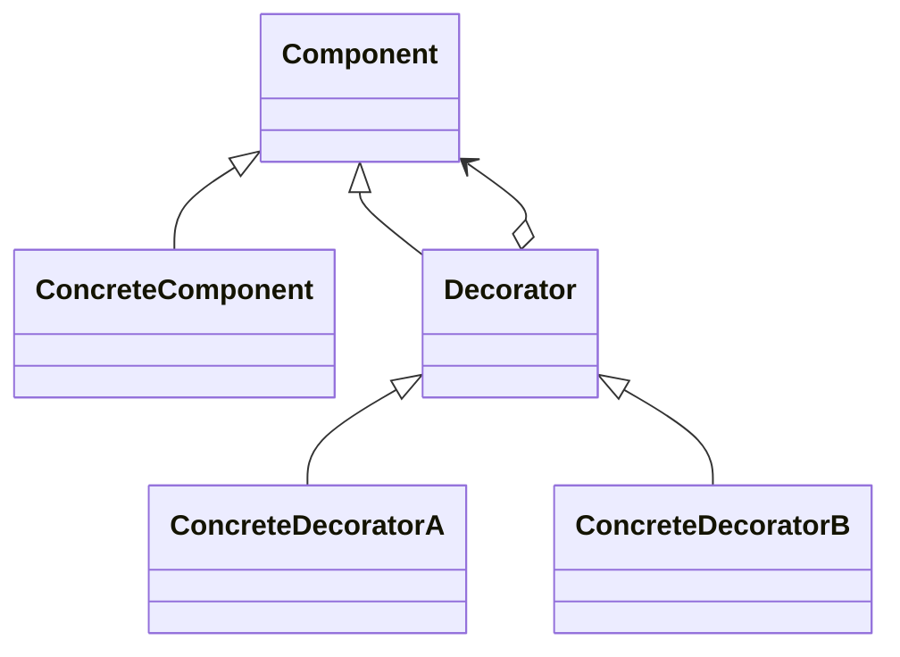
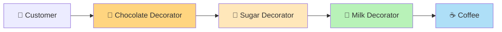
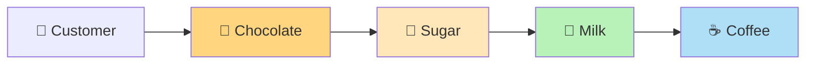
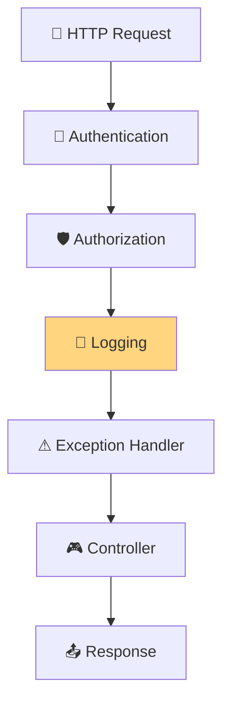
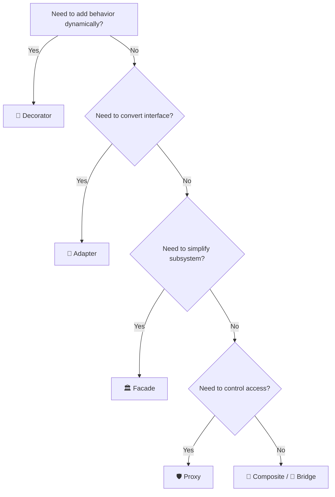

# 🎨 Decorator Design Pattern

> **Category:** Structural Design Pattern  
> **Difficulty:** ⭐⭐⭐⭐☆  
> **Interview Importance:** ⭐⭐⭐⭐⭐

---

# 📚 Design Pattern Navigation

| Previous | Current | Next |
|----------|----------|------|
| ⬅️ Facade Pattern | **Decorator Pattern** | ➡️ Bridge Pattern |

---

# 📖 Table of Contents

- 🎯 What is Decorator Pattern?
- 🤔 Problem Statement
- ❌ Why Inheritance Fails?
- 🌍 Real World Analogy
- 🏗 Structure
- 🧩 UML Class Diagram
- 🔄 Runtime Flow
- 💻 C# Example
- 💻 C++ Example
- 🎯 Pattern Recognition
- 💡 Memory Tricks

---

# 🎯 What is Decorator Pattern?

The **Decorator Design Pattern** allows us to **add new behavior to an object dynamically without modifying its existing code.**

Instead of creating new subclasses,

we wrap an existing object inside another object (Decorator).

Think of it as

> **Wrapping a Gift 🎁**

The gift remains the same,

but you can wrap it with:

- Decorative Paper
- Ribbon
- Greeting Card

Each wrapper adds new functionality,

while the original gift remains unchanged.

---

# 🤔 Problem Statement

Suppose you own a Coffee Shop.

Initially,

you only sell:

```text
Coffee
```

Later customers request:

- Milk
- Sugar
- Chocolate
- Whipped Cream

A common approach is inheritance.

```text
Coffee

↓

MilkCoffee

↓

SugarCoffee

↓

ChocolateCoffee

↓

MilkSugarCoffee

↓

MilkChocolateCoffee

↓

SugarChocolateCoffee

↓

MilkSugarChocolateCoffee

↓

...
```

---

## ❌ Problem

The number of subclasses grows exponentially.

```text
Coffee

MilkCoffee

SugarCoffee

ChocolateCoffee

MilkSugarCoffee

MilkChocolateCoffee

SugarChocolateCoffee

MilkSugarChocolateCoffee

MilkSugarChocolateWhippedCreamCoffee

...
```

Adding one more topping creates many new subclasses.

This is called

> **Class Explosion**

---

# ❌ Why Inheritance Fails?

Inheritance is **static**.

Behavior is decided at compile time.

Suppose tomorrow the customer wants:

```text
Coffee

+

Milk

+

Chocolate

+

Extra Sugar

+

Caramel
```

Do you create another subclass?

Soon you'll have

```
100+
```

coffee classes.

Clearly,

inheritance doesn't scale.

---

## 🚫 Problems with Inheritance

| Problem | Explanation |
|----------|-------------|
| Class Explosion | Too many subclasses |
| Rigid Design | Behavior fixed at compile time |
| Hard to Extend | Every new feature needs another subclass |
| Violates OCP | Existing classes keep changing |

---

# ✅ Decorator Solution

Instead of inheritance,

build the coffee step by step.

```text
Coffee

↓

+ Milk

↓

+ Sugar

↓

+ Chocolate

↓

+ Whipped Cream
```

Every topping is simply another decorator.

No new subclasses are required.

---

# 🌍 Real World Analogy

Imagine ordering a Pizza.

Base Pizza

↓

Add Cheese

↓

Add Olives

↓

Add Mushrooms

↓

Add Corn

Each topping wraps the existing pizza.

You don't create:

```text
CheesePizza

OlivePizza

CheeseOlivePizza

CornOlivePizza

...
```

Instead,

you decorate the pizza.

---

# 🏗 Structure



---

## Components

| Class | Responsibility |
|---------|----------------|
| Component | Common interface |
| ConcreteComponent | Original object |
| Decorator | Base wrapper |
| ConcreteDecorator | Adds new behavior |

---

# 🔄 Runtime Flow

Imagine adding toppings.



Execution happens

from outside

to inside

and then returns back.

---

# 💻 C# Example

```csharp
using System;

public interface ICoffee
{
    string GetDescription();
    double GetCost();
}

public class SimpleCoffee : ICoffee
{
    public string GetDescription() => "Coffee";

    public double GetCost() => 100;
}

public abstract class CoffeeDecorator : ICoffee
{
    protected ICoffee coffee;

    protected CoffeeDecorator(ICoffee coffee)
    {
        this.coffee = coffee;
    }

    public virtual string GetDescription() => coffee.GetDescription();

    public virtual double GetCost() => coffee.GetCost();
}

public class MilkDecorator : CoffeeDecorator
{
    public MilkDecorator(ICoffee coffee) : base(coffee) {}

    public override string GetDescription()
        => coffee.GetDescription() + ", Milk";

    public override double GetCost()
        => coffee.GetCost() + 20;
}

public class SugarDecorator : CoffeeDecorator
{
    public SugarDecorator(ICoffee coffee) : base(coffee) {}

    public override string GetDescription()
        => coffee.GetDescription() + ", Sugar";

    public override double GetCost()
        => coffee.GetCost() + 10;
}

class Program
{
    static void Main()
    {
        ICoffee coffee = new SimpleCoffee();

        coffee = new MilkDecorator(coffee);

        coffee = new SugarDecorator(coffee);

        Console.WriteLine(coffee.GetDescription());

        Console.WriteLine(coffee.GetCost());
    }
}
```

---

## Output

```text
Coffee, Milk, Sugar

130
```

---

# 💻 C++ Example

```cpp
#include <iostream>
#include <memory>
using namespace std;

class Coffee
{
public:
    virtual string description() = 0;
    virtual int cost() = 0;
    virtual ~Coffee() {}
};

class SimpleCoffee : public Coffee
{
public:
    string description() override
    {
        return "Coffee";
    }

    int cost() override
    {
        return 100;
    }
};

class CoffeeDecorator : public Coffee
{
protected:
    shared_ptr<Coffee> coffee;

public:
    CoffeeDecorator(shared_ptr<Coffee> c)
        : coffee(c) {}
};

class MilkDecorator : public CoffeeDecorator
{
public:
    MilkDecorator(shared_ptr<Coffee> c)
        : CoffeeDecorator(c) {}

    string description() override
    {
        return coffee->description() + ", Milk";
    }

    int cost() override
    {
        return coffee->cost() + 20;
    }
};

class SugarDecorator : public CoffeeDecorator
{
public:
    SugarDecorator(shared_ptr<Coffee> c)
        : CoffeeDecorator(c) {}

    string description() override
    {
        return coffee->description() + ", Sugar";
    }

    int cost() override
    {
        return coffee->cost() + 10;
    }
};

int main()
{
    shared_ptr<Coffee> coffee = make_shared<SimpleCoffee>();

    coffee = make_shared<MilkDecorator>(coffee);

    coffee = make_shared<SugarDecorator>(coffee);

    cout << coffee->description() << endl;

    cout << coffee->cost() << endl;
}
```

---

# 🎯 Pattern Recognition

If you hear:

- Add behavior dynamically
- Runtime feature addition
- Wrapping an object
- Avoid subclass explosion
- Composition over inheritance

👉 Think

```text
Decorator Pattern
```

---

# 💡 Memory Tricks

## 🎁 Gift Wrapper

```text
Gift

↓

Wrapping Paper

↓

Ribbon

↓

Greeting Card
```

Gift stays the same.

Wrappers add features.

---

## ☕

```text
Coffee

↓

Milk

↓

Sugar

↓

Chocolate
```

Every topping wraps the previous object.

---

# ⚡ 30-Second Revision

| Question | Answer |
|----------|--------|
| Category | Structural |
| Purpose | Add behavior dynamically |
| Technique | Composition |
| Alternative to | Inheritance |
| Main Benefit | Runtime flexibility |
| SOLID Principle | Open/Closed Principle |

---

# 📌 What's Next?

In **Part 2**, we'll build production-ready examples:

- ☕ Coffee Shop (GoF)
- 🍕 Pizza Builder
- 🌐 ASP.NET Core Middleware ⭐
- ☕ Java I/O Streams ⭐
- 📦 Logging Decorator
- 💾 Caching Decorator
- 🔒 Authorization Decorator
- 📊 Retry Decorator
- Advantages & Disadvantages
- Best Practices

# 🎨 Decorator Design Pattern (Part 2)

> Continue from **Decorator Design Pattern (Part 1)**

---

# 📖 Table of Contents

- ☕ Coffee Shop (GoF Example)
- 🍕 Pizza Toppings
- 🌐 ASP.NET Core Middleware ⭐
- ☕ Java I/O Streams ⭐
- 📦 Logging Decorator
- 💾 Caching Decorator
- 🔒 Authorization Decorator
- 🔄 Retry Decorator
- ✅ Advantages
- ❌ Disadvantages
- 💡 Best Practices

---

# ☕ Example 1 — Coffee Shop (GoF Example)

The classic example.

Instead of creating many subclasses,

we decorate the coffee dynamically.

```text
Coffee

↓

+ Milk

↓

+ Sugar

↓

+ Chocolate
```

---

## Runtime Flow



---

# 🍕 Example 2 — Pizza Toppings

Instead of

```text
CheesePizza

VegPizza

CheeseVegPizza

CheeseVegCornPizza
```

decorate the pizza.

```text
Base Pizza

↓

Cheese

↓

Olives

↓

Mushrooms

↓

Corn
```

---

## Why Decorator?

Customers choose toppings at runtime.

Inheritance cannot handle all combinations efficiently.

---

# 🌐 Example 3 — ASP.NET Core Middleware ⭐

One of the best real-world examples.

Every middleware wraps the next middleware.

```text
Request

↓

Authentication

↓

Authorization

↓

Logging

↓

Exception Handler

↓

Controller

↓

Response
```

---

## Architecture



---

### ASP.NET Example

```csharp
app.UseAuthentication();

app.UseAuthorization();

app.UseMiddleware<LoggingMiddleware>();

app.UseMiddleware<ExceptionMiddleware>();

app.MapControllers();
```

Each middleware decorates the next middleware.

---

# ☕ Example 4 — Java I/O Streams ⭐

Decorator Pattern is heavily used in Java.

```java
InputStream input =
    new BufferedInputStream(
        new FileInputStream("data.txt"));
```

Runtime

```text
FileInputStream

↓

BufferedInputStream
```

Need compression?

```text
FileInputStream

↓

BufferedInputStream

↓

ZipInputStream
```

Need encryption?

```text
FileInputStream

↓

BufferedInputStream

↓

CipherInputStream
```

Each wrapper adds behavior.

---

# 📦 Example 5 — Logging Decorator

Suppose

PaymentService

already works.

Now

you need logging.

Without changing

PaymentService.

---

Architecture


---

Example

```text
Before Payment

↓

Payment

↓

After Payment
```

---

Benefits

- No modification
- Reusable
- Easy to remove

---

# 💾 Example 6 — Caching Decorator

Suppose

ProductService

reads from database.

Now

you want caching.

```text
Client

↓

CacheDecorator

↓

ProductService

↓

Database
```

---

Workflow

```text
Cache Hit?

↓

Yes

↓

Return

No

↓

Database

↓

Cache Result
```

---

Benefits

- Better performance
- No ProductService changes

---

# 🔒 Example 7 — Authorization Decorator

Imagine

Admin APIs.

Without changing

BusinessService,

wrap it.

```text
Client

↓

AuthorizationDecorator

↓

BusinessService
```

---

Workflow

```text
User Authorized?

↓

Yes

↓

Execute Service

↓

No

↓

Reject
```

---

Real Examples

- Spring Security
- ASP.NET Authorization
- NestJS Guards

---

# 🔄 Example 8 — Retry Decorator

Very common

in distributed systems.

Suppose

Payment API fails.

Decorator retries automatically.

```text
Client

↓

RetryDecorator

↓

Payment API
```

---

Workflow

```text
Call API

↓

Success?

↓

No

↓

Retry

↓

Retry

↓

Success
```

---

Popular Libraries

- Polly (.NET)
- Resilience4j (Java)
- Hystrix (legacy)

---

# 🌍 Real Industry Examples

| Product | Decorator |
|-----------|-----------|
| ASP.NET Core | Middleware |
| Java | BufferedInputStream |
| Spring | AOP Proxies |
| Logging | Logging Decorator |
| Redis | Cache Decorator |
| Retry | Polly |
| Security | Authorization Decorator |

---

# ✅ Advantages

| Advantage | Why it Matters |
|------------|----------------|
| Runtime Flexibility | Add behavior dynamically |
| No Class Explosion | No hundreds of subclasses |
| Open/Closed Principle | Extend without modifying |
| Reusable Decorators | Combine behaviors easily |
| Composition | Preferred over inheritance |

---

# ❌ Disadvantages

| Disadvantage | Explanation |
|--------------|-------------|
| Many Small Objects | More wrappers |
| Harder Debugging | Multiple decorator layers |
| Order Matters | Different wrapping order changes behavior |
| Complex Stack Traces | Many nested calls |

---

# 💡 Best Practices

## ✅ Keep Decorators Small

Good

```text
LoggingDecorator

CachingDecorator

RetryDecorator
```

Bad

```text
EverythingDecorator
```

---

## ✅ One Responsibility Per Decorator

Logging

should only log.

Caching

should only cache.

Retry

should only retry.

---

## ✅ Prefer Composition

Never create

```text
LoggingCachingRetryDecorator
```

Instead

```text
Retry

↓

Logging

↓

Caching

↓

Service
```

---

## ✅ Order Matters

Example

```text
Retry

↓

Logging

↓

Service
```

is different from

```text
Logging

↓

Retry

↓

Service
```

Think carefully about execution order.

---

# 🧠 Pattern Recognition

If you hear

- Wrap object
- Runtime behavior
- Add feature without modifying
- Middleware
- Logging
- Caching
- Retry

Think

```text
Decorator Pattern
```

---

# ⚡ 30-Second Revision

Remember

```text
Object

↓

Decorator

↓

Decorator

↓

Decorator
```

Every wrapper adds one responsibility.

---

# 📌 What's Next?

In **Part 3**, we'll cover:

- 🆚 Decorator vs Inheritance ⭐
- 🆚 Decorator vs Proxy
- 🆚 Decorator vs Facade
- 🆚 Decorator vs Adapter
- 🆚 Decorator vs Composite
- 🏆 SOLID Mapping
- ⚠️ Common Mistakes
- 🎤 FAANG Interview Questions
- 🎯 Pattern Recognition Tree
- 🚀 One-Page Revision

# 🎨 Decorator Design Pattern (Part 3)

> Continue from **Decorator Design Pattern (Part 2)**

---

# 📖 Table of Contents

- 🧠 Composition over Inheritance
- 🆚 Decorator vs Inheritance ⭐
- 🆚 Decorator vs Adapter
- 🆚 Decorator vs Facade
- 🆚 Decorator vs Proxy
- 🆚 Decorator vs Composite
- 📊 Structural Pattern Comparison Matrix
- 🏆 SOLID Principle Mapping
- ⚠️ Common Mistakes
- 🎤 FAANG Interview Questions
- 🎯 Pattern Recognition Tree
- 💡 Memory Tricks
- ⚡ One-Page Revision

---

# 🧠 Composition over Inheritance

Decorator is one of the best examples of

> **"Favor Composition over Inheritance."**

Instead of creating new subclasses,

we compose objects at runtime.

```text
Coffee

↓

Milk Decorator

↓

Sugar Decorator

↓

Chocolate Decorator
```

Each wrapper adds behavior.

No new subclasses.

---

# 🆚 Decorator vs Inheritance ⭐

This is the most frequently asked interview comparison.

## ❌ Using Inheritance

Suppose we sell coffee with toppings.

```text
Coffee

├── MilkCoffee

├── SugarCoffee

├── ChocolateCoffee

├── MilkSugarCoffee

├── MilkChocolateCoffee

├── SugarChocolateCoffee

├── MilkSugarChocolateCoffee

└── ...
```

Every new topping creates many new subclasses.

This is known as

> **Class Explosion**

---

## ✅ Using Decorator

```text
Coffee

↓

Milk

↓

Sugar

↓

Chocolate
```

No extra subclasses.

Behavior is added dynamically.

---

## Comparison

| Inheritance | Decorator |
|-------------|-----------|
| Compile-time | Runtime |
| Fixed behavior | Dynamic behavior |
| Class explosion | Small reusable decorators |
| Tight coupling | Loose coupling |
| Hard to extend | Easy to extend |

---

# 🆚 Decorator vs Adapter

Both wrap objects,

but their intentions are completely different.

| Decorator | Adapter |
|------------|---------|
| Adds behavior | Converts interface |
| Same interface | Different interface |
| Runtime enhancement | Compatibility |
| Focus = Extension | Focus = Conversion |

---

## Decorator

```text
Coffee

↓

Milk

↓

Sugar
```

Adds features.

---

## Adapter

```text
Application

↓

PaymentAdapter

↓

Stripe SDK
```

Converts one interface into another.

---

## Memory Trick

Decorator

```
Adds
```

Adapter

```
Converts
```

---

# 🆚 Decorator vs Facade

Another common interview question.

| Decorator | Facade |
|------------|--------|
| Adds behavior | Simplifies subsystem |
| Wraps one object | Coordinates many objects |
| Runtime enhancement | Simplified API |
| Same interface | New simplified interface |

---

Decorator

```text
LoggingDecorator

↓

PaymentService
```

Facade

```text
CheckoutFacade

↓

Payment

Inventory

Email
```

---

## Memory Trick

Decorator

```
Enhance
```

Facade

```
Simplify
```

---

# 🆚 Decorator vs Proxy

This confuses many developers because both wrap another object.

| Decorator | Proxy |
|------------|-------|
| Adds new behavior | Controls access |
| Enhances functionality | Protects functionality |
| Client usually knows it's decorated | Client often doesn't know it's proxied |
| Purpose = Extend | Purpose = Control |

---

## Decorator

```text
Logging

↓

Payment Service
```

Adds logging.

---

## Proxy

```text
ImageProxy

↓

RealImage
```

Controls when the real image loads.

---

## Memory Trick

Decorator

```
Enhance
```

Proxy

```
Protect
```

---

# 🆚 Decorator vs Composite

Both use recursive composition.

However,

their intent is different.

| Decorator | Composite |
|------------|-----------|
| Adds behavior | Represents tree structures |
| Wraps one object | Contains many children |
| Runtime extension | Hierarchical structure |

---

Decorator

```text
Coffee

↓

Milk

↓

Sugar
```

Composite

```text
Folder

├── File

├── File

└── Folder
```

---

# 📊 Structural Pattern Comparison Matrix

| Pattern | Primary Purpose | Changes Interface | Adds Behavior | Controls Access | Simplifies System |
|----------|-----------------|------------------|---------------|-----------------|------------------|
| 🎨 Decorator | Add behavior dynamically | ❌ | ✅ | ❌ | ❌ |
| 🔌 Adapter | Convert interface | ✅ | ❌ | ❌ | ❌ |
| 🏛 Facade | Simplify subsystem | ❌ | ❌ | ❌ | ✅ |
| 🛡 Proxy | Control access | ❌ | ❌ | ✅ | ❌ |
| 🌳 Composite | Tree structure | ❌ | ❌ | ❌ | ❌ |
| 🌉 Bridge | Separate abstraction | ❌ | ❌ | ❌ | ❌ |

---

# 🏆 SOLID Principle Mapping

## ✅ Single Responsibility Principle (SRP)

Each decorator has one responsibility.

Examples

- LoggingDecorator
- RetryDecorator
- CacheDecorator

---

## ✅ Open/Closed Principle (OCP)

New decorators can be added

without modifying existing classes.

This is the strongest SOLID principle demonstrated by Decorator.

---

## ✅ Dependency Inversion Principle (DIP)

Decorators depend on

abstractions,

not concrete implementations.

Example

```text
ICoffee

↓

MilkDecorator

↓

SugarDecorator
```

---

# ⚠️ Common Mistakes

## ❌ Creating One Huge Decorator

Bad

```text
LoggingCachingRetryDecorator
```

Good

```text
Logging

↓

Caching

↓

Retry
```

One decorator,

one responsibility.

---

## ❌ Using Inheritance Instead

If every combination becomes a subclass,

Decorator should probably be used.

---

## ❌ Forgetting Order Matters

Example

```text
Logging

↓

Retry

↓

Service
```

is different from

```text
Retry

↓

Logging

↓

Service
```

Execution order changes behavior.

---

## ❌ Modifying the Wrapped Object

Decorator should

extend behavior,

not change the internal implementation.

---

# 🎤 FAANG Interview Questions

### Q1. Why use Decorator instead of inheritance?

Because inheritance causes class explosion and fixes behavior at compile time, while Decorator allows behavior to be added dynamically at runtime.

---

### Q2. Which SOLID principle is most associated with Decorator?

**Open/Closed Principle (OCP).**

---

### Q3. Is ASP.NET Core Middleware an example of Decorator?

✅ Yes.

Each middleware wraps the next middleware in the request pipeline.

---

### Q4. Is Java BufferedInputStream a Decorator?

✅ Yes.

It wraps another InputStream and adds buffering behavior.

---

### Q5. Can multiple decorators be combined?

✅ Yes.

That's the primary advantage of the pattern.

---

### Q6. Does Decorator change the interface?

❌ No.

It preserves the same interface while adding behavior.

---

# 🎯 Pattern Recognition Tree



---

# 💡 Memory Tricks

## 🎁 Gift Wrapper

```text
Gift

↓

Gift Wrap

↓

Ribbon

↓

Greeting Card
```

Gift stays the same.

Wrappers add value.

---

## ☕

```text
Coffee

↓

Milk

↓

Sugar

↓

Chocolate
```

Every topping is another decorator.

---

## ASP.NET

```text
Request

↓

Authentication

↓

Authorization

↓

Logging

↓

Controller
```

Every middleware wraps the next one.

---

# ⚡ One-Page Revision

| Question | Answer |
|----------|--------|
| Category | Structural |
| Purpose | Add behavior dynamically |
| Technique | Composition |
| Alternative To | Inheritance |
| Main SOLID Principle | Open/Closed Principle |
| Runtime or Compile Time? | Runtime |
| Interface Changes? | ❌ No |
| Real Examples | Middleware, Java I/O, Logging, Caching |

---

## Golden Rule

> **Decorator enhances an object without changing its interface.**

It follows

> **Composition over Inheritance**

to add responsibilities dynamically.

---

# 🏁 Final Interview Formula

```text
Need to add features?

↓

Decorator

Need to convert interfaces?

↓

Adapter

Need to simplify subsystem?

↓

Facade

Need to control access?

↓

Proxy

Need tree structures?

↓

Composite

Need abstraction & implementation independence?

↓

Bridge
```

---

# 🎯 Pattern Recognition (30 Seconds)

If you hear:

- Add behavior dynamically
- Runtime feature addition
- Middleware
- Logging
- Caching
- Retry
- Authorization
- Composition over Inheritance

👉 Think **Decorator Pattern**