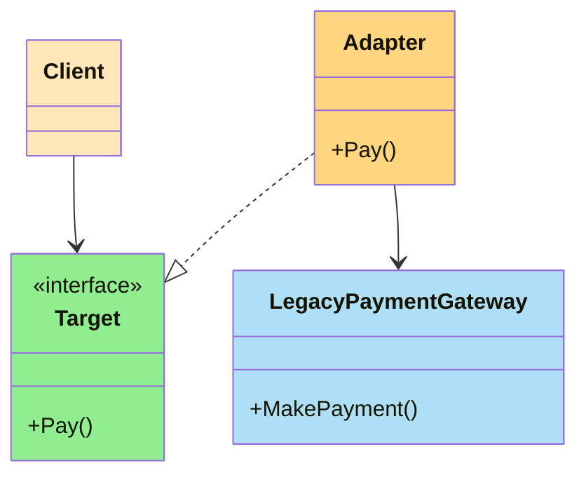
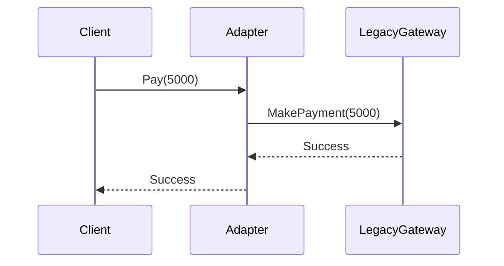
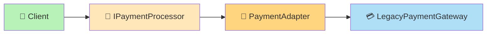
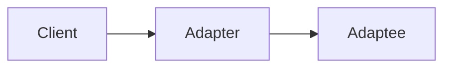
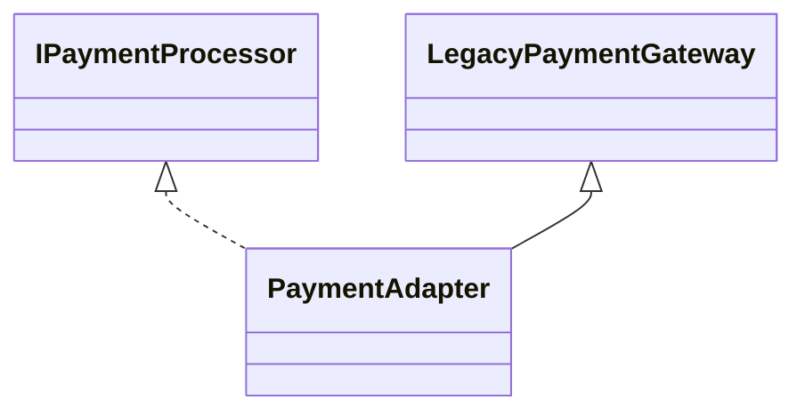
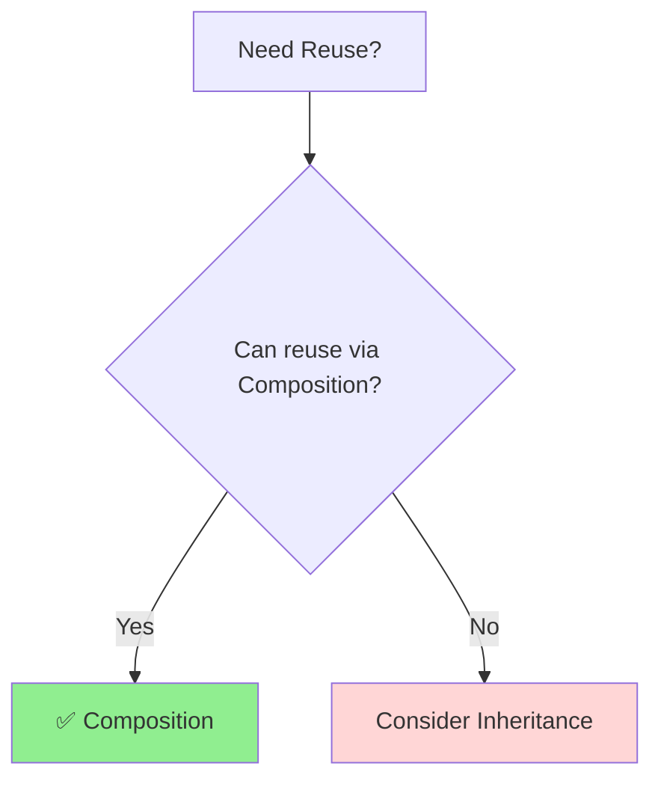
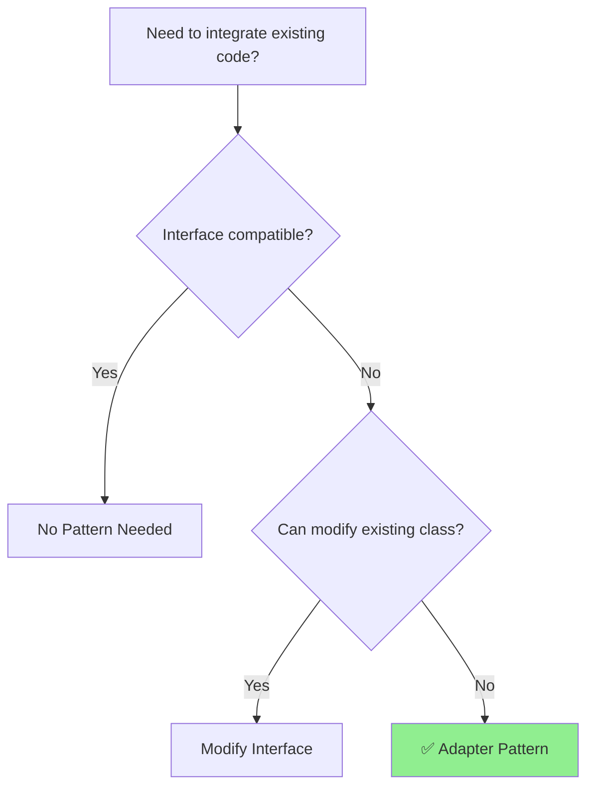

# 🔌 Adapter Design Pattern

> **Category:** Structural Design Pattern
> **Difficulty:** ⭐⭐⭐☆☆
> **Interview Frequency:** ⭐⭐⭐⭐⭐
> **Languages:** C#, Modern C++17 (Object Adapter)

---

# 📖 Table of Contents

* 🎯 Definition
* 💡 GoF Intent
* ❓ Decision Box
* 🤔 Problem Statement
* ❌ Why Traditional Solution Fails
* 🌍 Real World Analogies
* 🌍 Software Examples
* 🧠 Intuition Before Code
* 🎯 Pattern Recognition Checklist
* 🏗 Participants
* 🧩 Architecture Diagram
* 🔄 Runtime Flow
* 📊 Before vs After
* 🎯 When to Use
* 🚫 When NOT to Use
* ❓ Why Not Other Patterns?

---

# 🎯 Definition

The **Adapter Design Pattern** is a **Structural Design Pattern** that allows **two incompatible interfaces to work together**.

It acts as a **translator** between the client and an existing class (called the **Adaptee**) without modifying the adaptee's code.

> 💡 Think of it as a **plug converter** that lets two incompatible devices communicate.

---

# 💡 GoF Intent

> Convert the interface of a class into another interface that clients expect.

Adapter lets classes work together that otherwise couldn't because of incompatible interfaces.

---

# ❓ Decision Box

> [!IMPORTANT]
> Use **Adapter Pattern** when:
>
> * You **cannot modify** an existing class.
> * The client expects a different interface.
> * You need to integrate **legacy code**, **third-party libraries**, or **external APIs**.
>
> **One-line memory:**
>
> **"Need compatibility? → Use Adapter."**

---

# 🤔 Problem Statement

Imagine your application uses the following interface:

```text
PaymentProcessor

↓

Pay(amount)
```

Your client code expects every payment provider to implement:

```text
Pay()
```

Now suppose the business decides to integrate a **legacy payment gateway**.

Unfortunately, its API looks like this:

```text
MakePayment()
```

The interfaces don't match.

---

# ❌ Traditional Solution

Modify the legacy class.

```text
LegacyPaymentGateway

↓

Rename MakePayment()

↓

Pay()
```

### Problems

❌ Third-party library

❌ Vendor code

❌ Cannot modify source

❌ Changes may break updates

---

Or modify the client.

```text
if(provider == Legacy)
    MakePayment();

else
    Pay();
```

### Problems

❌ Giant if-else

❌ Tight coupling

❌ Violates Open/Closed Principle

❌ Difficult to maintain

---

> [!WARNING]
> Never modify vendor or third-party libraries just to fit your application.

---

# 🌍 Real World Analogies

## 🔌 Mobile Charger Adapter

You have:

```text
USB-C Laptop
```

Monitor supports:

```text
HDMI
```

They are incompatible.

Solution:

```text
USB-C

↓

USB-C to HDMI Adapter

↓

HDMI Monitor
```

The adapter translates one connector into another.

---

## 🌍 Travel Adapter

```text
Indian Plug

↓

Travel Adapter

↓

European Socket
```

The appliance doesn't change.

The socket doesn't change.

Only the adapter makes them compatible.

---

# 🌍 Software Examples

## 💳 Legacy Payment Gateway

```text
Application

↓

Pay()

↓

Adapter

↓

MakePayment()
```

---

## 🖨 Printer Driver

```text
Application

↓

Print()

↓

Printer Adapter

↓

Vendor Driver
```

---

## ☁ Cloud Providers

```text
Application

↓

Upload()

↓

AWS Adapter

↓

AWS SDK
```

or

```text
Application

↓

Upload()

↓

Azure Adapter

↓

Azure SDK
```

The application remains unchanged.

Only the adapter differs.

---

# 🧠 Intuition Before Code

Imagine two people.

One speaks:

```text
English
```

The other speaks:

```text
Japanese
```

They cannot communicate directly.

Add a translator.

```text
English

↓

Translator

↓

Japanese
```

The translator is the **Adapter**.

Neither person changes.

Only communication changes.

---

# 🎯 Pattern Recognition Checklist

If the interviewer says:

* Legacy System
* Third-party Library
* Vendor SDK
* Incompatible Interface
* Integration
* Compatibility Layer
* Wrapper
* Converter

👉 Think immediately:

# 🔌 Adapter Pattern

---

# 🏗 Participants

| Component | Responsibility                      |
| --------- | ----------------------------------- |
| Client    | Uses the target interface           |
| Target    | Interface expected by the client    |
| Adapter   | Converts one interface into another |
| Adaptee   | Existing incompatible class         |

---

# 🧩 Architecture Diagram



---

# 🔄 Runtime Flow

```mermaid
flowchart LR

    Client["👤 Client"]
    Adapter["🔌 Payment Adapter"]
    Legacy["💳 Legacy Gateway"]

    Client -->|Pay()| Adapter
    Adapter -->|MakePayment()| Legacy

    style Client fill:#B8F2B8
    style Adapter fill:#FFD580
    style Legacy fill:#AEDFF7
```

---

# 📊 Before vs After Adapter

## ❌ Without Adapter

```text
Client

↓

Pay()

❌

Legacy Gateway

↓

MakePayment()
```

Interfaces don't match.

---

## ✅ With Adapter

```text
Client

↓

Pay()

↓

Adapter

↓

MakePayment()

↓

Legacy Gateway
```

Now the client doesn't know it's talking to a legacy system.

---

# 🎯 When to Use

Use Adapter when:

* ✅ Integrating third-party libraries
* ✅ Working with legacy systems
* ✅ Interfaces are incompatible
* ✅ Existing code cannot be modified
* ✅ Migrating from old APIs to new APIs

---

# 🚫 When NOT to Use

Avoid Adapter when:

* You own both interfaces and can change them.
* No compatibility issue exists.
* You're adding new behavior (Decorator fits better).
* You're simplifying a subsystem (Facade fits better).

---

# ❓ Why Not Other Patterns?

| Pattern       | Purpose                                         |
| ------------- | ----------------------------------------------- |
| **Adapter**   | Make incompatible interfaces work together      |
| **Decorator** | Add new behavior without changing the interface |
| **Facade**    | Simplify a complex subsystem                    |
| **Proxy**     | Control access to an object                     |

> 💡 **Quick Rule**
>
> * Need **compatibility**? → Adapter
> * Need **extra functionality**? → Decorator
> * Need **simplification**? → Facade
> * Need **controlled access**? → Proxy

---

# 📝 Part 1 Summary

You should now understand:

* ✅ Why Adapter Pattern exists.
* ✅ The compatibility problem it solves.
* ✅ Real-world analogies (charger, travel adapter).
* ✅ Software examples (payment gateway, cloud SDKs).
* ✅ Core participants (Client, Target, Adapter, Adaptee).
* ✅ How the Adapter acts as a translator.
* ✅ When to choose Adapter over Decorator, Facade, or Proxy.

➡️ **Next:** Part 2 will implement the **Object Adapter** in **C#** and **Modern C++17**, then explain **Class Adapter vs Object Adapter**, why **Composition is preferred over Inheritance**, and include interview-focused comparisons.


---

# 💻 C# Implementation (Object Adapter)

We'll continue with the **Legacy Payment Gateway** example.

Suppose our application expects every payment provider to implement:

```text
Pay(amount)
```

However, the legacy payment gateway only provides:

```text
MakePayment(amount)
```

Our goal is to use the legacy gateway **without modifying its source code**.

---

# Step 1 : Target Interface

This is the interface expected by our application.

```csharp
public interface IPaymentProcessor
{
    void Pay(decimal amount);
}
```

---

# Step 2 : Adaptee (Existing Legacy Class)

This class already exists.

Imagine it's a third-party SDK.

```csharp
public class LegacyPaymentGateway
{
    public void MakePayment(decimal amount)
    {
        Console.WriteLine($"Processing payment of ₹{amount}");
    }
}
```

Notice:

❌ No `Pay()`

Only

```text
MakePayment()
```

---

# Step 3 : Adapter (Object Adapter)

This is where the magic happens.

```csharp
public class PaymentAdapter : IPaymentProcessor
{
    private readonly LegacyPaymentGateway gateway;

    public PaymentAdapter(LegacyPaymentGateway gateway)
    {
        this.gateway = gateway;
    }

    public void Pay(decimal amount)
    {
        gateway.MakePayment(amount);
    }
}
```

Notice:

The adapter **HAS-A**

```text
LegacyPaymentGateway
```

This is **Composition**.

---

# Step 4 : Client

```csharp
class Program
{
    static void Main()
    {
        LegacyPaymentGateway gateway =
            new LegacyPaymentGateway();

        IPaymentProcessor processor =
            new PaymentAdapter(gateway);

        processor.Pay(5000);
    }
}
```

---

## Output

```text
Processing payment of ₹5000
```

---

# 💻 Modern C++17 Implementation (Object Adapter)

---

## Target Interface

```cpp
class IPaymentProcessor
{
public:

    virtual void pay(double amount) = 0;

    virtual ~IPaymentProcessor() = default;
};
```

---

## Adaptee

```cpp
class LegacyPaymentGateway
{
public:

    void makePayment(double amount)
    {
        std::cout
            << "Processing ₹"
            << amount
            << std::endl;
    }
};
```

---

## Adapter

```cpp
class PaymentAdapter
    : public IPaymentProcessor
{
private:

    LegacyPaymentGateway& gateway;

public:

    PaymentAdapter(
        LegacyPaymentGateway& gateway)
        : gateway(gateway)
    {
    }

    void pay(double amount) override
    {
        gateway.makePayment(amount);
    }
};
```

---

## Client

```cpp
int main()
{
    LegacyPaymentGateway gateway;

    PaymentAdapter adapter(gateway);

    adapter.pay(5000);
}
```

---

## Output

```text
Processing ₹5000
```

---

# ⚙️ Step-by-Step Execution

Suppose the client executes

```text
processor.Pay(5000)
```

Runtime flow



Notice:

The client never knows

```text
MakePayment()
```

exists.

---

# 🧠 Execution Flow



---

# 🌍 Framework Examples

## ASP.NET Core

Imagine changing cloud providers.

Your application expects

```text
Upload(file)
```

AWS SDK provides

```text
PutObject()
```

Azure SDK provides

```text
UploadBlob()
```

Instead of changing your application,

create adapters.

```text
Application

↓

IStorage

↓

AWS Adapter

↓

AWS SDK
```

or

```text
Application

↓

IStorage

↓

Azure Adapter

↓

Azure SDK
```

Only the adapter changes.

---

# ⭐ Two Types of Adapter Pattern

Many interviewers ask this.

There are **two implementations**.

---

# 1️⃣ Object Adapter (Recommended ✅)

Uses

```text
Composition
```

Relationship



The adapter contains an instance of the adaptee.

Example

```csharp
PaymentAdapter

↓

LegacyPaymentGateway
```

This is exactly what we implemented.

---

# 2️⃣ Class Adapter (Rarely Used)

Uses

```text
Inheritance
```

Relationship



Pseudo example

```cpp
class PaymentAdapter
    : public IPaymentProcessor,
      public LegacyPaymentGateway
{
};
```

or conceptually in languages that support multiple inheritance.

Instead of wrapping the adaptee,

the adapter **inherits** from it.

---

# ⚖️ Object Adapter vs Class Adapter

| Object Adapter                        | Class Adapter                 |
| ------------------------------------- | ----------------------------- |
| Uses Composition                      | Uses Inheritance              |
| HAS-A Relationship                    | IS-A Relationship             |
| Loose Coupling                        | Tight Coupling                |
| Preferred in C#, Java, .NET           | Rarely Used                   |
| Can wrap different adaptee instances  | Fixed to one adaptee          |
| Easy to extend                        | Harder to extend              |
| Supports Composition over Inheritance | Doesn't follow that principle |

---

# 🏆 Why Object Adapter is Better

The biggest OO principle says:

> **Favor Composition Over Inheritance**

Why?

Because composition is more flexible.

---

## Inheritance

```text
Adapter

↓

Legacy Gateway
```

Problem

If the legacy class changes,

the adapter may also need changes.

Strong coupling.

---

## Composition

```text
Adapter

↓

HAS-A

↓

Legacy Gateway
```

The adapter simply delegates work.

If tomorrow you replace

```text
LegacyPaymentGateway
```

with

```text
NewPaymentGateway
```

you can create a new adapter without changing the client.

---

# 🧠 Composition vs Inheritance



---

# 💡 Interview Tip

If the interviewer asks:

> "Which Adapter implementation should we use in modern software?"

Answer:

> **Object Adapter**, because it uses **composition instead of inheritance**, resulting in better flexibility, lower coupling, and easier maintenance. This is also why it is the preferred implementation in languages like **C#, Java, and most modern frameworks**.

---

# 📝 Part 2 Summary

You now understand:

* ✅ Complete C# Object Adapter implementation
* ✅ Complete Modern C++17 implementation
* ✅ Runtime execution flow
* ✅ Object Adapter
* ✅ Class Adapter
* ✅ Composition vs Inheritance
* ✅ Why Object Adapter is preferred
* ✅ Framework examples

➡️ **Next:** Part 3 will cover SOLID mapping, advantages, disadvantages, Adapter vs Decorator vs Facade vs Proxy, interview questions, FAANG follow-ups, memory tricks, and a concise revision sheet.

---

# 🏆 SOLID Principle Mapping

| SOLID Principle | How Adapter Supports It                                                              |
| --------------- | ------------------------------------------------------------------------------------ |
| **SRP**         | ✅ Adapter has only one responsibility: converting one interface into another.        |
| **OCP**         | ✅ New adapters can be created without modifying existing client code.                |
| **LSP**         | ✅ Adapter implements the Target interface and can replace any implementation.        |
| **ISP**         | ✅ Client depends only on the Target interface.                                       |
| **DIP**         | ✅ Client depends on abstractions (`IPaymentProcessor`), not concrete legacy classes. |

> [!TIP]
> Adapter is an excellent example of **Dependency Inversion Principle (DIP)** because the client never depends on the legacy implementation.

---

# ✅ Advantages

* ✅ Reuse existing or legacy code without modification.
* ✅ Integrate third-party libraries easily.
* ✅ Loose coupling between client and adaptee.
* ✅ Supports Open/Closed Principle.
* ✅ Improves maintainability.
* ✅ Makes migration to newer systems easier.

---

# ❌ Disadvantages

* ❌ Adds an extra abstraction layer.
* ❌ Too many adapters may increase project complexity.
* ❌ Incorrect adapter design can hide poor architecture.
* ❌ Small performance overhead due to delegation (usually negligible).

---

# ⚠️ Common Mistakes

## ❌ Modifying the Legacy Class

Bad approach:

```text
LegacyPaymentGateway

↓

Rename MakePayment()

↓

Pay()
```

Never modify third-party or vendor code.

---

## ❌ Client Depending on the Adaptee

Bad:

```csharp
LegacyPaymentGateway gateway = new();
gateway.MakePayment(5000);
```

Now your application is tightly coupled to the legacy API.

---

Correct:

```csharp
IPaymentProcessor processor =
    new PaymentAdapter(gateway);

processor.Pay(5000);
```

The client depends only on the Target interface.

---

## ❌ Using Inheritance Unnecessarily

Instead of:

```text
PaymentAdapter

↓

inherits

↓

LegacyGateway
```

Prefer:

```text
PaymentAdapter

↓

HAS-A

↓

LegacyGateway
```

Composition is more flexible.

---

## ❌ Using Adapter for New Features

Adapter **does not add behavior**.

If you're adding caching, logging, encryption, or additional responsibilities, you're looking for the **Decorator Pattern**, not Adapter.

---

# 📊 Pattern Comparison

## Adapter vs Decorator

| Adapter                             | Decorator                  |
| ----------------------------------- | -------------------------- |
| Converts one interface into another | Adds new behavior          |
| Solves compatibility                | Extends functionality      |
| Interface changes                   | Interface remains the same |
| Used for integration                | Used for enhancement       |

### Memory Trick

```text
Adapter = Translate

Decorator = Enhance
```

---

## Adapter vs Facade

| Adapter                          | Facade                         |
| -------------------------------- | ------------------------------ |
| Converts incompatible interfaces | Simplifies a complex subsystem |
| Usually wraps one class          | Often wraps multiple classes   |
| Compatibility                    | Simplicity                     |

---

## Adapter vs Proxy

| Adapter                            | Proxy                                      |
| ---------------------------------- | ------------------------------------------ |
| Makes incompatible interfaces work | Controls access to an object               |
| Client gets compatibility          | Client gets controlled access              |
| Focus on translation               | Focus on protection, lazy loading, caching |

---

## Adapter vs Bridge

| Adapter                             | Bridge                                    |
| ----------------------------------- | ----------------------------------------- |
| Applied after classes already exist | Designed from the beginning               |
| Solves compatibility                | Separates abstraction from implementation |
| Existing systems                    | New architecture                          |

---

# 🧠 Memory Tricks

## 🔌 USB Adapter

```text
USB-C Laptop

↓

USB Adapter

↓

HDMI Monitor
```

Neither device changes.

The adapter translates between them.

---

## 🌍 Translator

```text
English

↓

Translator

↓

Japanese
```

The translator doesn't change either person.

It only converts communication.

---

## 💳 Payment Gateway

```text
Application

↓

Pay()

↓

Adapter

↓

MakePayment()
```

The adapter simply forwards the request in a format the legacy gateway understands.

---

# 🎯 Pattern Recognition Checklist

If the interviewer says:

* Legacy system
* Third-party SDK
* Vendor library
* Existing code
* Different interface
* Compatibility
* Wrapper
* Converter
* Integration layer

👉 **Think Adapter Pattern immediately.**

---

# 🌍 Real-World Framework Examples

## Payment Gateways

```text
Application

↓

IPaymentProcessor

↓

Stripe Adapter

↓

Stripe SDK
```

or

```text
Application

↓

IPaymentProcessor

↓

Razorpay Adapter

↓

Razorpay SDK
```

The application code never changes.

---

## Cloud Storage

```text
Application

↓

IStorage

↓

AWS Adapter

↓

AWS SDK
```

or

```text
Application

↓

IStorage

↓

Azure Adapter

↓

Azure SDK
```

---

## Database Providers

```text
Repository

↓

IDatabase

↓

MySQL Adapter

↓

MySQL Driver
```

or

```text
Repository

↓

IDatabase

↓

Mongo Adapter

↓

Mongo Driver
```

---

## Hardware Drivers

Operating systems use adapters to communicate with different hardware devices through a common interface.

---

# 🔥 Interview Questions

## Q1. What is the Adapter Pattern?

**Answer:**

Adapter is a **Structural Design Pattern** that converts one interface into another interface expected by the client, allowing incompatible classes to work together.

---

## Q2. What problem does Adapter solve?

It solves **interface incompatibility** without modifying existing code.

---

## Q3. What are the participants?

* Client
* Target Interface
* Adapter
* Adaptee

---

## Q4. What are the two types of Adapter?

### 1. Object Adapter ✅ (Preferred)

Uses **Composition**.

### 2. Class Adapter

Uses **Inheritance**.

---

## Q5. Which Adapter should we use?

**Answer:**

Object Adapter.

Because it:

* Uses composition
* Is loosely coupled
* Is more flexible
* Supports the "Composition over Inheritance" principle

---

## Q6. Why not modify the legacy class?

Because:

* You may not own the code.
* It's a third-party SDK.
* Updates may overwrite your changes.
* Other applications may depend on the original behavior.

---

## Q7. Is Adapter a wrapper?

**Yes.**

It wraps the adaptee and translates one interface into another.

---

## Q8. Difference between Adapter and Decorator?

**Adapter**

Changes the interface.

**Decorator**

Adds functionality while keeping the same interface.

---

# 🎤 FAANG Follow-Up Questions

### Can Adapter adapt multiple classes?

Yes.

One adapter can coordinate multiple legacy classes if required, although keeping adapters focused is generally preferable.

---

### Does Adapter improve performance?

No.

Its purpose is compatibility, not optimization.

---

### Can Adapter be combined with Factory?

Yes.

Factories often create the appropriate adapter based on configuration.

Example:

```text
PaymentFactory

↓

StripeAdapter

or

PayPalAdapter

or

RazorpayAdapter
```

---

### Can Adapter work with Dependency Injection?

Absolutely.

Register the adapter as the implementation of the Target interface.

```text
IPaymentProcessor

↓

PaymentAdapter
```

The client remains unaware of the underlying legacy class.

---

### When should Adapter NOT be used?

* When both interfaces are under your control and can be redesigned.
* When you're adding behavior instead of translating interfaces.
* When no compatibility problem exists.

---

# ⚡ 30-Second Revision Sheet

| Item              | Remember                                   |
| ----------------- | ------------------------------------------ |
| Pattern Type      | Structural                                 |
| Intent            | Convert one interface into another         |
| Main Participants | Client, Target, Adapter, Adaptee           |
| Preferred Type    | Object Adapter                             |
| OO Principle      | Composition over Inheritance               |
| Main Use          | Legacy Integration                         |
| Common Examples   | Payment Gateway, Cloud SDK, Printer Driver |

---

# 🚀 10-Second Interview Answer

> **Adapter Pattern** is a Structural Design Pattern that allows incompatible interfaces to work together by introducing an adapter object that translates one interface into another. Modern implementations prefer the **Object Adapter**, which uses **composition instead of inheritance**.

---

# 📌 Last-Minute Interview Revision

## Remember These Five Points

```text
1. Client expects Target Interface

↓

2. Adapter implements Target

↓

3. Adapter wraps Adaptee

↓

4. Adapter translates calls

↓

5. Client never knows about Adaptee
```

---

## Interview Keywords

```text
Structural Pattern

Compatibility

Legacy System

Wrapper

Translation

Third-Party SDK

Object Adapter

Composition
```

---

# 💡 Pattern Decision Tree



---

# 📝 Practice Problems

Implement Adapter Pattern for:

* 💳 Payment Gateway Integration
* ☁️ AWS ↔ Azure Storage Adapter
* 🖨 Printer Driver Adapter
* 📧 Email Provider Adapter
* 📦 Shipping Provider Adapter
* 🌐 Translation Service Adapter
* 🎥 Video Player Codec Adapter

---

# 📚 Quick Pattern Comparison

| Pattern       | Purpose                                  |
| ------------- | ---------------------------------------- |
| **Adapter**   | Convert incompatible interfaces          |
| **Decorator** | Add new behavior dynamically             |
| **Facade**    | Simplify a subsystem                     |
| **Proxy**     | Control access                           |
| **Bridge**    | Separate abstraction from implementation |

---

# 🎉 Adapter Pattern Complete

You now understand:

* ✔️ Why Adapter exists
* ✔️ Object Adapter implementation
* ✔️ Class Adapter concept
* ✔️ Composition vs Inheritance
* ✔️ Complete C# implementation
* ✔️ Complete Modern C++ implementation
* ✔️ SOLID principles
* ✔️ Advantages & disadvantages
* ✔️ Pattern comparisons
* ✔️ Interview questions
* ✔️ FAANG follow-ups
* ✔️ Revision techniques

🚀 **Interview Takeaway:**

> **Adapter Pattern = "Translate one interface into another without changing the existing code."**

If you hear **legacy systems**, **third-party SDKs**, **vendor libraries**, or **interface compatibility**, the Adapter Pattern should immediately come to mind.

