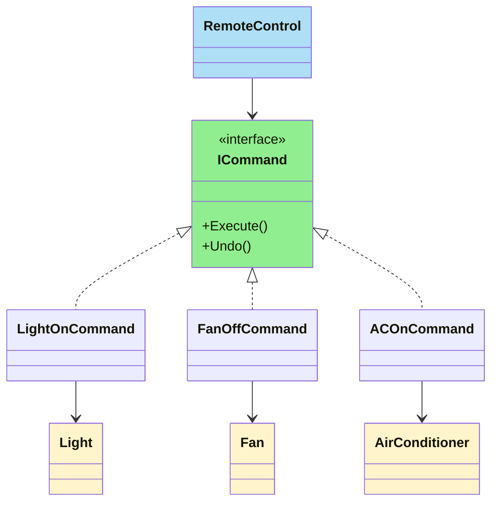
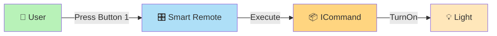
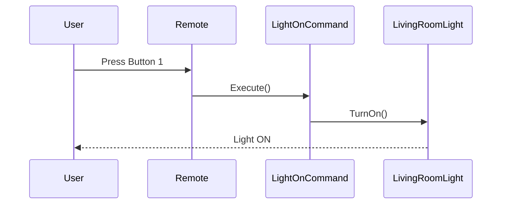
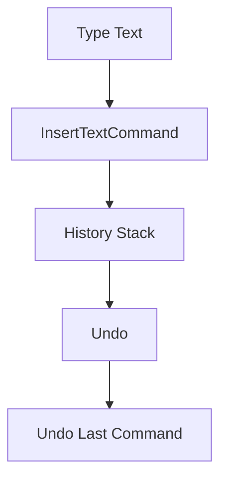
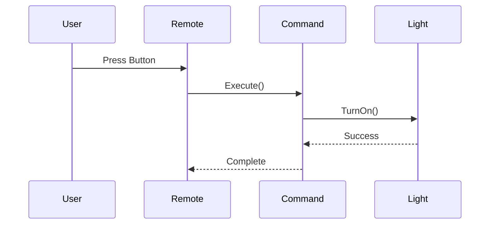
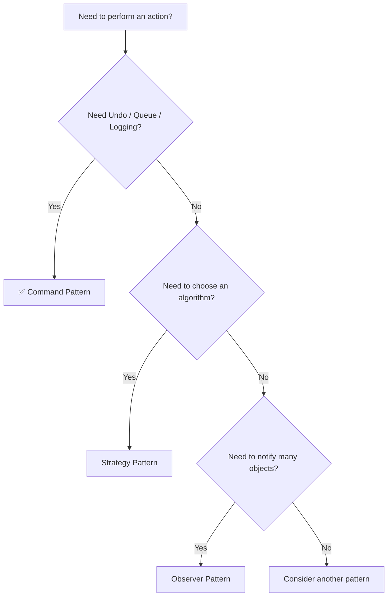

# 🎮 Command Design Pattern

> **Category:** Behavioral Design Pattern
> **Difficulty:** ⭐⭐⭐⭐☆
> **Interview Frequency:** ⭐⭐⭐⭐⭐
> **Languages:** C#, Modern C++17

---

# 📖 Table of Contents

* 🎯 Definition
* 💡 GoF Intent
* 🤔 Problem Statement
* ❌ Why Traditional Solution Fails
* 🏠 Smart Home Remote Example
* 📝 Text Editor Undo Example
* 🧠 Intuition Before Code
* 🎯 Recognition Checklist
* 🏗 Components
* 🧩 Mermaid Class Diagram
* 🔄 Runtime Flow
* 📊 Command Execution Flow
* ⚖ Before vs After Command Pattern
* 🎯 When to Use
* 🚫 When NOT to Use

---

# 🎯 Definition

The **Command Design Pattern** is a **Behavioral Design Pattern** that **encapsulates a request as an object**.

Instead of calling methods directly, we create a **Command object** representing that request and pass it around.

This allows us to:

* Queue commands
* Log commands
* Undo/Redo commands
* Execute commands later
* Decouple the sender from the receiver

---

# 💡 GoF Intent

> Encapsulate a request as an object, thereby allowing you to parameterize clients with different requests, queue or log requests, and support undoable operations.

---

# 🤔 Problem Statement

Imagine you're building a **Smart Home Remote**.

The remote should control:

* 💡 Lights
* 🌀 Fans
* ❄️ Air Conditioner
* 🚪 Garage Door
* 🪟 Smart Curtains

The remote has buttons:

```text
Button 1

Button 2

Button 3

Button 4

Button 5
```

Each button can be assigned to any smart appliance.

---

# ❌ Traditional Solution

Suppose the remote directly controls every appliance.

```csharp
remote.TurnOnLight();

remote.TurnOffFan();

remote.OpenGarage();

remote.CloseCurtains();

remote.StartAC();
```

Now imagine a new appliance arrives.

```text
Robot Vacuum
```

You'll have to modify the Remote class.

Later,

```text
Smart Sprinkler
```

Modify Remote again.

Later,

```text
Smart Door Lock
```

Modify again.

The Remote becomes responsible for every device.

---

# Problems

❌ Tight coupling

❌ Violates Open/Closed Principle

❌ Difficult to extend

❌ Huge switch statements

❌ Remote knows every appliance

---

> [!WARNING]
> Every new smart appliance requires changing the Remote class.

---

# 🏠 Smart Home Remote Example

Instead of making the remote know every appliance,

every button simply stores a **Command**.

```text
Button 1 → Light ON Command

Button 2 → Fan OFF Command

Button 3 → AC ON Command

Button 4 → Garage OPEN Command

Button 5 → Curtain CLOSE Command
```

When Button 1 is pressed,

the Remote simply executes:

```text
Execute()
```

The remote has **no idea** whether it is controlling a light, fan, AC, or garage.

---

# Real Flow

```text
User

↓

Remote

↓

Command

↓

Smart Appliance
```

Notice something important.

The Remote **never calls**

```text
Light.On()

Fan.Off()

AC.Start()
```

Instead,

it always executes

```text
Command.Execute()
```

That's the entire beauty of the Command Pattern.

---

# 📝 Text Editor Undo Example

Consider a text editor.

User actions:

```text
Type "Hello"

↓

Bold Text

↓

Paste Paragraph

↓

Delete Line
```

Without Command Pattern,

the editor only performs actions.

Undo becomes difficult.

---

With Command Pattern,

each user action becomes a Command object.

```text
InsertTextCommand

BoldCommand

PasteCommand

DeleteCommand
```

Whenever a command executes,

store it inside

```text
History Stack
```

When Undo is pressed,

```text
Last Command

↓

Undo()
```

This is why **Undo/Redo** is one of the most famous applications of the Command Pattern.

---

# 🧠 Intuition Before Code

Think of a waiter in a restaurant.

```text
Customer

↓

Waiter

↓

Kitchen
```

The waiter never cooks.

He only carries the order.

Similarly,

```text
User

↓

Remote

↓

Command

↓

Appliance
```

The Remote never turns on the light.

It only forwards the command.

---

# 🎯 Recognition Checklist

If the interviewer says:

* Queue requests
* Undo / Redo
* Scheduler
* Task Queue
* Macro Recording
* Remote Control
* Decouple sender from receiver
* Execute later
* Store operations

👉 Think immediately

# 🎮 Command Pattern

---

# 🏗 Components

| Component        | Responsibility                                 |
| ---------------- | ---------------------------------------------- |
| Command          | Declares Execute() (and optionally Undo())     |
| Concrete Command | Implements the request                         |
| Receiver         | Performs the actual work                       |
| Invoker          | Stores and executes commands                   |
| Client           | Creates commands and wires everything together |

---

# 🧩 Architecture Diagram



---

# 🔄 Runtime Flow



---

# 📊 Smart Home Command Flow

Suppose Button 1 controls the Living Room Light.



Notice:

* Remote doesn't know **how** to turn on the light.
* It only knows which command to execute.

---

# 📊 Undo Flow (Text Editor)



Every executed command is pushed into the history stack.

Undo simply pops the latest command and calls:

```text
Undo()
```

---

# ⚖ Before vs After Command Pattern

## ❌ Without Command

```text
Remote

├── TurnOnLight()

├── TurnOffFan()

├── StartAC()

├── OpenGarage()

├── CloseCurtains()

├── LockDoor()

├── StartSprinkler()

├── StartVacuum()

...
```

The Remote keeps growing forever.

---

## ✅ With Command

```text
Remote

↓

Execute()

↓

LightOnCommand

↓

Light
```

Tomorrow you add:

```text
RobotVacuumCommand
```

Remote doesn't change.

---

# 🎯 When to Use

Use Command Pattern when:

* ✅ You want to decouple sender and receiver.
* ✅ Operations should be executed later.
* ✅ You need Undo/Redo.
* ✅ Requests must be queued.
* ✅ Operations should be logged.
* ✅ Macro recording is required.

---

# 🚫 When NOT to Use

Avoid Command Pattern when:

* Only one fixed operation exists.
* No need for queuing or history.
* Simple direct method calls are sufficient.
* The added abstraction would unnecessarily complicate the design.

---

> [!TIP]
> **Rule of Thumb:** If you ever hear **"button", "action", "task", "job", "undo", "queue", or "execute later"**, the Command Pattern is likely a good fit.

---

# 📝 Part 1 Summary

You should now understand:

* ✅ Why direct method calls create tight coupling.
* ✅ Why the Smart Home Remote is an excellent use case.
* ✅ How the Remote (Invoker) delegates work to Commands.
* ✅ Why Undo/Redo naturally fits the Command Pattern.
* ✅ The roles of Client, Invoker, Command, Concrete Command, and Receiver.

➡️ **Next:** Part 2 will implement the complete **Smart Home Remote** in **C#** and **Modern C++17**, including configurable buttons, multiple appliances, and **Undo support** inspired by a text editor.

---

# 💻 C# Implementation

We'll build a **Smart Home Universal Remote** that can control multiple appliances.

## Step 1: Command Interface

Every command should support:

* Execute
* Undo

```csharp
public interface ICommand
{
    void Execute();
    void Undo();
}
```

---

# Step 2: Receivers (Smart Appliances)

These classes know **how to perform the actual work**.

## 💡 Smart Light

```csharp
public class SmartLight
{
    public void TurnOn()
    {
        Console.WriteLine("Living Room Light ON");
    }

    public void TurnOff()
    {
        Console.WriteLine("Living Room Light OFF");
    }
}
```

---

## 🌀 Smart Fan

```csharp
public class SmartFan
{
    public void TurnOn()
    {
        Console.WriteLine("Fan ON");
    }

    public void TurnOff()
    {
        Console.WriteLine("Fan OFF");
    }
}
```

---

## ❄ Smart Air Conditioner

```csharp
public class SmartAC
{
    public void TurnOn()
    {
        Console.WriteLine("AC ON");
    }

    public void TurnOff()
    {
        Console.WriteLine("AC OFF");
    }
}
```

---

# Step 3: Concrete Commands

## 💡 Light ON Command

```csharp
public class LightOnCommand : ICommand
{
    private readonly SmartLight light;

    public LightOnCommand(SmartLight light)
    {
        this.light = light;
    }

    public void Execute()
    {
        light.TurnOn();
    }

    public void Undo()
    {
        light.TurnOff();
    }
}
```

---

## 🌀 Fan OFF Command

```csharp
public class FanOffCommand : ICommand
{
    private readonly SmartFan fan;

    public FanOffCommand(SmartFan fan)
    {
        this.fan = fan;
    }

    public void Execute()
    {
        fan.TurnOff();
    }

    public void Undo()
    {
        fan.TurnOn();
    }
}
```

---

## ❄ AC ON Command

```csharp
public class ACOnCommand : ICommand
{
    private readonly SmartAC ac;

    public ACOnCommand(SmartAC ac)
    {
        this.ac = ac;
    }

    public void Execute()
    {
        ac.TurnOn();
    }

    public void Undo()
    {
        ac.TurnOff();
    }
}
```

---

# Step 4: Invoker (Smart Remote)

Notice the remote knows **nothing about appliances**.

It only executes commands.

```csharp
public class SmartRemote
{
    private readonly ICommand[] buttons = new ICommand[5];

    private readonly Stack<ICommand> history = new();

    public void SetCommand(int slot, ICommand command)
    {
        buttons[slot] = command;
    }

    public void PressButton(int slot)
    {
        buttons[slot]?.Execute();

        if (buttons[slot] != null)
            history.Push(buttons[slot]);
    }

    public void Undo()
    {
        if (history.Count == 0)
            return;

        ICommand command = history.Pop();

        command.Undo();
    }
}
```

---

# Step 5: Client

```csharp
class Program
{
    static void Main()
    {
        SmartLight light = new();
        SmartFan fan = new();
        SmartAC ac = new();

        SmartRemote remote = new();

        remote.SetCommand(0, new LightOnCommand(light));
        remote.SetCommand(1, new FanOffCommand(fan));
        remote.SetCommand(2, new ACOnCommand(ac));

        remote.PressButton(0);

        remote.PressButton(1);

        remote.PressButton(2);

        Console.WriteLine();

        Console.WriteLine("Undo Last Action");

        remote.Undo();
    }
}
```

---

# ✅ Output

```text
Living Room Light ON

Fan OFF

AC ON

Undo Last Action

AC OFF
```

---

# 💻 Modern C++17 Implementation

---

## Command Interface

```cpp
class ICommand
{
public:
    virtual void execute() = 0;

    virtual void undo() = 0;

    virtual ~ICommand() = default;
};
```

---

## Receiver

```cpp
class SmartLight
{
public:

    void turnOn()
    {
        std::cout << "Light ON\n";
    }

    void turnOff()
    {
        std::cout << "Light OFF\n";
    }
};
```

---

## Concrete Command

```cpp
class LightOnCommand : public ICommand
{
    SmartLight& light;

public:

    LightOnCommand(SmartLight& light)
        : light(light)
    {
    }

    void execute() override
    {
        light.turnOn();
    }

    void undo() override
    {
        light.turnOff();
    }
};
```

---

## Invoker

```cpp
class SmartRemote
{
    std::vector<std::shared_ptr<ICommand>> buttons;

    std::stack<std::shared_ptr<ICommand>> history;

public:

    SmartRemote()
    {
        buttons.resize(5);
    }

    void setCommand(int slot,
                    std::shared_ptr<ICommand> command)
    {
        buttons[slot] = command;
    }

    void pressButton(int slot)
    {
        if (buttons[slot])
        {
            buttons[slot]->execute();

            history.push(buttons[slot]);
        }
    }

    void undo()
    {
        if (history.empty())
            return;

        history.top()->undo();

        history.pop();
    }
};
```

---

## Client

```cpp
int main()
{
    SmartLight light;

    SmartRemote remote;

    remote.setCommand(
        0,
        std::make_shared<LightOnCommand>(light));

    remote.pressButton(0);

    remote.undo();
}
```

---

## Output

```text
Light ON

Light OFF
```

---

# ⚙️ Step-by-Step Execution

Suppose the user presses:

```text
Button 1
```

Runtime flow:

```mermaid
flowchart LR

A[User]

-->

B[Remote]

-->

C[LightOnCommand]

-->

D[SmartLight]

-->

E[TurnOn()]
```

Notice:

Remote never calls

```text
light.TurnOn()
```

Instead,

```text
Execute()
```

is called.

---

# 🔄 Runtime Method Calls



---

# 🧠 Understanding Undo

After each execution

```text
Execute()

↓

Push Command

↓

History Stack
```

Example

```text
Button 1

↓

Light ON
```

History

```text
Top

↓

LightOnCommand
```

Next

```text
Button 2

↓

Fan OFF
```

History

```text
Top

↓

FanOffCommand

↓

LightOnCommand
```

Undo

```text
Pop()

↓

FanOffCommand

↓

Undo()
```

Fan turns back ON.

Exactly how a text editor behaves.

---

# 📝 Text Editor Analogy

Suppose user performs:

```text
Type "Hello"

↓

Bold

↓

Paste

↓

Delete
```

Instead of executing directly,

store commands.

```text
InsertCommand

BoldCommand

PasteCommand

DeleteCommand
```

History

```text
Delete

↓

Paste

↓

Bold

↓

Insert
```

Undo simply does

```text
DeleteCommand.Undo()
```

Next Undo

```text
PasteCommand.Undo()
```

No giant if-else.

No switch statements.

Just polymorphism.

---

# 🌍 Real-World Framework Examples

## Desktop Applications

* Microsoft Word
* VS Code
* IntelliJ IDEA

Every menu item:

```text
Copy

Paste

Undo

Redo

Delete
```

is implemented conceptually as a command.

---

## Smart Home Systems

```text
Remote

↓

Light Command

↓

Fan Command

↓

Garage Command

↓

Curtain Command

↓

AC Command
```

Buttons can even be reconfigured at runtime without changing the remote.

---

## Job Scheduler

```text
Queue

↓

EmailJob

↓

SMSJob

↓

BackupJob

↓

InvoiceJob
```

Workers simply execute commands from the queue.

---

## Macro Recording

Gaming keyboards or IDEs record commands:

```text
Copy

↓

Paste

↓

Save

↓

Build
```

Later,

execute the same command sequence again.

---

# 💡 Interview Tip

> The **Invoker (Remote)** never knows **how** the work is performed.

It only knows:

```text
command.Execute()
```

This is the key idea behind the Command Pattern.

---

# 📝 Part 2 Summary

You now understand:

* ✅ Complete C# implementation
* ✅ Complete Modern C++17 implementation
* ✅ Smart Home Remote architecture
* ✅ Command history using a stack
* ✅ Undo support
* ✅ Text Editor analogy
* ✅ Runtime execution flow
* ✅ Real-world applications

➡️ **Part 3** will cover SOLID principles, advantages, disadvantages, comparisons (Command vs Strategy vs Observer vs Chain of Responsibility), common mistakes, interview questions, FAANG follow-ups, memory tricks, and a concise revision sheet.

---

# 🏆 SOLID Principle Mapping

| SOLID Principle | How Command Supports It                                                 |
| --------------- | ----------------------------------------------------------------------- |
| **SRP**         | ✅ Each command has only one responsibility (one action).                |
| **OCP**         | ✅ Add new commands without modifying the Remote (Invoker).              |
| **LSP**         | ✅ Every concrete command can replace the `ICommand` interface.          |
| **ISP**         | ✅ Clients depend only on the small `ICommand` interface.                |
| **DIP**         | ✅ Remote depends on `ICommand`, not concrete devices like Light or Fan. |

> [!TIP]
> **Command Pattern is one of the best real-world examples of the Dependency Inversion Principle (DIP).**

---

# ✅ Advantages

* ✅ Decouples sender (Invoker) from receiver.
* ✅ Easy to add new commands.
* ✅ Supports **Undo/Redo** naturally.
* ✅ Commands can be queued for later execution.
* ✅ Commands can be logged or persisted.
* ✅ Supports macro recording and replay.
* ✅ Follows Open/Closed Principle.
* ✅ Makes the Invoker reusable.

---

# ❌ Disadvantages

* ❌ Introduces many command classes.
* ❌ Slightly more complex than direct method calls.
* ❌ Simple applications may not need this abstraction.
* ❌ Maintaining command history requires extra memory.

---

# ⚠️ Common Mistakes

## ❌ Invoker Knows Too Much

Bad design:

```csharp
public void PressLightButton()
{
    light.TurnOn();
}
```

Now the Remote is tightly coupled to `SmartLight`.

---

Correct design:

```csharp
public void PressButton()
{
    command.Execute();
}
```

The Remote has no knowledge of the underlying appliance.

---

## ❌ Giant Switch Statements

Bad:

```text
switch(button)
{
    case 1:
        light.On();

    case 2:
        fan.Off();

    case 3:
        ac.On();

    ...
}
```

Every new appliance modifies the switch.

---

Correct:

```text
Button

↓

Execute()
```

No switch statements.

No if-else chains.

---

## ❌ Forgetting Undo Information

Suppose the command is:

```text
IncreaseFanSpeed
```

Undo requires knowing the previous speed.

Bad implementation:

```text
Execute()

↓

Fan Speed = 5
```

Undo doesn't know the previous value.

Correct implementation:

```text
Previous Speed = 3

↓

Execute()

↓

Undo()

↓

Restore Speed = 3
```

Commands that support Undo should capture the previous state before execution.

---

## ❌ Mixing Business Logic into Invoker

The Invoker should never contain appliance logic.

The Invoker should only:

```text
Store Command

↓

Execute Command

↓

Maintain History
```

Nothing more.

---

# 📊 Pattern Comparison

## Command vs Strategy

| Command                | Strategy                  |
| ---------------------- | ------------------------- |
| Encapsulates a request | Encapsulates an algorithm |
| Execute later          | Execute immediately       |
| Supports Undo          | No Undo concept           |
| Can be queued          | Usually not queued        |
| Stores receiver        | Doesn't store receiver    |

### Memory Trick

```text
Command = Action

Strategy = Algorithm
```

---

## Command vs Observer

| Command                   | Observer                    |
| ------------------------- | --------------------------- |
| One sender → One receiver | One sender → Many receivers |
| Explicit execution        | Automatic notification      |
| Represents an action      | Represents an event         |
| Supports history          | Doesn't manage history      |

---

## Command vs Chain of Responsibility

| Command              | Chain of Responsibility                   |
| -------------------- | ----------------------------------------- |
| One command executes | Multiple handlers may inspect the request |
| Knows the receiver   | Doesn't know who will handle it           |
| Represents an action | Represents a processing pipeline          |

---

## Command vs Mediator

| Command                   | Mediator                     |
| ------------------------- | ---------------------------- |
| Encapsulates an operation | Coordinates communication    |
| Focus on actions          | Focus on interactions        |
| Executes requests         | Manages object collaboration |

---

## Command vs Factory

| Command            | Factory             |
| ------------------ | ------------------- |
| Executes objects   | Creates objects     |
| Behavioral Pattern | Creational Pattern  |
| Represents work    | Represents creation |

---

# 🧠 Memory Tricks

## 🏠 Smart Home Remote

```text
User

↓

Remote

↓

Command

↓

Light
```

Remember:

> The Remote never touches the Light directly.

---

## 📝 Text Editor

```text
Type

↓

Command

↓

History Stack

↓

Undo
```

Every action is an object.

Undo simply calls:

```text
command.Undo()
```

---

## 🍽 Restaurant Analogy

```text
Customer

↓

Waiter

↓

Order Ticket

↓

Chef
```

| Restaurant   | Command Pattern |
| ------------ | --------------- |
| Customer     | Client          |
| Waiter       | Invoker         |
| Order Ticket | Command         |
| Chef         | Receiver        |

The waiter never cooks.

The waiter only delivers the order.

---

# 🎯 Pattern Recognition Checklist

If the interviewer says:

* Undo / Redo
* Smart Remote
* Button Actions
* Queue Requests
* Background Jobs
* Task Scheduler
* Macro Recording
* Execute Later
* Logging Operations
* History Stack

👉 Think immediately:

# 🎮 Command Pattern

---

# 🌍 Real-World Framework Examples

## Text Editors

* Microsoft Word
* VS Code
* IntelliJ IDEA
* Visual Studio

Commands:

```text
Copy

Paste

Undo

Redo

Delete
```

---

## Smart Home Automation

```text
Remote

↓

Light Command

↓

Fan Command

↓

Garage Command

↓

Curtain Command

↓

AC Command
```

The same remote works with any new appliance by assigning a new command.

---

## Background Job Processing

Examples:

* Hangfire (.NET)
* Quartz.NET
* Windows Task Scheduler

Jobs are represented as executable commands.

---

## Message Queues

```text
RabbitMQ

↓

Email Command

↓

SMS Command

↓

Invoice Command
```

Workers simply execute commands from the queue.

---

## Macro Recording

Gaming keyboards and IDEs record:

```text
Copy

↓

Paste

↓

Save

↓

Build
```

Later, replay the recorded command sequence.

---

# 🔥 Interview Questions

## Q1. What is the Command Pattern?

**Answer:**

Command is a **Behavioral Design Pattern** that encapsulates a request as an object, allowing requests to be executed, queued, logged, or undone independently of the sender.

---

## Q2. What problem does it solve?

It removes the dependency between the object requesting an action (Invoker) and the object performing the action (Receiver).

---

## Q3. Who are the main participants?

* Client
* Invoker
* Command Interface
* Concrete Command
* Receiver

---

## Q4. Why use a Command object instead of calling methods directly?

Because commands can be:

* Stored
* Queued
* Logged
* Undone
* Replayed

Direct method calls cannot easily support these features.

---

## Q5. How does Undo work?

Each command stores enough state to reverse its operation.

Executed commands are pushed into a history stack.

Undo pops the last command and calls:

```text
Undo()
```

---

## Q6. What is the Receiver?

The Receiver is the object that performs the actual business logic.

Example:

```text
Light

Fan

Air Conditioner

Garage Door
```

---

## Q7. Why is the Smart Remote a good example?

Because the Remote only executes commands.

It never knows how the Light, Fan, or AC actually work.

---

## Q8. Which SOLID principle is most closely related?

Dependency Inversion Principle (DIP).

The Invoker depends on the `ICommand` abstraction rather than concrete devices.

---

# 🎤 FAANG Follow-Up Questions

### Can commands be executed asynchronously?

Yes.

Since commands are objects, they can be placed into a queue and processed later by background workers.

---

### Can multiple commands be executed together?

Yes.

This is called a **Macro Command** (Composite Command), where one command internally executes several commands.

Example:

```text
Good Night Button

↓

Turn Off Lights

↓

Lock Doors

↓

Close Curtains

↓

Turn Off AC
```

---

### Can Command Pattern be distributed across machines?

Yes.

Commands can be serialized and sent through message queues like RabbitMQ or Kafka for remote execution.

---

### How is Redo implemented?

Maintain two stacks:

```text
Undo Stack

Redo Stack
```

Undo:

```text
Undo Stack

↓

Redo Stack
```

Redo:

```text
Redo Stack

↓

Undo Stack
```

---

### What if a command fails?

Use transaction management or compensating commands to safely recover.

---

# ⚡ 30-Second Revision Sheet

| Item           | Remember              |
| -------------- | --------------------- |
| Pattern Type   | Behavioral            |
| Intent         | Encapsulate a request |
| Invoker        | Executes commands     |
| Receiver       | Performs actual work  |
| Main Benefit   | Decoupling            |
| Key Feature    | Undo / Redo           |
| Real Example   | Smart Home Remote     |
| Data Structure | Stack (Undo History)  |

---

# 🚀 10-Second Interview Answer

> **Command Pattern** is a Behavioral Design Pattern that encapsulates a request as an object. It decouples the sender from the receiver and enables features like **Undo/Redo**, request queuing, logging, macro recording, and delayed execution.

---

# 📌 Last-Minute Interview Revision

## Remember These Five Points

```text
1. Request becomes an Object

↓

2. Invoker executes Command

↓

3. Command calls Receiver

↓

4. Supports Undo

↓

5. Decouples Sender & Receiver
```

---

## Interview Keywords

```text
Behavioral Pattern

Execute()

Undo()

Invoker

Receiver

History Stack

Queue

Macro

Scheduler
```

---

# 📝 Practice Problems

Implement Command Pattern for:

* 🏠 Smart Home Remote
* 📝 Text Editor Undo/Redo
* 🎮 Game Controls
* 🚗 Car Remote Start/Stop
* 📧 Email Scheduler
* 📦 Order Processing Queue
* 🖨 Print Queue
* 🎬 Video Player Controls (Play, Pause, Stop)

---

# 💡 Pattern Recognition Decision Tree



---

# 📚 Quick Pattern Comparison

| Pattern       | Primary Purpose          |
| ------------- | ------------------------ |
| **Singleton** | One shared instance      |
| **Factory**   | Create objects           |
| **Builder**   | Build complex objects    |
| **Strategy**  | Change algorithms        |
| **Observer**  | Notify subscribers       |
| **Decorator** | Add behavior dynamically |
| **Command**   | Encapsulate requests     |

---

# 🎉 Command Pattern Complete

You now understand:

* ✔️ Why direct method calls create tight coupling
* ✔️ Smart Home Remote architecture
* ✔️ Client, Invoker, Command, Concrete Command, and Receiver roles
* ✔️ Complete C# and Modern C++ implementations
* ✔️ Undo/Redo using a history stack
* ✔️ Macro Commands and delayed execution
* ✔️ SOLID principles
* ✔️ Real-world framework usage
* ✔️ Interview questions and FAANG follow-ups

🚀 **Interview Takeaway:**

> **Command Pattern = "Convert every action into an object."**
> If you hear **button actions**, **Undo/Redo**, **task queues**, **background jobs**, **macro recording**, or **smart remote controls**, the Command Pattern should immediately come to mind.
