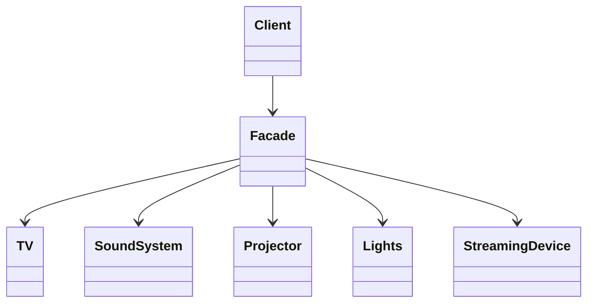
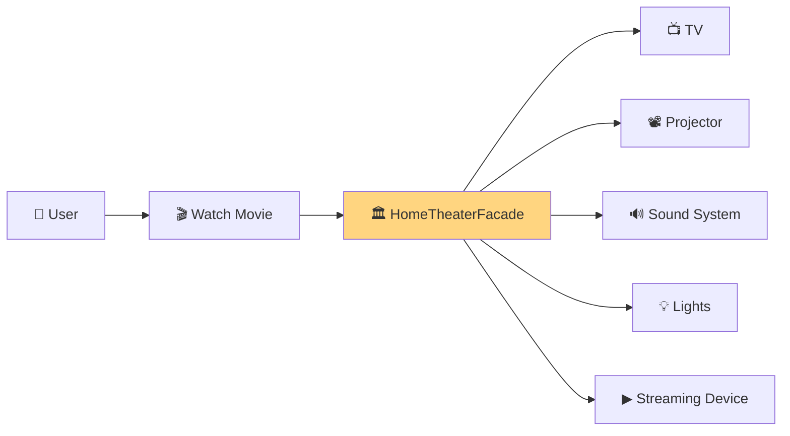
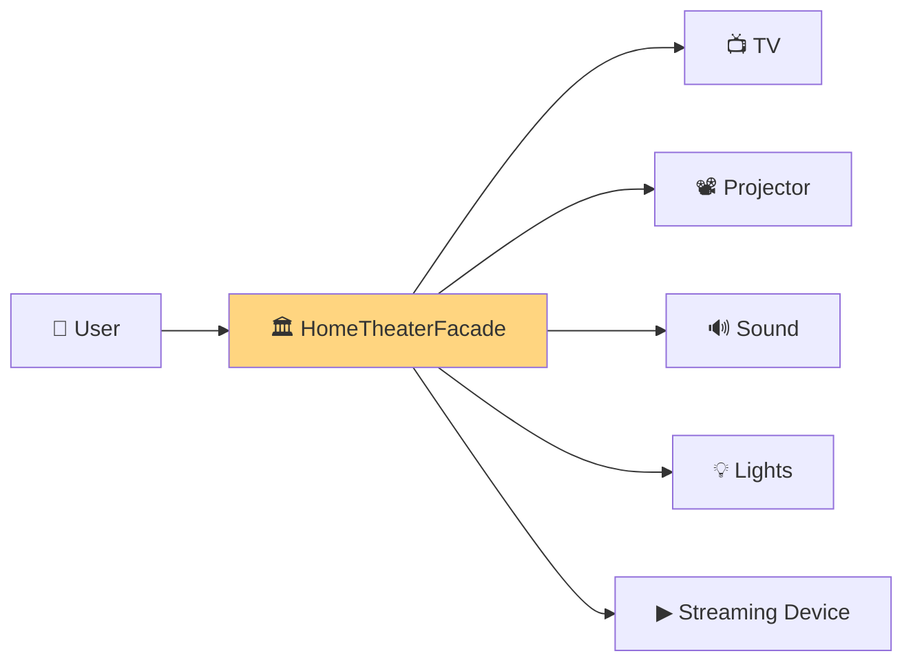
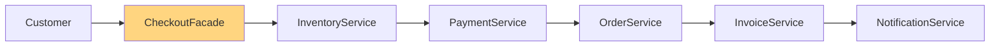
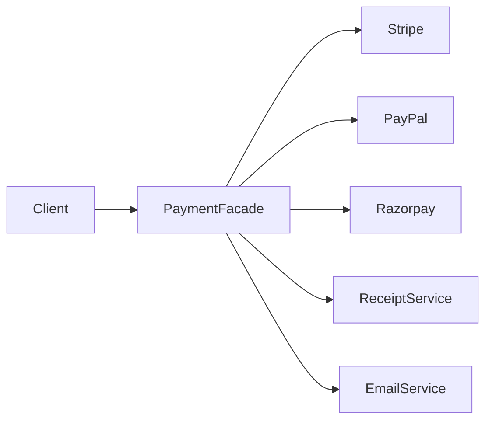
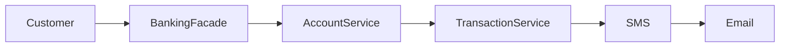
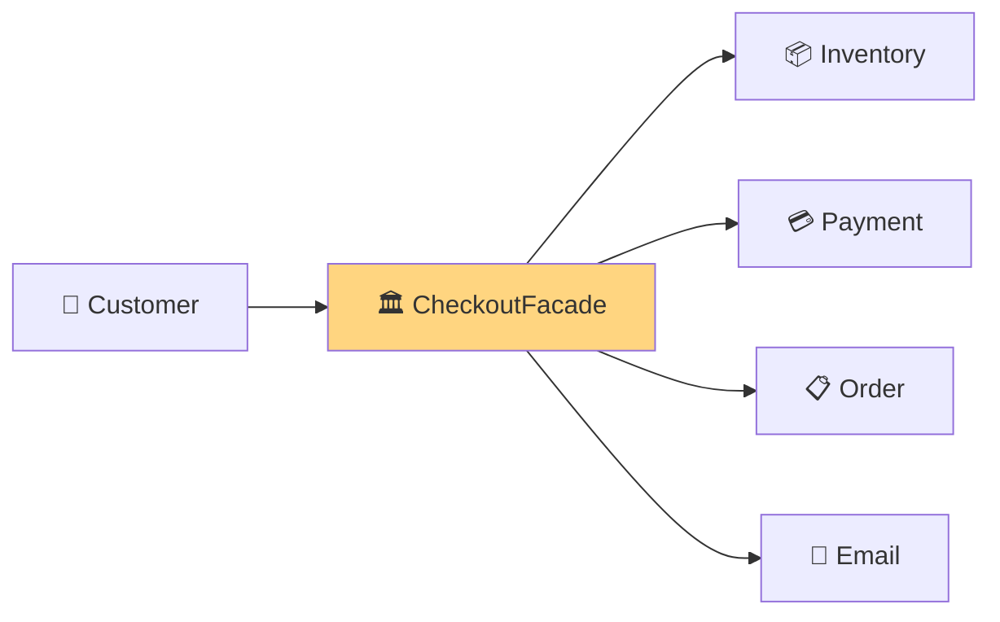
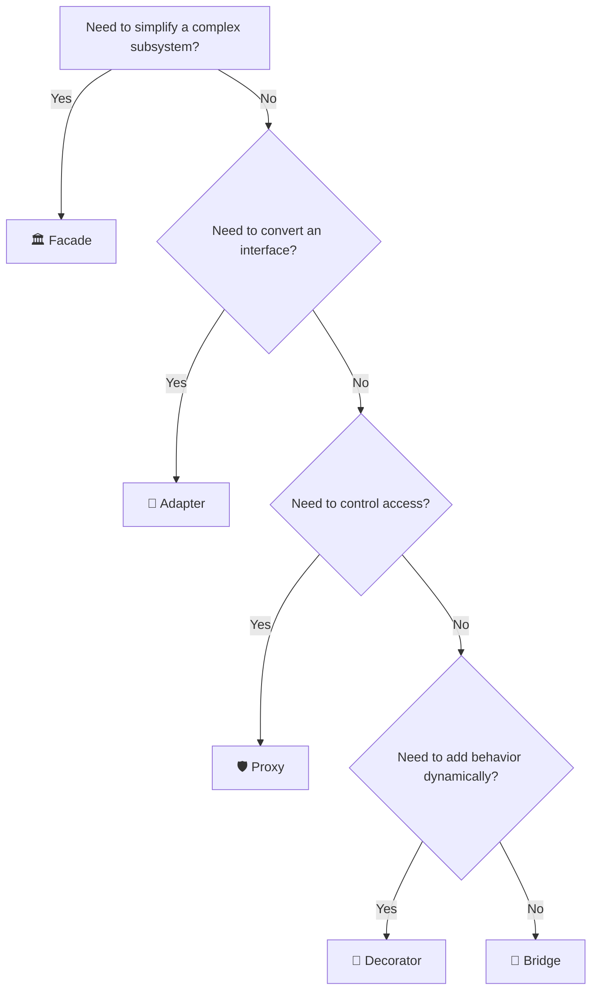

# 🏛 Facade Design Pattern

> **Part of the Design Patterns Handbook**  
> **Category:** Structural Pattern  
> **Difficulty:** ⭐⭐⭐☆☆  
> **Interview Importance:** ⭐⭐⭐⭐⭐

---

# 📚 Design Pattern Navigation

| Previous | Current | Next |
|----------|----------|------|
| ⬅️ Adapter Pattern | **Facade Pattern** | ➡️ Proxy Pattern |

---

# 📖 Table of Contents

- 🎯 What is Facade Pattern?
- 🤔 Problem Statement
- 🌍 Real World Analogy
- 🧠 Principle of Least Knowledge
- 🏗 Structure
- 🔄 Runtime Flow
- 💻 C# Example
- 💻 C++ Example
- 🎯 Recognition Clues
- 💡 Memory Tricks

---

# 🎯 What is Facade Pattern?

The **Facade Design Pattern** provides a **single simplified interface** to a complex subsystem.

Instead of interacting with many classes directly,

the client communicates with **one Facade object**.

Think of it as

> **A Reception Desk in a Hotel**

Instead of talking to

- Housekeeping
- Restaurant
- Laundry
- Security
- Maintenance

you simply call

> Reception

The reception coordinates everything for you.

---

# 🤔 Problem Statement

Imagine building a Home Theater.

To watch a movie,

the client must do:

```text
Turn on TV

↓

Turn on Sound System

↓

Turn on Projector

↓

Dim Lights

↓

Start Streaming Device
```

The client now depends on **five different classes**.

Problems:

- Tight Coupling
- Complex API
- Difficult to maintain
- Difficult to use

---

# 🌍 Real World Analogy

Imagine booking a vacation.

Without a Facade:

```text
Book Flight

↓

Book Hotel

↓

Book Taxi

↓

Book Travel Insurance

↓

Book Activities
```

With a Travel Agency (Facade):

```text
Travel Agency

↓

Everything Done
```

The agency coordinates all underlying services.

---

# 🧠 Principle of Least Knowledge (Law of Demeter)

One of the strongest interview topics related to Facade.

## Definition

> **A class should know as little as possible about other classes.**

In simple words:

> **Talk only to your immediate friends.**

Avoid chains like:

```text
Customer

↓

Order

↓

Payment

↓

Gateway

↓

Bank

↓

Network
```

Instead:

```text
Customer

↓

CheckoutFacade
```

The facade hides the complexity.

---

## Why?

Benefits:

- Lower coupling
- Easier maintenance
- Better readability
- Easier testing

---

# 🏗 Architecture



Notice

The client only knows

the Facade.

---

# 🔄 Runtime Flow



---

# 💻 C# Example

```csharp
class TV
{
    public void On() => Console.WriteLine("TV ON");
}

class SoundSystem
{
    public void On() => Console.WriteLine("Sound ON");
}

class Projector
{
    public void On() => Console.WriteLine("Projector ON");
}

class HomeTheaterFacade
{
    private readonly TV tv = new();
    private readonly SoundSystem sound = new();
    private readonly Projector projector = new();

    public void WatchMovie()
    {
        tv.On();
        sound.On();
        projector.On();

        Console.WriteLine("Movie Started");
    }
}

class Program
{
    static void Main()
    {
        var theater = new HomeTheaterFacade();

        theater.WatchMovie();
    }
}
```

---

## Output

```text
TV ON

Sound ON

Projector ON

Movie Started
```

---

# 💻 C++ Example

```cpp
#include <iostream>
using namespace std;

class TV
{
public:
    void On()
    {
        cout << "TV ON\n";
    }
};

class SoundSystem
{
public:
    void On()
    {
        cout << "Sound ON\n";
    }
};

class Projector
{
public:
    void On()
    {
        cout << "Projector ON\n";
    }
};

class HomeTheaterFacade
{
    TV tv;
    SoundSystem sound;
    Projector projector;

public:

    void WatchMovie()
    {
        tv.On();
        sound.On();
        projector.On();

        cout << "Movie Started\n";
    }
};

int main()
{
    HomeTheaterFacade theater;

    theater.WatchMovie();
}
```

---

# 🎯 How to Recognize Facade Pattern

Look for phrases like:

- Simplified API
- Hide complexity
- One entry point
- Wrapper around subsystem
- Easy-to-use interface
- Encapsulate multiple services

If you hear these,

think

> **Facade Pattern**

---

# 💡 Memory Trick

```text
Facade

=

Reception Desk

↓

One Person

↓

Many Departments
```

---

Another way

```text
Client

↓

Facade

↓

Complex System
```

---

# ⚡ 30-Second Revision

| Question | Answer |
|----------|--------|
| Purpose | Simplify complex subsystem |
| Category | Structural |
| Creates Objects? | ❌ No |
| Wraps Existing Classes? | ✅ Yes |
| Main Benefit | Reduced Complexity |
| Main Principle | Principle of Least Knowledge |

---

# 📌 What's Next?

In **Part 2**, we'll build production examples:

- 🎬 Home Theater (Complete GoF Example)
- 💳 Payment Gateway
- 🛒 E-Commerce Checkout
- 🏦 Banking System
- 🚗 Car Engine
- 🌐 ASP.NET Core Example
- ☕ Spring Boot Example
- Advantages & Disadvantages

# 🏛 Facade Design Pattern (Part 2)

> Continue from **Facade Design Pattern (Part 1)**

---

# 📖 Table of Contents

- 🎬 Home Theater (GoF Example)
- 🛒 E-Commerce Checkout
- 💳 Payment Processing
- 🏦 Banking System
- 🚗 Car Engine
- 🌐 ASP.NET Core Example
- ☕ Spring Boot Example
- ✅ Advantages
- ❌ Disadvantages
- 💡 Best Practices

---

# 🎬 Example 1 — Home Theater (GoF Example)

This is the classic example from the **Gang of Four (GoF)** book.

Without a Facade, the client has to control every device manually.

```text
Turn On TV

↓

Turn On Projector

↓

Turn On Sound System

↓

Dim Lights

↓

Start Streaming Device
```

With Facade

```text
WatchMovie()

↓

Everything Starts Automatically
```

---

## 🏗 Architecture



---

# 🛒 Example 2 — E-Commerce Checkout

Imagine Amazon Checkout.

Without Facade

```text
Validate Cart

↓

Reserve Inventory

↓

Process Payment

↓

Create Order

↓

Generate Invoice

↓

Send Email

↓

Notify Warehouse
```

Client needs to call every service.

---

With Facade

```text
CheckoutFacade.PlaceOrder()
```

Everything happens automatically.

---

## Runtime Flow



---

## C# Example

```csharp
class CheckoutFacade
{
    public void PlaceOrder()
    {
        Console.WriteLine("Reserve Inventory");

        Console.WriteLine("Process Payment");

        Console.WriteLine("Create Order");

        Console.WriteLine("Generate Invoice");

        Console.WriteLine("Send Confirmation Email");
    }
}
```

Client

```csharp
var checkout = new CheckoutFacade();

checkout.PlaceOrder();
```

---

# 💳 Example 3 — Payment Processing

Suppose your application supports:

- Stripe
- Razorpay
- PayPal

Without Facade

```text
Validate User

↓

Choose Gateway

↓

Charge Card

↓

Store Transaction

↓

Generate Receipt

↓

Send Email
```

With

```text
PaymentFacade.Pay()
```

---

Architecture



---

# 🏦 Example 4 — Banking System

Customer requests

Transfer Money.

Without Facade

```text
Validate User

↓

Check Balance

↓

Debit Account

↓

Credit Account

↓

Save Transaction

↓

Send SMS

↓

Send Email
```

---

With Facade

```text
BankingFacade.TransferMoney()
```

---

Runtime



---

# 🚗 Example 5 — Car Engine

Driver only turns the key.

Internally

```text
Fuel Pump

↓

Battery

↓

Ignition

↓

Starter

↓

Engine
```

The driver interacts with

```text
Start()
```

This is a Facade.

---

# 🌐 ASP.NET Core Example

A typical Controller shouldn't know every service.

Bad

```text
Controller

↓

Payment

↓

Inventory

↓

Email

↓

Invoice

↓

Order

↓

Logger
```

Better

```text
Controller

↓

CheckoutFacade
```

---

Example

```csharp
public class CheckoutController : ControllerBase
{
    private readonly CheckoutFacade _facade;

    public CheckoutController(CheckoutFacade facade)
    {
        _facade = facade;
    }

    [HttpPost]
    public IActionResult Checkout()
    {
        _facade.PlaceOrder();

        return Ok();
    }
}
```

---

# ☕ Spring Boot Example

Instead of

Controller

↓

Five Services

Use

```text
CheckoutFacade
```

```java
@RestController
public class CheckoutController
{
    @Autowired

    CheckoutFacade facade;

    @PostMapping("/checkout")

    public void checkout()
    {
        facade.placeOrder();
    }
}
```

---

# ✅ Advantages

| Advantage | Why it Matters |
|------------|----------------|
| Simpler API | Easier to use |
| Lower Coupling | Client knows less |
| Better Readability | One entry point |
| Easier Maintenance | Hide subsystem changes |
| Better Testing | Mock one facade instead of many services |

---

# ❌ Disadvantages

| Disadvantage | Explanation |
|--------------|-------------|
| Can Become God Object | If it owns too many responsibilities |
| May Hide Useful Features | Advanced subsystem features may not be exposed |
| Extra Layer | Additional abstraction |

---

# 💡 Best Practices

## ✅ Keep Facades Focused

Good

```text
CheckoutFacade

PaymentFacade

NotificationFacade
```

Bad

```text
ApplicationFacade
```

that controls everything.

---

## ✅ Don't Put Business Logic Inside Facade

Facade should

coordinate,

not

implement business rules.

---

Good

```text
Facade

↓

PaymentService

↓

OrderService
```

Bad

```text
Facade

↓

Entire Business Logic
```

---

## ✅ Use Dependency Injection

Instead of

```csharp
new PaymentService();
```

Inject dependencies.

Makes testing easier.

---

## ✅ Facade Should Be Optional

Advanced users

should still be able

to access

subsystem classes directly

if required.

---

# 🧠 Recognition Clues

If you hear

- One entry point
- Hide subsystem
- Simplify API
- Wrapper around services
- Reduce client complexity

Think

```
Facade Pattern
```

---

# ⚡ 30-Second Revision

Remember

```
Client

↓

Facade

↓

Subsystem
```

Facade coordinates.

Subsystem performs the work.

---

# 📌 What's Next?

In **Part 3**, we'll cover:

- 🆚 Facade vs Adapter
- 🆚 Facade vs Proxy
- 🆚 Facade vs Mediator
- 🆚 Facade vs Abstract Factory
- 🧠 Principle of Least Knowledge (Deep Dive)
- 🏆 SOLID Mapping
- ⚠️ Common Mistakes
- 🎤 FAANG Interview Questions
- 🚀 One-Page Revision

# 🏛 Facade Design Pattern (Part 3)

> Continue from **Facade Design Pattern (Part 2)**

---

# 📖 Table of Contents

- 🧠 Principle of Least Knowledge (Law of Demeter)
- 🆚 Facade vs Adapter
- 🆚 Facade vs Proxy
- 🆚 Facade vs Mediator
- 🆚 Facade vs Abstract Factory
- 📊 Structural Pattern Comparison Matrix
- 🏆 SOLID Principle Mapping
- ⚠️ Common Mistakes
- 🎤 FAANG Interview Questions
- 🎯 Pattern Recognition Tree
- ⚡ One-Page Revision

---

# 🧠 Principle of Least Knowledge (Law of Demeter)

One of the most important principles associated with the Facade Pattern.

Also known as:

> **Law of Demeter (LoD)**

---

## Definition

> **A class should communicate only with its immediate collaborators and should know as little as possible about the internal structure of other objects.**

A simpler way to remember it:

> **"Talk only to your immediate friends."**

---

## ❌ Violating the Principle

Imagine an e-commerce application.

```text
Customer

↓

Order

↓

Payment

↓

Gateway

↓

Bank

↓

Network
```

The customer knows too much.

Every subsystem becomes tightly coupled.

If the payment gateway changes,

many classes must also change.

---

## ✅ Following the Principle

```text
Customer

↓

CheckoutFacade
```

The facade handles:

- Payment
- Inventory
- Order
- Invoice
- Email

The client doesn't know how the work gets done.

---

## Mermaid Example



---

## Benefits

| Benefit | Why it Matters |
|----------|----------------|
| Lower Coupling | Easier maintenance |
| Better Encapsulation | Internal changes stay hidden |
| Better Readability | Simpler client code |
| Easier Testing | Mock one facade instead of many services |

---

# 🆚 Facade vs Adapter

One of the most common interview questions.

| Facade | Adapter |
|---------|----------|
| Simplifies an existing subsystem | Converts one interface into another |
| Client gets a simpler API | Client gets a compatible API |
| Doesn't change subsystem interface | Changes interface |
| Focus = Simplicity | Focus = Compatibility |

---

## Facade

```text
Customer

↓

CheckoutFacade

↓

Inventory

↓

Payment

↓

Email
```

Goal

Simplify usage.

---

## Adapter

```text
Application

↓

PaymentAdapter

↓

Stripe SDK
```

Goal

Convert incompatible interfaces.

---

## Interview Trick

If you hear

> "Hide complexity"

Think

```
Facade
```

If you hear

> "Convert interface"

Think

```
Adapter
```

---

# 🆚 Facade vs Proxy

| Facade | Proxy |
|---------|-------|
| Simplifies subsystem | Controls access |
| Usually calls many objects | Usually wraps one object |
| Improves usability | Adds authorization, caching, lazy loading |

---

Facade

```text
CheckoutFacade

↓

Payment

Inventory

Email
```

Proxy

```text
ImageProxy

↓

RealImage
```

Proxy decides

whether

access should happen.

Facade doesn't.

---

# 🆚 Facade vs Mediator

This comparison confuses many developers.

| Facade | Mediator |
|---------|----------|
| Client communicates with one facade | Objects communicate through mediator |
| Simplifies subsystem | Coordinates object interactions |
| One-way interaction | Two-way collaboration |

---

Facade

```text
Client

↓

Facade

↓

Subsystem
```

Mediator

```text
Object A

↓

Mediator

↓

Object B

↓

Object C
```

Mediator manages communication

between peers.

Facade manages access

to a subsystem.

---

# 🆚 Facade vs Abstract Factory

| Facade | Abstract Factory |
|---------|------------------|
| Uses existing objects | Creates related objects |
| Structural Pattern | Creational Pattern |
| Simplifies API | Creates families of objects |

---

Facade

```text
CheckoutFacade

↓

Payment

Inventory

Email
```

---

Abstract Factory

```text
WindowsFactory

↓

Button

Checkbox

Textbox
```

---

# 📊 Structural Pattern Comparison Matrix

| Pattern | Primary Purpose | Changes Interface | Controls Access | Adds Behavior | Simplifies Complexity |
|----------|-----------------|------------------|-----------------|---------------|----------------------|
| 🏛 Facade | Simplify subsystem | ❌ | ❌ | ❌ | ✅ |
| 🔌 Adapter | Convert interface | ✅ | ❌ | ❌ | ❌ |
| 🛡 Proxy | Control access | ❌ | ✅ | ❌ | ❌ |
| 🎨 Decorator | Add responsibilities | ❌ | ❌ | ✅ | ❌ |
| 🌉 Bridge | Separate abstraction & implementation | ❌ | ❌ | ❌ | ❌ |

---

# 🏆 SOLID Principle Mapping

## ✅ Single Responsibility Principle (SRP)

Facade should only coordinate subsystem interactions.

It should **not** implement business logic.

---

## ✅ Open/Closed Principle (OCP)

New subsystem services can often be added

without changing client code.

---

## ✅ Dependency Inversion Principle (DIP)

Facade should depend on interfaces,

not concrete implementations.

Example:

```text
CheckoutFacade

↓

IPaymentService

↓

StripePaymentService
```

---

# ⚠️ Common Mistakes

## ❌ Turning the Facade into a God Object

Bad

```text
ApplicationFacade

↓

Everything
```

Good

```text
CheckoutFacade

PaymentFacade

NotificationFacade
```

Each facade should have one responsibility.

---

## ❌ Putting Business Logic in the Facade

Wrong

```text
Facade

↓

Calculates Tax

Processes Discount

Creates Invoice

Stores Data
```

Facade should coordinate,

not own business rules.

---

## ❌ Thinking Facade Hides Objects Completely

Subsystem classes can still exist.

Advanced users

may bypass the facade

when needed.

---

## ❌ Confusing Facade with Adapter

Remember:

Facade

```
Simplifies
```

Adapter

```
Converts
```

---

# 🎤 FAANG Interview Questions

### Q1. What problem does the Facade Pattern solve?

It provides a single simplified interface to a complex subsystem, reducing client complexity and coupling.

---

### Q2. Does the Facade Pattern hide the subsystem?

No.

It **simplifies access** to the subsystem.

The subsystem is still available if direct access is needed.

---

### Q3. Can a system have multiple facades?

✅ Yes.

Examples:

- CheckoutFacade
- PaymentFacade
- NotificationFacade
- ReportingFacade

---

### Q4. Does Facade violate SRP?

No,

as long as it only coordinates subsystem interactions.

It violates SRP only if business logic is moved into the facade.

---

### Q5. Is Facade a wrapper?

Yes,

but its purpose is to simplify access,

not change behavior or interface.

---

### Q6. Which principle is closely related to Facade?

**Principle of Least Knowledge (Law of Demeter).**

---

# 🎯 Pattern Recognition Tree



---

# 🧠 Memory Tricks

## Facade

Think

```text
Reception Desk

↓

One Contact

↓

Many Departments
```

---

## Adapter

Think

```text
Travel Plug Adapter

↓

Convert Interface
```

---

## Proxy

Think

```text
Security Guard

↓

Control Access
```

---

## Decorator

Think

```text
Gift Wrapping

↓

Add Features
```

---

# ⚡ One-Page Revision

| Question | Answer |
|----------|--------|
| Category | Structural |
| Purpose | Simplify subsystem |
| Main Principle | Law of Demeter |
| Changes Interface? | ❌ No |
| Controls Access? | ❌ No |
| Adds Behavior? | ❌ No |
| Main Benefit | Lower Coupling & Simpler API |

---

## Golden Rule

> **Facade hides complexity, not functionality.**

It makes a complex subsystem **easier to use**, while still allowing direct access to subsystem classes when necessary.

---

# 🏁 Final Interview Formula

```text
Need to hide complexity?

↓

Facade

Need to convert interfaces?

↓

Adapter

Need to control access?

↓

Proxy

Need to add behavior?

↓

Decorator

Need to separate abstraction from implementation?

↓

Bridge
```

---

# 🎯 Pattern Recognition (30 Seconds)

If you hear:

- One entry point
- Simplified API
- Wrapper around multiple services
- Hide subsystem complexity
- CheckoutFacade
- BankingFacade
- HomeTheaterFacade

👉 Think **Facade Pattern**.