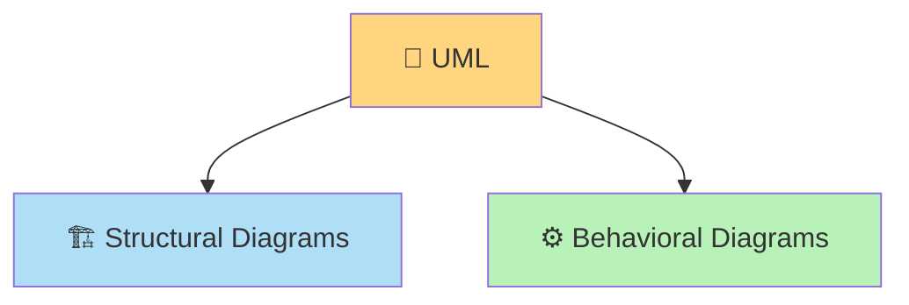
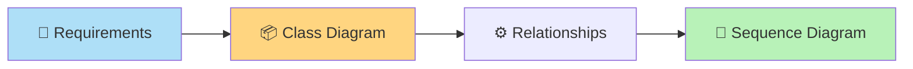
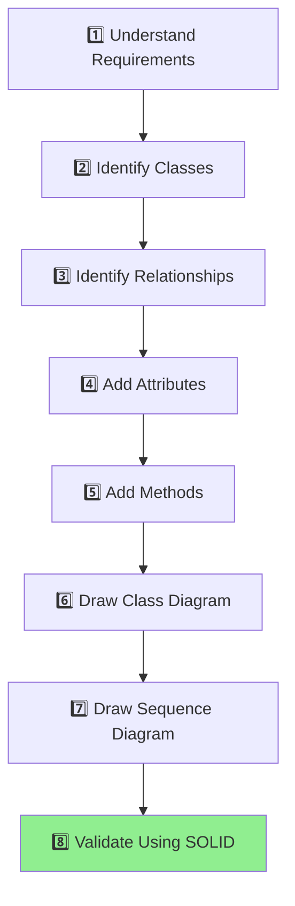

# 📘 UML Fundamentals

> **Part 1 of the UML Handbook**
> **Difficulty:** ⭐☆☆☆☆
> **Interview Importance:** ⭐⭐⭐⭐⭐

---

## 📚 UML Handbook Navigation

| Previous  | Current                   | Next                                         |
| --------- | ------------------------- | -------------------------------------------- |
| 🏠 README | **01 - UML Fundamentals** | ➡️ [02 - Class Diagram](02-Class-Diagram.md) |

---

# 📖 Table of Contents

* 🎯 What is UML?
* 🤔 Why UML Exists?
* 🏢 Why Companies Use UML
* 🧩 UML Categories
* 📊 Most Important UML Diagrams for Interviews
* 🛠 UML vs Other Diagrams
* 🎯 When Interviewers Expect UML
* 🧠 UML Development Workflow
* 📋 UML Cheat Sheet
* ❓ Frequently Asked Questions
* ⚡ 30-Second Revision
* 🚀 Interview Cheat Sheet

---

# 🎯 What is UML?

**UML (Unified Modeling Language)** is a **standard visual language** used to **design, communicate, and document software systems**.

Instead of explaining a system using only text, UML represents it using diagrams that are easier to understand.

Think of UML as the **blueprint of software**, just like architects create blueprints before constructing a building.

---

## 🏠 Real-Life Analogy

Imagine building a house.

Before construction begins, the architect creates a blueprint showing:

* Rooms
* Doors
* Windows
* Electrical wiring
* Plumbing

The blueprint helps everyone understand the design before construction starts.

Software engineers use UML for the same reason.

```text
House Blueprint
        │
        ▼
House

Software UML
        │
        ▼
Software
```

---

# 🤔 Why UML Exists?

Without UML, developers often explain systems only with words.

Example:

> "User sends a request to the server, which validates authentication, checks the database, processes the order, and sends a response."

Now imagine explaining a system with:

* 200 classes
* 15 services
* 8 databases
* 5 microservices

Text quickly becomes difficult to understand.

UML solves this by making the design visual.

---

# 🏢 Why Companies Use UML

Large companies use UML because software is built by teams, not individuals.

Benefits:

* 📖 Better communication between developers
* 🤝 Easier collaboration
* 📝 Better documentation
* 🏗 Better Low-Level Design discussions
* 🐞 Easier debugging and maintenance
* 🚀 Faster onboarding of new developers

---

## 🌍 Real Industry Usage

Although teams may not always draw formal UML diagrams every day, the concepts behind UML are widely used.

| Company   | Typical Usage                         |
| --------- | ------------------------------------- |
| Amazon    | LLD discussions, architecture reviews |
| Microsoft | Enterprise application design         |
| Google    | Design documents and system reviews   |
| Uber      | Service interaction modeling          |
| Netflix   | Architecture communication            |
| Atlassian | Technical design documentation        |

> [!NOTE]
> In interviews, UML is primarily a **communication tool**, not an artistic exercise.

---

# 🧩 UML Categories

UML diagrams are broadly divided into two categories.



---

## 🏗 Structural Diagrams

These describe **how the system is organized**.

Examples:

* Class Diagram
* Component Diagram
* Deployment Diagram
* Package Diagram

Think:

> **Structure = Static View**

---

## ⚙ Behavioral Diagrams

These describe **how the system behaves**.

Examples:

* Sequence Diagram
* Activity Diagram
* State Diagram
* Use Case Diagram

Think:

> **Behavior = Dynamic View**

---

# 📊 UML Diagrams by Interview Importance

| Diagram                | Importance | Asked In Interviews        |
| ---------------------- | ---------- | -------------------------- |
| ⭐⭐⭐⭐⭐ Class Diagram    | Essential  | Every LLD interview        |
| ⭐⭐⭐⭐⭐ Sequence Diagram | Essential  | Every LLD interview        |
| ⭐⭐⭐⭐ Activity Diagram  | Common     | Workflow discussions       |
| ⭐⭐⭐ State Diagram      | Moderate   | Stateful systems           |
| ⭐⭐⭐ Component Diagram  | Moderate   | Architecture discussions   |
| ⭐⭐ Use Case Diagram    | Occasional | Requirement gathering      |
| ⭐ Deployment Diagram   | Rare       | Infrastructure discussions |

> 🎯 **Focus first on Class and Sequence Diagrams.** They appear in almost every Low-Level Design interview.

---

# 🛠 UML vs Other Diagrams

| Diagram              | Purpose                                    |
| -------------------- | ------------------------------------------ |
| UML Class Diagram    | Shows classes and relationships            |
| UML Sequence Diagram | Shows runtime interactions                 |
| Flowchart            | Shows algorithm or process flow            |
| ER Diagram           | Models database entities and relationships |
| Architecture Diagram | High-level system components               |
| Wireframe            | UI layout                                  |

---

# 🎯 When Interviewers Expect UML

During an LLD interview, interviewers often ask you to design systems such as:

* Parking Lot
* Library Management
* BookMyShow
* Chess
* Elevator
* Food Delivery
* Splitwise
* ATM

The expected workflow is usually:



---

# 🧠 UML Development Workflow

Whenever you're asked to design a system, follow this approach.



> 💡 This workflow works for almost every LLD interview.

---

# 📋 UML Cheat Sheet

| Topic                   | Remember                          |
| ----------------------- | --------------------------------- |
| UML                     | Unified Modeling Language         |
| Purpose                 | Visualize software design         |
| Most Important Diagrams | Class & Sequence                  |
| Structural              | Static view                       |
| Behavioral              | Dynamic view                      |
| Used In                 | LLD, documentation, communication |

---

# ❓ Frequently Asked Questions

## Q1. Is UML a programming language?

No.

It is a **modeling language**, not a programming language.

---

## Q2. Is UML mandatory in software development?

No.

But understanding UML concepts makes designing and communicating systems much easier.

---

## Q3. Which UML diagrams are most important for interviews?

1. ✅ Class Diagram
2. ✅ Sequence Diagram

These two cover the majority of LLD interview discussions.

---

## Q4. Do FAANG companies expect perfect UML syntax?

No.

They care more about:

* Correct design
* Relationships
* Communication
* Object interactions

than perfectly drawn boxes.

---

# ⚡ 30-Second Revision

| Item       | Remember                         |
| ---------- | -------------------------------- |
| UML        | Unified Modeling Language        |
| Purpose    | Visualize software design        |
| Structural | Static                           |
| Behavioral | Dynamic                          |
| Most Asked | Class Diagram & Sequence Diagram |
| Used In    | LLD Interviews                   |

---

# 🚀 Interview Cheat Sheet

If you're asked to design any system:

```text
✔ Understand requirements

↓

✔ Identify classes

↓

✔ Define relationships

↓

✔ Draw Class Diagram

↓

✔ Explain runtime using Sequence Diagram

↓

✔ Verify SOLID principles
```

This simple process is enough to handle most Low-Level Design interviews confidently.

---

# 📖 What's Next?

In the next chapter, you'll learn:

* 📦 How to draw Class Diagrams
* 🔗 Relationships (Association, Aggregation, Composition, Dependency, Inheritance)
* 🔢 Multiplicity
* 👁 Visibility
* 🏗 Real-world examples (Library, Parking Lot, E-Commerce)
* 🎯 Interview tips and common mistakes

➡️ **Continue to:** **[02-Class-Diagram.md](02-Class-Diagram.md)**

---

## 📚 UML Handbook Navigation

| Previous  | Current                   | Next                                         |
| --------- | ------------------------- | -------------------------------------------- |
| 🏠 README | **01 - UML Fundamentals** | ➡️ [02 - Class Diagram](02-Class-Diagram.md) |
