# 📦 UML Class Diagram

> **Part 2 of the UML Handbook**
> **Difficulty:** ⭐⭐⭐⭐☆
> **Interview Importance:** ⭐⭐⭐⭐⭐

---

# 📚 UML Handbook Navigation

| Previous                                         | Current              | Next                                             |
| ------------------------------------------------ | -------------------- | ------------------------------------------------ |
| ⬅️ [01-UML Fundamentals](01-UML-Fundamentals.md) | **02-Class Diagram** | ➡️ [03-Sequence Diagram](03-Sequence-Diagram.md) |

---

# 📖 Table of Contents

* 🎯 What is a Class Diagram?
* 💡 Why Interviewers Love It
* 🧠 How to Think Before Drawing
* 🏗 Anatomy of a Class
* 👁 Visibility Modifiers
* 🏷 Attributes & Methods
* 📚 Interfaces vs Abstract Classes
* 📦 Packages
* 🔢 Multiplicity
* 🧠 Identifying Classes from Requirements
* 🏗 Step-by-Step Process
* 📖 Library Management Example
* ⚡ Quick Revision

---

# 🎯 What is a Class Diagram?

A **Class Diagram** is a **Structural UML Diagram** that represents the **static structure** of a system.

It describes:

* 📦 Classes
* 🏷 Attributes
* ⚙ Methods
* 🔗 Relationships
* 👁 Visibility
* 🔢 Multiplicity

Think of it as the **blueprint of your code**.

Unlike a Sequence Diagram, it **does not show execution flow**.

---

# 💡 Why Interviewers Love Class Diagrams

In almost every LLD interview, the interviewer wants to evaluate:

* Can you identify the right classes?
* Can you model relationships correctly?
* Can you design maintainable code?
* Do you understand OOP?
* Do you follow SOLID principles?

That's why the Class Diagram is often the **first diagram** you'll draw.

---

# 🧠 Interview Thought Process

> [!IMPORTANT]
> **Never start drawing boxes immediately.**

Follow this order:

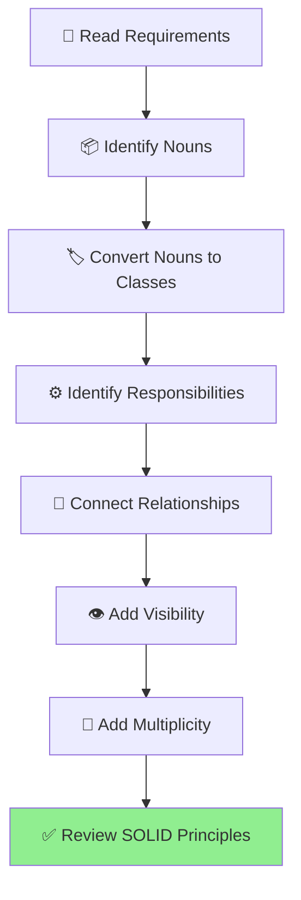

---

# 📦 Anatomy of a UML Class

Every UML class has **three sections**.

```text
+----------------------------+
|        Class Name          |
+----------------------------+
| - attributes               |
| - variables                |
+----------------------------+
| + methods()                |
| + operations()             |
+----------------------------+
```

Example

```text
+-----------------------------+
|          User               |
+-----------------------------+
| - id : int                  |
| - name : string             |
| - email : string            |
+-----------------------------+
| + Login()                   |
| + Logout()                  |
+-----------------------------+
```

---

# 👁 Visibility Modifiers

| Symbol | Meaning            | Access                               |
| ------ | ------------------ | ------------------------------------ |
| **+**  | Public             | Accessible everywhere                |
| **-**  | Private            | Accessible only inside the class     |
| **#**  | Protected          | Accessible in derived classes        |
| **~**  | Package / Internal | Accessible within the package/module |

---

## Example

```text
+-----------------------------+
|           Car               |
+-----------------------------+
| - engine                    |
| - speed                     |
| # mileage                   |
+-----------------------------+
| + Start()                   |
| + Stop()                    |
+-----------------------------+
```

---

# 🏷 Attributes

Attributes represent the **state** of an object.

Example:

```text
User

↓

Id

Name

Email

Password
```

UML notation:

```text
- name : string

- age : int

- salary : decimal
```

---

# ⚙ Methods

Methods represent the **behavior** of an object.

```text
+ Login()

+ Logout()

+ Register()
```

With parameters:

```text
+ Transfer(amount : decimal)

+ Withdraw(amount : decimal)
```

Return type:

```text
+ GetBalance() : decimal
```

---

# 📚 Interface vs Abstract Class

Interviewers frequently ask this.

## Interface

Contains **behavior contract**.

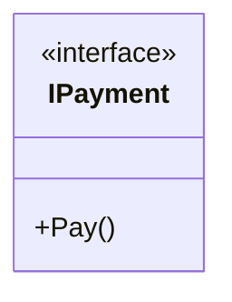

---

## Abstract Class

Contains:

* Abstract methods
* Concrete methods
* State (fields)

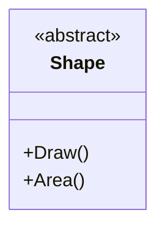

---

## Quick Comparison

| Interface            | Abstract Class                 |
| -------------------- | ------------------------------ |
| Contract             | Partial implementation         |
| No state (generally) | Can have state                 |
| Multiple interfaces  | Single inheritance (C# / Java) |
| "Can Do"             | "Is A" base                    |

---

# 📦 Packages

Large systems group related classes into packages/modules.

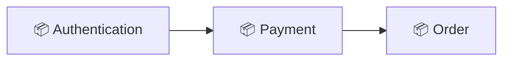

Packages improve organization and modularity.

---

# 🔢 Multiplicity

Multiplicity tells **how many objects participate** in a relationship.

| Symbol | Meaning      |
| ------ | ------------ |
| 1      | Exactly one  |
| 0..1   | Zero or one  |
| *      | Many         |
| 1..*   | One or many  |
| 0..*   | Zero or many |

---

## Example

One customer can place many orders.

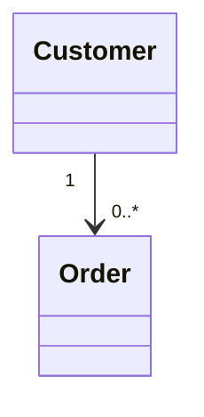

---

Another example

One library has many books.

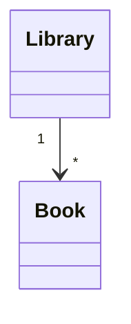

---

# 🧠 Identifying Classes from Requirements

This is where many candidates struggle.

Suppose the interviewer says:

> Design a Library Management System.

Read the requirements carefully.

```
A library has books.

Members borrow books.

A librarian manages books.

Books belong to categories.
```

### Step 1 — Identify Nouns

| Requirement | Possible Class |
| ----------- | -------------- |
| Library     | ✅ Library      |
| Book        | ✅ Book         |
| Member      | ✅ Member       |
| Librarian   | ✅ Librarian    |
| Category    | ✅ Category     |

Nouns usually become classes.

---

### Step 2 — Identify Responsibilities

Book

* Borrow
* Return

Member

* BorrowBook()
* ReturnBook()

Library

* AddBook()
* RemoveBook()

Responsibilities become methods.

---

# 🏗 Step-by-Step Class Diagram Process

Whenever you face an interview question:

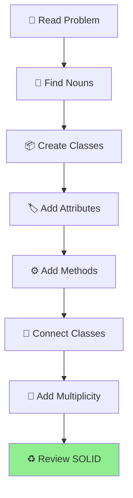

---

# 📖 Example — Library Management

Requirements:

* Library stores books.
* Members borrow books.
* Librarian manages books.

Possible classes:

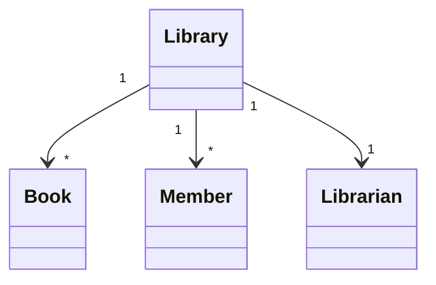

At this stage, **don't overthink the relationships**.

We'll study **Association, Aggregation, Composition, Dependency, and Inheritance** in the next chapter.

---

# 💡 Interview Tips

> [!TIP]
> **Don't start with relationships.**
>
> Start with classes first.
>
> Most candidates do the opposite.

---

> [!IMPORTANT]
> Your first draft doesn't need to be perfect.
>
> Interviewers care more about your thought process than a flawless diagram.

---

# ⚡ 30-Second Revision

| Remember                        | Why                     |
| ------------------------------- | ----------------------- |
| Class Diagram = Static View     | Structure               |
| Sequence Diagram = Dynamic View | Runtime                 |
| Nouns → Classes                 | Interview trick         |
| Verbs → Methods                 | Responsibilities        |
| Multiplicity                    | Number of relationships |
| Interfaces                      | Contracts               |
| Abstract Classes                | Shared implementation   |

---

# 📌 What's Next?

In **Part 2**, we'll cover the **heart of Class Diagrams**:

* 🔗 Association
* 🧩 Aggregation
* 💎 Composition
* ⚡ Dependency
* 🧬 Inheritance
* Real-world examples
* Parking Lot
* E-Commerce
* Library
* Common interview mistakes

These relationships are among the **most frequently asked UML topics** in LLD interviews.

➡️ Continue with **02-Class-Diagram.md (Part 2)**.

# 🔗 UML Relationships (Part 2)

> Continue from **02-Class-Diagram.md (Part 1)**

---

# 📖 Table of Contents

- 🎯 Why Relationships Matter
- 🔗 Association
- 💎 Aggregation
- 💠 Composition
- ⚡ Dependency
- 🧬 Inheritance
- 🧩 Interface Realization
- 📊 Relationship Comparison
- 🧠 Relationship Decision Tree
- 🌍 Real Interview Examples
- ⚠️ Common Mistakes
- 💡 Memory Tricks
- ⚡ Revision Sheet

---

# 🎯 Why Relationships Matter

Once you've identified the classes, the next question is:

> **"How are these classes connected?"**

Choosing the wrong relationship can completely change your design.

Interviewers often spend **more time discussing relationships than the classes themselves.**

---

# 🧠 Relationship Decision Tree

Use this during interviews.

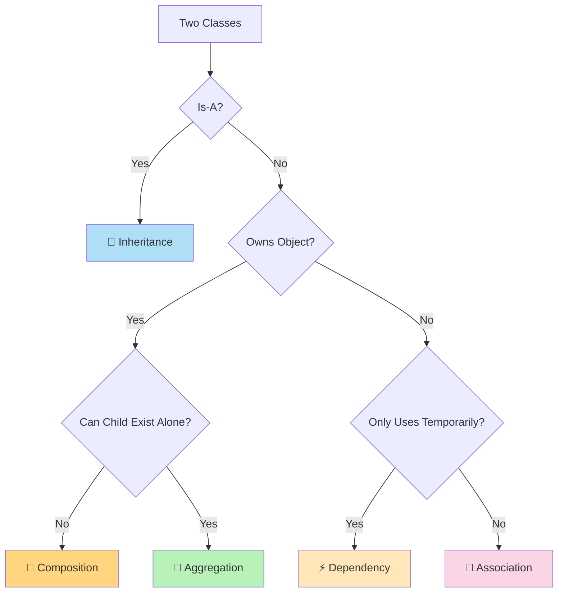

> ⭐ This decision tree alone is enough to answer most UML relationship questions.

---

# 🔗 Association

## Definition

Association means **one object knows about another object.**

Neither object owns the other.

Both can exist independently.

---

## Real World Example

```text
Teacher -------- Student
```

A teacher teaches students.

Students still exist even if the teacher leaves.

Teachers still exist without those students.

---

## UML

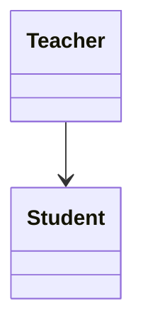

---

## Example

```cpp
class Teacher
{
    vector<Student*> students;
};
```

---

## Recognition Clues

If the interviewer says:

- knows
- uses
- communicates
- interacts

Think:

> **Association**

---

# 💎 Aggregation

## Definition

Aggregation represents a **HAS-A** relationship.

The parent owns child objects,

but the children can exist independently.

---

## Real World Example

A **Department** has Employees.

If the department closes,

employees still exist.

---

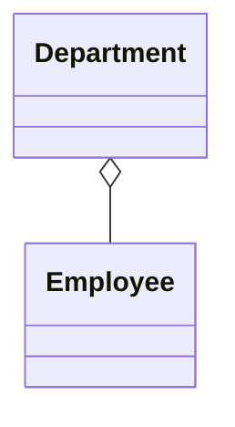

---

The **empty diamond** represents Aggregation.

---

## C++ Example

```cpp
class Department
{
    vector<Employee*> employees;
};
```

Notice

Employees are created elsewhere.

Department only stores references.

---

## Recognition Clues

Interview wording:

- Has many
- Contains
- Groups

Children survive after parent dies.

Think:

> Aggregation

---

# 💠 Composition

## Definition

Composition is also a **HAS-A** relationship,

but the child **cannot exist independently**.

Destroy the parent.

Child is also destroyed.

---

## Real World Example

A House has Rooms.

Destroy the house.

Rooms disappear.

---

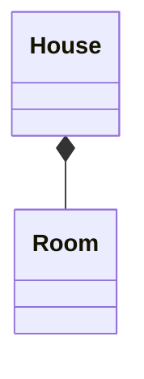

---

The **filled diamond** represents Composition.

---

## C++ Example

```cpp
class House
{
    vector<Room> rooms;
};
```

Notice

Rooms are created inside House.

---

## Recognition Clues

Interview wording:

- Part of
- Cannot exist alone
- Lifetime depends

Think

> Composition

---

# ⚡ Dependency

## Definition

Dependency means

One class **temporarily uses** another.

It does not own it.

---

## Example

```cpp
class PaymentService
{
public:

    void Pay(PaymentGateway& gateway);
};
```

PaymentService simply uses the gateway.

No ownership.

---

## UML

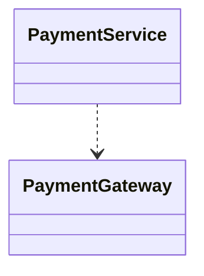

Dashed arrow

means

Dependency.

---

## Recognition Clues

Words like

- Uses
- Calls
- Temporary
- Parameter

Think

Dependency

---

# 🧬 Inheritance

## Definition

Inheritance represents

**IS-A**

relationship.

---

## Example

Dog

IS A

Animal

---

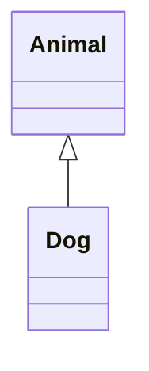

---

## C++

```cpp
class Animal {};

class Dog : public Animal {};
```

---

## Recognition Clues

Words like

- Is A
- Specialization
- Extends

Think

Inheritance

---

# 🧩 Interface Realization

A class implements an interface.

---

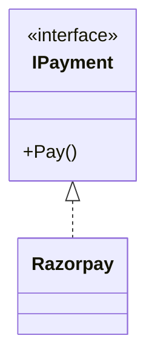

Dashed inheritance arrow.

---

# 📊 Relationship Comparison

| Relationship | Ownership | Lifetime | Keyword |
|--------------|-----------|----------|---------|
| Association | ❌ | Independent | Knows |
| Aggregation | ✅ Weak | Independent | Has-A |
| Composition | ✅ Strong | Dependent | Part-Of |
| Dependency | ❌ | Temporary | Uses |
| Inheritance | N/A | N/A | Is-A |

---

# 🌍 Real Interview Example 1

## 🚗 Parking Lot

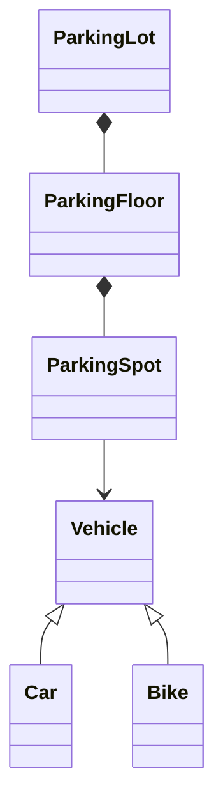

### Explanation

ParkingLot owns ParkingFloor.

ParkingFloor owns ParkingSpot.

Destroy ParkingLot.

Everything disappears.

That's Composition.

Vehicle only occupies a ParkingSpot.

That's Association.

---

# 🌍 Real Interview Example 2

## 📚 Library

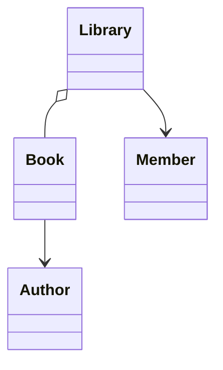

Books can exist outside one library.

Hence

Aggregation.

---

# 🌍 Real Interview Example 3

## 🛒 E-Commerce

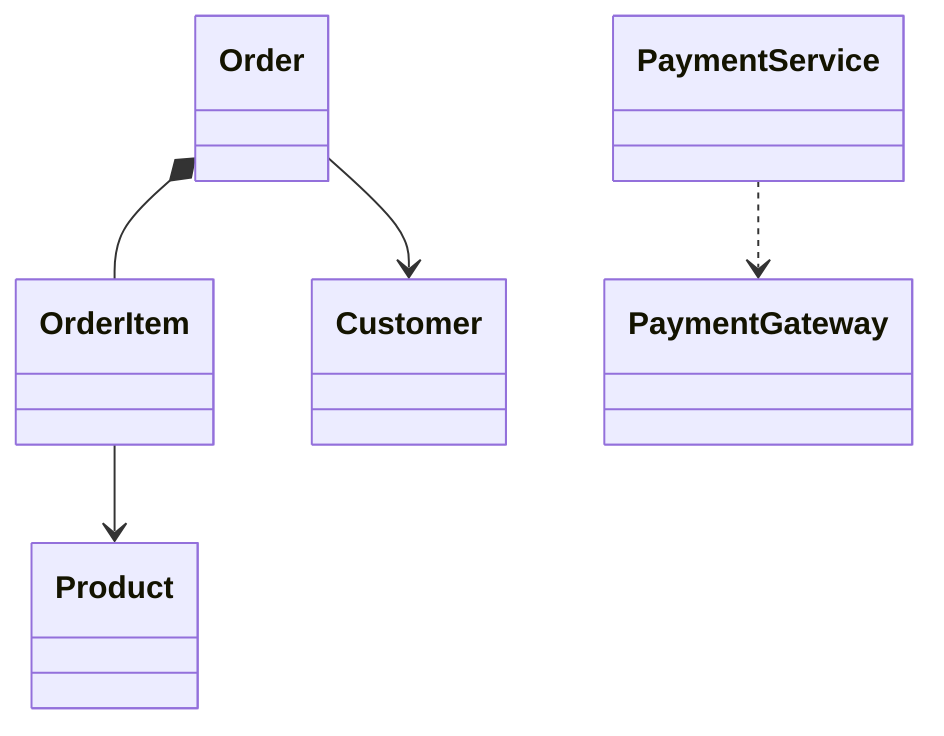

---

Explanation

Order owns OrderItems.

Delete Order.

Items disappear.

Composition.

PaymentService only calls Gateway.

Dependency.

---

# ⚠️ Common Interview Mistakes

## Mistake 1

Using Inheritance everywhere.

Wrong

```text
Customer

↓

Person

↓

Object

↓

Entity

↓

BaseEntity
```

Interviewers dislike deep inheritance trees.

Prefer composition.

---

## Mistake 2

Confusing Aggregation & Composition.

Easy trick:

Ask

```text
Parent dies.

Does child survive?
```

YES

↓

Aggregation

NO

↓

Composition

---

## Mistake 3

Making everything Association.

Not every relationship is just "knows".

Ownership matters.

---

# 💡 Memory Tricks

## Association

```text
Teacher

↓

Student
```

Knows.

---

## Aggregation

```text
Team

↓

Players
```

Players survive.

---

## Composition

```text
House

↓

Room
```

Rooms disappear.

---

## Dependency

```text
PaymentService

↓

Gateway
```

Temporary usage.

---

## Inheritance

```text
Dog

↓

Animal
```

IS-A.

---

# ⚡ 30-Second Revision

| Symbol | Meaning |
|---------|----------|
| → | Association |
| o-- | Aggregation |
| *-- | Composition |
| ..> | Dependency |
| <\|-- | Inheritance |
| <\|.. | Interface Implementation |

---

# 📌 What's Next?

In **Part 3**, we'll learn:

- 🎨 How to draw production-quality class diagrams
- 🏗 Common interview mistakes
- 🧠 Best practices
- 🎤 FAANG interview questions
- ⚡ Cheat sheet
- 📋 Practice problems
- 🚀 One-page revision guide

➡️ Continue to **02-Class-Diagram.md (Part 3)**.

# 📦 UML Class Diagram (Part 3)

> Continue from **02-Class-Diagram.md (Part 2)**

---

# 📖 Table of Contents

- 🎯 How to Draw Class Diagrams in Interviews
- 🏗 Best Practices
- ❌ Bad vs ✅ Good Design
- 🎤 FAANG Interview Tips
- ⚠️ Common Mistakes
- 🔥 Interview Questions
- 🌍 Complete Example
- 🧠 Memory Tricks
- 📊 Complete Relationship Summary
- ⚡ 30-Second Revision
- 🚀 10-Second Cheat Sheet
- 📝 Practice Problems

---

# 🎯 How to Draw a Class Diagram in an Interview

Most candidates immediately start drawing boxes.

❌ Don't do that.

Instead follow this workflow.

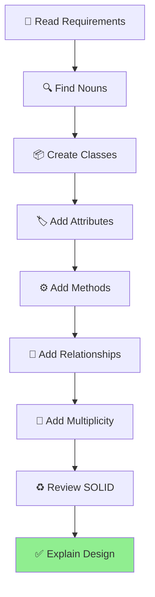

> [!IMPORTANT]
>
> Interviewers care more about **your thought process** than the final diagram.

---

# 🏗 Best Practices

## ✅ Keep Classes Focused

Good

```text
User

Order

Payment

Invoice
```

Bad

```text
SystemManager
```

that performs everything.

---

## ✅ Use Composition Over Inheritance

Instead of

```text
Vehicle

↓

Car

↓

ElectricCar

↓

Tesla

↓

Model3
```

Prefer

```text
Car

↓

Engine

↓

Battery

↓

GPS
```

Composition leads to more flexible designs.

---

## ✅ Keep Relationships Meaningful

Don't connect every class.

Each relationship should answer:

> Why do these classes know each other?

---

## ✅ Prefer Interfaces

Instead of

```text
PaymentService

↓

Stripe
```

Prefer

```text
PaymentService

↓

IPaymentGateway

↓

StripeGateway
```

Supports Dependency Inversion Principle.

---

## ✅ Think About Ownership

Before choosing:

Aggregation

or

Composition

Ask

```text
Can the child survive if the parent disappears?
```

---

# ❌ Bad vs ✅ Good Design

## ❌ Bad

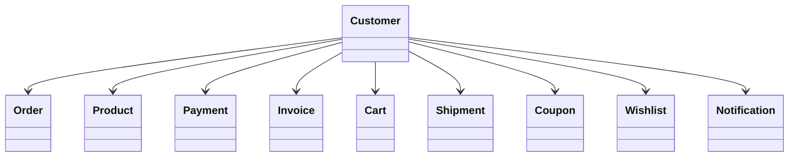

Everything depends on Customer.

This creates unnecessary coupling.

---

## ✅ Better

```mermaid
classDiagram

Customer --> Cart

Cart --> Product

Order --> Payment

Order --> Shipment

Order --> Invoice
```

Responsibilities are distributed.

---

# 🎤 Interview Tips

> [!TIP]
>
> While drawing, continuously explain your assumptions.
>
> Example:
>
> "I'm using Composition here because ParkingSpot cannot exist without ParkingFloor."

Interviewers love hearing reasoning.

---

## Think Aloud

Don't silently draw.

Instead say

```text
"I identified Book and Member
as classes because they are nouns."

"I chose Composition because
ParkingSpot cannot exist without
ParkingFloor."
```

Communication is a huge part of LLD interviews.

---

# ⚠️ Common Mistakes

## ❌ Drawing Everything

You don't need every class.

Start with

Core Classes.

---

## ❌ Ignoring Multiplicity

Instead of

```mermaid
classDiagram

Customer --> Order
```

Draw

```mermaid
classDiagram

Customer "1" --> "*" Order
```

Multiplicity communicates much more information.

---

## ❌ Missing Interfaces

Don't tightly couple services.

Wrong

```text
PaymentService

↓

StripeGateway
```

Correct

```text
PaymentService

↓

IPaymentGateway
```

---

## ❌ Deep Inheritance Trees

Avoid

```text
Animal

↓

Mammal

↓

Pet

↓

Dog

↓

GoldenRetriever

↓

Puppy
```

Interviewers generally prefer composition unless inheritance is truly justified.

---

## ❌ Wrong Relationship

Many candidates confuse

Aggregation

and

Composition.

Remember

```text
Parent dies

↓

Child survives?

↓

YES

Aggregation

NO

Composition
```

---

# 🌍 Complete Example

## Food Delivery System

```mermaid
classDiagram

Customer "1" --> "*" Order

Restaurant "1" --> "*" MenuItem

Order *-- OrderItem

Order --> Payment

DeliveryAgent --> Order

PaymentService ..> PaymentGateway

PaymentGateway <|.. StripeGateway
```

---

### Explanation

Customer places many Orders.

Restaurant owns MenuItems.

Order owns OrderItems.

PaymentService only uses PaymentGateway.

StripeGateway implements PaymentGateway.

This diagram demonstrates:

- Association
- Composition
- Dependency
- Interface Realization

All together.

---

# 💡 Interview Expectations

Interviewers usually evaluate:

| Skill | Weight |
|---------|--------|
| Correct Classes | ⭐⭐⭐⭐⭐ |
| Correct Relationships | ⭐⭐⭐⭐⭐ |
| Communication | ⭐⭐⭐⭐⭐ |
| SOLID Principles | ⭐⭐⭐⭐ |
| Perfect UML Syntax | ⭐⭐ |

Notice:

Perfect UML syntax is less important than good design.

---

# 🔥 Interview Questions

## Q1. Difference between Aggregation and Composition?

Aggregation

↓

Weak ownership

Child survives.

Composition

↓

Strong ownership

Child dies.

---

## Q2. What is Multiplicity?

It specifies

how many objects participate

in a relationship.

---

## Q3. Why use Interfaces?

To reduce coupling.

To support Dependency Inversion.

---

## Q4. How do you identify classes?

Find nouns.

Responsibilities become methods.

---

## Q5. What diagram comes after Class Diagram?

Usually

Sequence Diagram.

Static

↓

Dynamic.

---

## Q6. Which UML diagram is most important?

For LLD interviews

Class Diagram.

---

## Q7. Which relationships are most commonly asked?

- Composition
- Aggregation
- Association

Almost every interview.

---

# 🎤 FAANG Follow-Up Questions

### Why Composition over Inheritance?

Because composition

is more flexible,

supports runtime behavior,

and reduces coupling.

---

### How do SOLID principles affect Class Diagrams?

Class Diagrams should clearly show:

- SRP
- DIP
- OCP

through proper class responsibilities and abstractions.

---

### Can one class have multiple relationships?

Absolutely.

Example

Order

↓

Customer

Association

↓

OrderItem

Composition

↓

PaymentService

Dependency

---

### Should utility classes appear?

Usually no.

Focus on domain objects.

---

# 🧠 Memory Tricks

## Classes

```text
Nouns
```

---

## Methods

```text
Verbs
```

---

## Association

```text
Knows
```

---

## Aggregation

```text
Has-A

Weak
```

---

## Composition

```text
Part-Of

Strong
```

---

## Inheritance

```text
Is-A
```

---

## Dependency

```text
Uses
```

---

# 📊 Complete Relationship Summary

| Symbol | Relationship | Keyword |
|----------|--------------|----------|
| → | Association | Knows |
| o-- | Aggregation | Has-A (Weak) |
| *-- | Composition | Part-Of (Strong) |
| ..> | Dependency | Uses |
| <\|-- | Inheritance | Is-A |
| <\|.. | Interface Realization | Implements |

---

# ⚡ 30-Second Revision

```text
Read Requirements

↓

Find Nouns

↓

Create Classes

↓

Add Attributes

↓

Add Methods

↓

Connect Relationships

↓

Add Multiplicity

↓

Review SOLID
```

---

# 🚀 10-Second Interview Cheat Sheet

Remember these six words:

```text
Class

Relationship

Multiplicity

Visibility

Responsibility

SOLID
```

If you cover these six things,

your Class Diagram is usually strong enough for interviews.

---

# 📝 Practice Problems

Draw a Class Diagram for:

- 🚗 Parking Lot
- 🏦 ATM
- 📚 Library Management
- 🍕 Food Delivery
- 🏨 Hotel Management
- 🎬 BookMyShow
- 💬 WhatsApp
- 🛒 Amazon Shopping Cart
- 🚕 Uber
- 🎵 Spotify

Try identifying:

- Classes
- Attributes
- Methods
- Relationships
- Multiplicity

before drawing.

---

# 📚 Next Chapter

Now that you understand the **static structure** of a system, let's learn how objects interact **at runtime**.

➡️ Continue to:

# **03-Sequence-Diagram.md**

You'll learn:

- Lifelines
- Messages
- Activation Bars
- Sync vs Async Calls
- Authentication Flow
- Payment Flow
- REST API Calls
- Microservices Communication
- Real Interview Examples

---

# 📚 UML Handbook Navigation

| Previous | Current | Next |
|----------|----------|------|
| ⬅️ 01-UML Fundamentals | ✅ 02-Class Diagram | ➡️ 03-Sequence Diagram |

