# 🔄 UML Sequence Diagram

> **Part 3 of the UML Handbook**  
> **Difficulty:** ⭐⭐⭐⭐☆  
> **Interview Importance:** ⭐⭐⭐⭐⭐

---

# 📚 UML Handbook Navigation

| Previous | Current | Next |
|----------|----------|------|
| ⬅️ 02-Class Diagram | **03-Sequence Diagram** | ➡️ 04-Activity Diagram |

---

# 📖 Table of Contents

- 🎯 What is a Sequence Diagram?
- 🤔 Why Interviewers Love It
- 🧠 Static vs Dynamic Design
- 🏗 Components
- 👤 Actors
- 📦 Objects
- 📏 Lifelines
- ⚙ Activation Bars
- ✉ Message Types
- 🔄 Sync vs Async
- ➕ Create & Destroy Messages
- 📝 First Example
- ⚡ Revision

---

# 🎯 What is a Sequence Diagram?

A **Sequence Diagram** is a **Behavioral UML Diagram** that shows:

> **How objects interact over time to complete a task.**

Unlike a Class Diagram,

which shows

```text
Structure
```

a Sequence Diagram shows

```text
Behavior
```

---

# 🤔 Why Interviewers Love It

Suppose the interviewer asks

> "Explain how User Login works."

Drawing a Class Diagram won't answer this.

Instead you need

```text
User

↓

Frontend

↓

Backend

↓

Database

↓

Response
```

That is exactly what a Sequence Diagram represents.

---

# 🧠 Static vs Dynamic

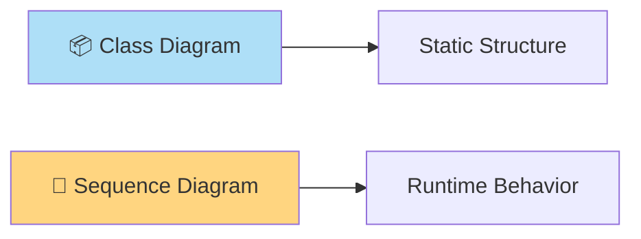

---

# 🏗 Components

A Sequence Diagram consists of

- 👤 Actor
- 📦 Object
- 📏 Lifeline
- ⚙ Activation Bar
- ✉ Messages
- ↩ Return Messages
- ➕ Object Creation
- ❌ Object Destruction

---

# 👤 Actor

An **Actor** is someone or something interacting with the system.

Examples

- User
- Admin
- Customer
- Payment Gateway
- External Service

---

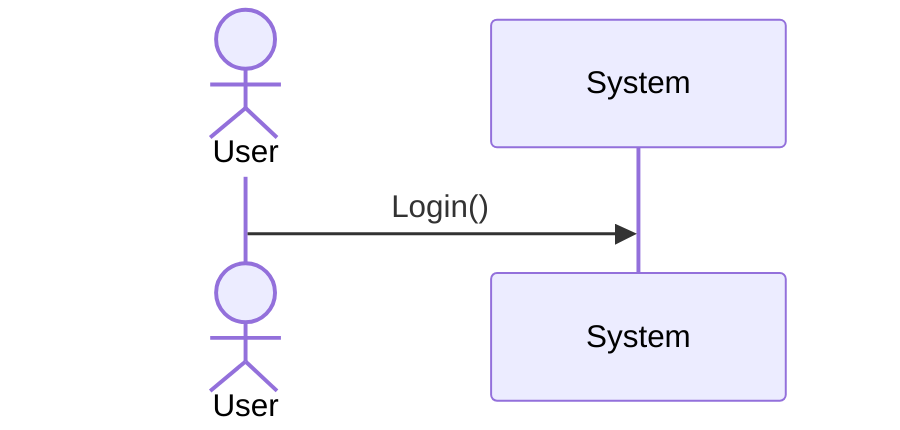

---

# 📦 Objects

Objects participate in the interaction.

Example

```text
Frontend

Backend

Database
```

---

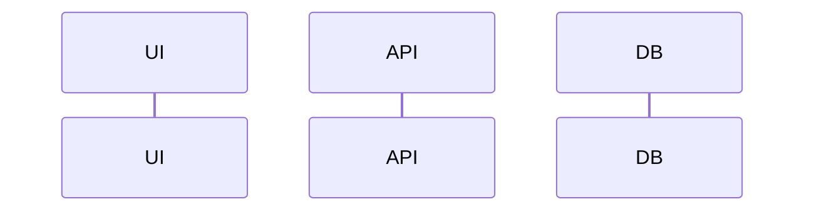

---

# 📏 Lifeline

Every participant has a

**Lifeline**

representing its existence during the interaction.

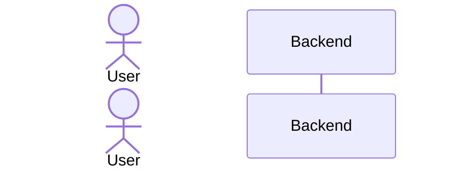

The vertical dotted line

is called

Lifeline.

---

# ⚙ Activation Bar

Activation bars represent

```text
Currently Executing
```

When an object is processing a request,

its activation bar appears.

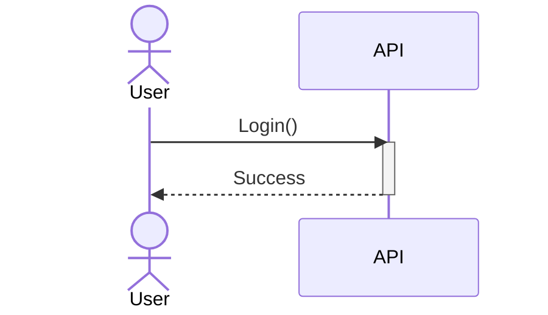

---

# ✉ Message Types

There are four message types interviewers commonly expect.

---

## 1️⃣ Synchronous Message

Caller waits.

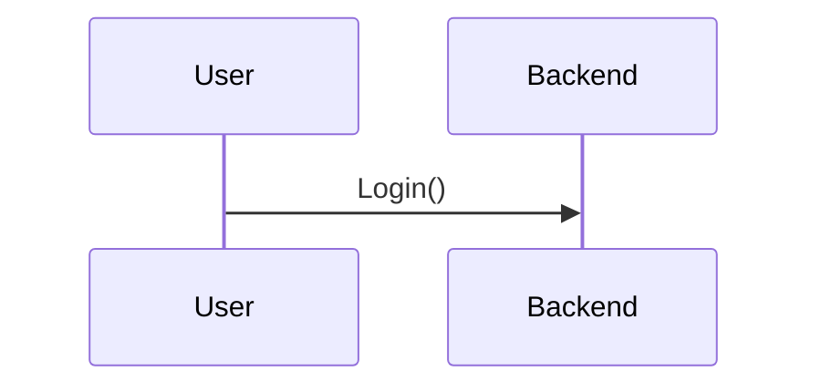

Examples

- REST API
- Function Call
- Database Query

---

## 2️⃣ Asynchronous Message

Caller doesn't wait.

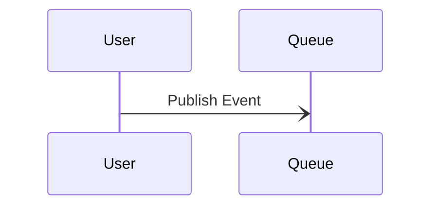

Examples

- RabbitMQ
- Kafka
- Email Queue

---

## 3️⃣ Return Message

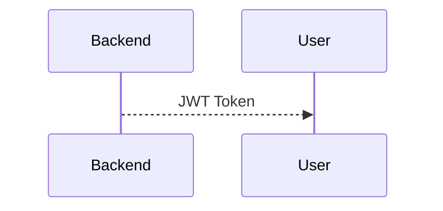

Usually shown with

dashed arrow.

---

## 4️⃣ Self Message

Object calls itself.

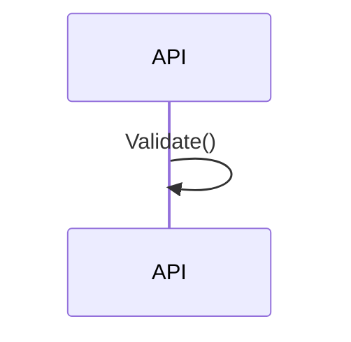

Used for

private methods,

validation,

helper methods.

---

# 🔄 Sync vs Async

## Synchronous

```text
Request

↓

Wait

↓

Response
```

Example

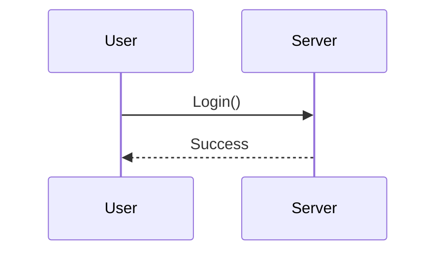

---

## Asynchronous

```text
Request

↓

Continue

↓

Response Later
```

Example

```mermaid
sequenceDiagram

Server-)RabbitMQ: Send Email

Note right of RabbitMQ:
Process Later
```

---

# ➕ Object Creation

Objects can be created

during execution.

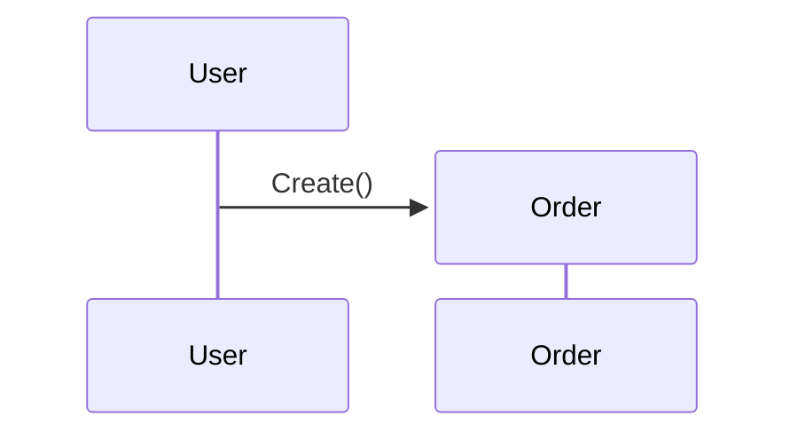

---

# ❌ Object Destruction

Objects can also be destroyed.

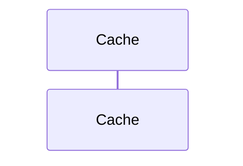

---

# 🌍 First Example

## User Login

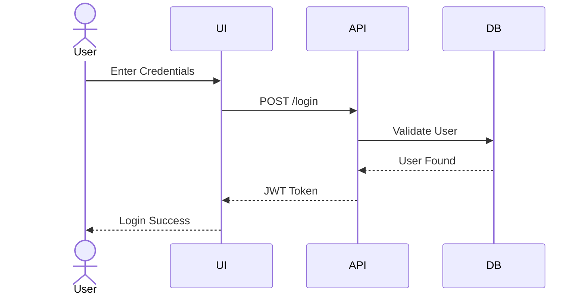

---

# 🧠 How to Think During Interviews

When the interviewer asks

> Explain Login

don't think

Classes.

Think

```text
Who talks to whom?

↓

In what order?

↓

What response comes back?
```

That's exactly what Sequence Diagrams model.

---

# 💡 Interview Tips

> [!TIP]
>
> Always identify the participants first.
>
> Then connect them with messages.
>
> Don't start drawing arrows immediately.

---

> [!IMPORTANT]
>
> Time flows **from top to bottom**.
>
> Every arrow should represent
>
> one meaningful interaction.

---

# ⚡ 30-Second Revision

| Component | Purpose |
|-----------|----------|
| Actor | External user/system |
| Participant | Object |
| Lifeline | Object lifetime |
| Activation Bar | Execution |
| Sync Message | Wait |
| Async Message | Don't Wait |
| Return | Response |
| Self Message | Internal Call |

---

# 🚀 Interview Cheat Sheet

Remember

```text
Actor

↓

Participant

↓

Message

↓

Return

↓

Next Participant

↓

Finish
```

---

# 📌 What's Next?

In **Part 2**, we'll draw complete production-style Sequence Diagrams for:

- 🔐 JWT Login
- 🛒 Place Order
- 💳 Payment Gateway
- 📦 Inventory Check
- 📧 Email Notification
- ☁️ Microservices
- 🐇 RabbitMQ
- 🔄 Async Processing

These are among the **most frequently discussed runtime flows** in LLD interviews.

➡️ Continue with **03-Sequence-Diagram.md (Part 2)**.

# 🔄 UML Sequence Diagram (Part 2)

> Continue from **03-Sequence-Diagram.md (Part 1)**

---

# 📖 Table of Contents

- 🔐 JWT Authentication
- 🛒 Place Order
- 💳 Payment Gateway
- 📦 Inventory Service
- 📧 Notification Service
- 🐇 RabbitMQ (Async)
- 🌐 Microservice Communication
- 🔄 Sync vs Async Comparison
- 💡 Interview Tips

---

# 🔐 Example 1 — JWT Authentication

This is probably the **most frequently discussed sequence diagram** in backend interviews.

## Scenario

User logs into the application.

System validates credentials and returns a JWT Token.

---

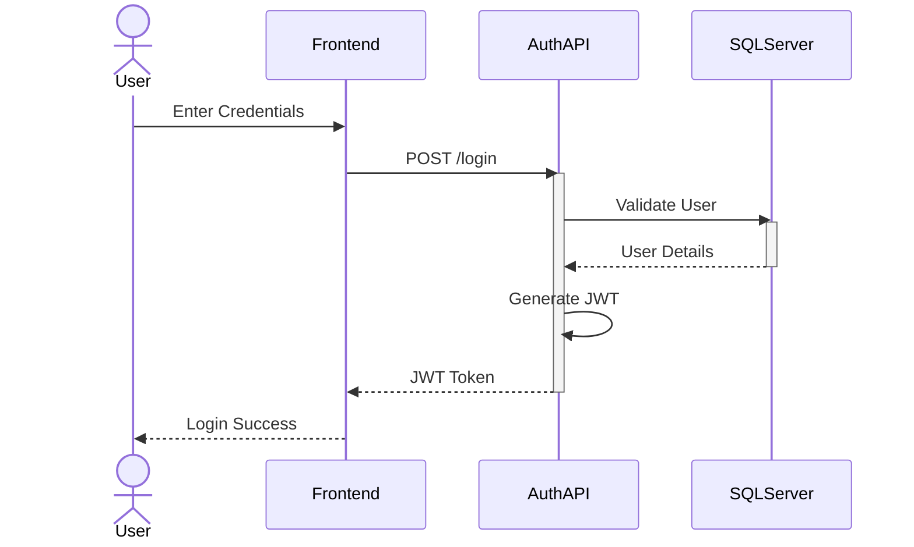

---

## 🧠 Interview Explanation

Notice

Authentication API performs:

- Validate credentials
- Generate JWT
- Return Token

Database never generates JWT.

Frontend never validates passwords.

Each component has a single responsibility.

---

# 🛒 Example 2 — Place Order

Suppose user buys a laptop.

---

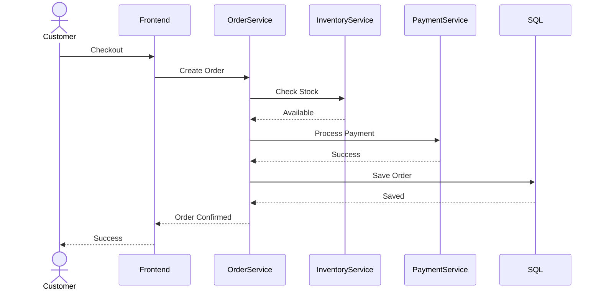

---

## 💡 Interview Discussion

Notice the order:

Inventory

↓

Payment

↓

Database

Saving an unpaid order would be a design flaw.

---

# 💳 Example 3 — Payment Gateway

Payment Service doesn't directly talk to Stripe or Razorpay.

Instead,

it communicates through an adapter/interface.

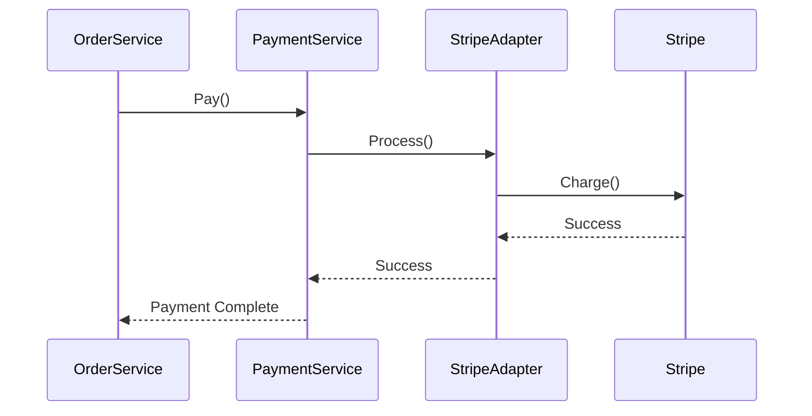

---

## 🧠 Interview Insight

This demonstrates:

- Adapter Pattern
- Dependency Inversion
- Loose Coupling

---

# 📦 Example 4 — Inventory Update

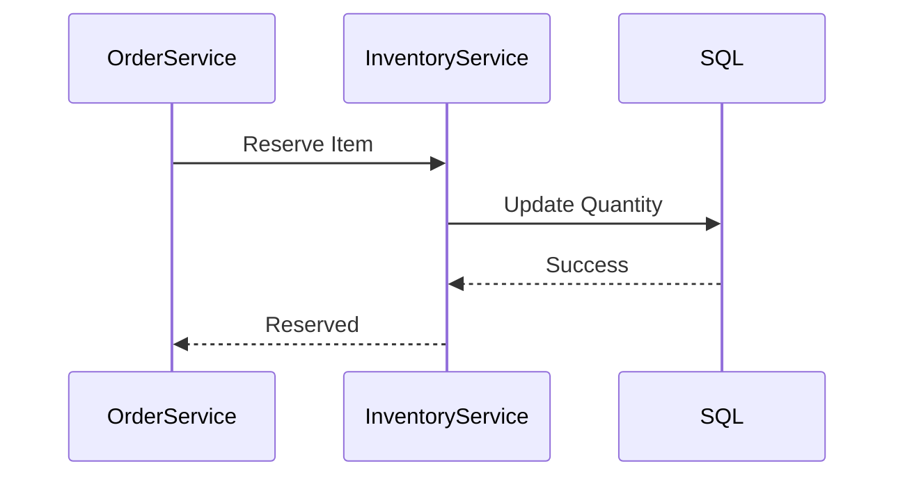

---

Notice

Inventory owns inventory logic.

Order Service should never update stock directly.

---

# 📧 Example 5 — Email Notification

After successful payment,

send email.

This is usually asynchronous.

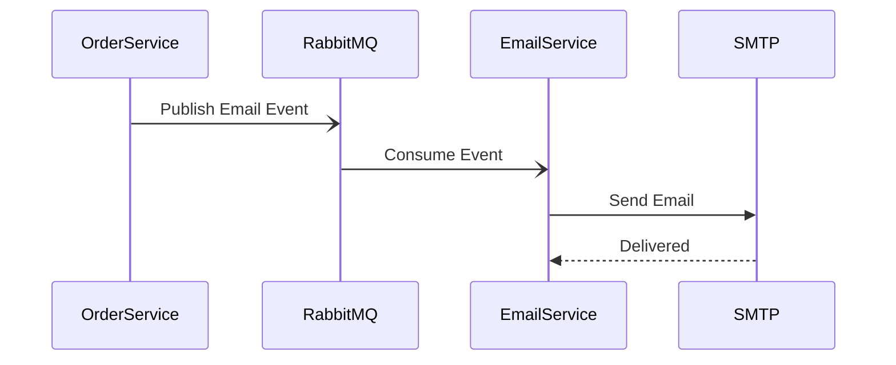

---

## Why Async?

Imagine email takes

5 seconds.

If we wait,

checkout becomes slower.

Instead,

publish event

and continue.

---

# 🐇 Example 6 — RabbitMQ

This is one of the most common interview discussions.

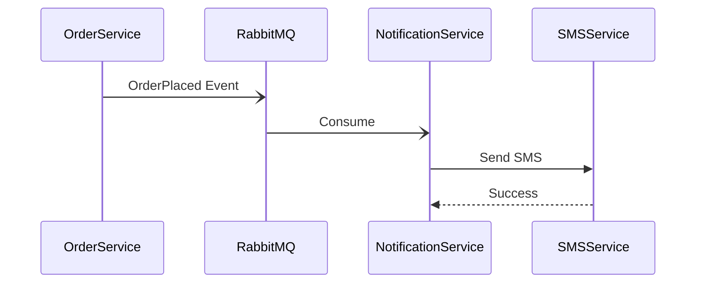

---

## Benefits

- Loose coupling
- Retry mechanism
- Background processing
- Better scalability

---

# 🌐 Example 7 — Microservice Communication

Suppose

Order Service

needs

User Service

and

Inventory Service.

```mermaid
sequenceDiagram

participant Order

participant User

participant Inventory

participant Payment

Order->>User: Validate User

User-->>Order: Valid

Order->>Inventory: Check Stock

Inventory-->>Order: Available

Order->>Payment: Charge

Payment-->>Order: Success
```

---

# 🔄 Sync vs Async

## Synchronous

```mermaid
sequenceDiagram

Client->>API: Request

API-->>Client: Response
```

Characteristics

- Caller waits
- Immediate result
- REST APIs

---

## Asynchronous

```mermaid
sequenceDiagram

API-)RabbitMQ: Publish

RabbitMQ-)Worker: Consume
```

Characteristics

- Caller doesn't wait
- Better scalability
- Event Driven

---

# 💡 Interview Tip

Whenever you hear

- RabbitMQ
- Kafka
- Notification
- Email
- Analytics
- Logging

Think

```text
Async Sequence Diagram
```

---

# 🎯 How to Explain a Sequence Diagram

Instead of saying

```text
User calls API.
```

Say

```text
User sends login request.

↓

Frontend forwards request.

↓

API validates credentials.

↓

Database verifies user.

↓

API generates JWT.

↓

Frontend stores JWT.

↓

User enters dashboard.
```

Interviewers appreciate storytelling.

---

# ⚠️ Common Mistakes

## ❌ Database directly calling API

Wrong direction.

Database never initiates business logic.

---

## ❌ Frontend calling Database

Never.

Always

Frontend

↓

Backend

↓

Database

---

## ❌ Payment before Authentication

Authentication must happen first.

---

## ❌ Making everything synchronous

Email

SMS

Analytics

Logging

should generally be asynchronous.

---

# 📊 Sequence Diagram Patterns

| Scenario | Pattern |
|-----------|----------|
| Login | Sync |
| Payment | Sync |
| Inventory | Sync |
| Email | Async |
| SMS | Async |
| Analytics | Async |
| RabbitMQ | Async |
| Kafka | Async |

---

# 🧠 Memory Tricks

## Login

```text
User

↓

Frontend

↓

API

↓

DB

↓

JWT
```

---

## Order

```text
Inventory

↓

Payment

↓

Save
```

---

## Notification

```text
Publish

↓

Queue

↓

Worker

↓

Email
```

---

# ⚡ 30-Second Revision

Remember

```text
Frontend

↓

Backend

↓

Database

↓

Response
```

For microservices

```text
Service

↓

Another Service

↓

Queue

↓

Worker
```

---

# 📌 What's Next?

In **Part 3**, we'll learn:

- 🎤 FAANG Interview Questions
- 🎯 Sequence Diagram Best Practices
- ⚠️ Common Mistakes
- 🧠 Decision Trees
- 📚 Cheat Sheet
- 🚀 One-Page Revision
- 📝 Practice Problems

➡️ Continue with **03-Sequence-Diagram.md (Part 3)**.

# 🔄 UML Sequence Diagram (Part 3)

> Continue from **03-Sequence-Diagram.md (Part 2)**

---

# 📖 Table of Contents

- 🎯 How to Draw a Sequence Diagram in Interviews
- 🏗 Best Practices
- ❌ Bad vs ✅ Good Sequence Diagram
- ⚠️ Common Mistakes
- 🎤 FAANG Interview Questions
- 🧠 Sequence Diagram Decision Tree
- 🌍 Which Diagram Should I Draw?
- 💡 Memory Tricks
- ⚡ 30-Second Revision
- 🚀 10-Second Interview Answer
- 📝 Practice Problems

---

# 🎯 How to Draw a Sequence Diagram in an Interview

Most candidates immediately start drawing arrows.

❌ Don't.

Follow this workflow instead.

```mermaid
flowchart TD

A["📝 Understand Use Case"]

-->

B["👤 Identify Actor"]

-->

C["📦 Identify Participants"]

-->

D["➡ Arrange Left to Right"]

-->

E["✉ Draw Messages"]

-->

F["🔄 Add Returns"]

-->

G["⚡ Mark Sync / Async"]

-->

H["✅ Explain Flow"]

style H fill:#90EE90
```

> [!IMPORTANT]
>
> A Sequence Diagram tells a **story**.
>
> Think:
>
> **Who talks to whom?**
>
> **In what order?**
>
> **Why?**

---

# 🏗 Best Practices

## ✅ Arrange Participants Logically

Recommended order

```text
User

↓

Frontend

↓

API Gateway

↓

Backend Service

↓

Database

↓

External Service
```

This makes diagrams much easier to read.

---

## ✅ One Arrow = One Interaction

Avoid this

```text
Login

Validate

Generate JWT

Save

Return
```

inside one arrow.

Instead,

split into multiple interactions.

---

## ✅ Use Activation Bars

Whenever an object performs work,

show its activation.

```mermaid
sequenceDiagram

participant API

activate API

API->>API: Validate()

deactivate API
```

---

## ✅ Show Return Messages

Instead of

```mermaid
sequenceDiagram

Client->>API: Login()
```

also show

```mermaid
sequenceDiagram

Client->>API: Login()

API-->>Client: JWT
```

Return messages improve readability.

---

## ✅ Keep Responsibilities Clear

Database

should

store data.

API

should

implement business logic.

Frontend

should

handle UI.

---

# ❌ Bad vs Good Example

## ❌ Bad

```mermaid
sequenceDiagram

User->>Database: Login
```

Problems

- Frontend missing
- Backend missing
- Security ignored

---

## ✅ Better

```mermaid
sequenceDiagram

actor User

participant UI

participant API

participant DB

User->>UI: Login

UI->>API: POST Login

API->>DB: Validate

DB-->>API: Success

API-->>UI: JWT

UI-->>User: Dashboard
```

Every layer has a clear responsibility.

---

# ⚠️ Common Interview Mistakes

## ❌ Too Many Participants

Avoid

```text
15 Services

20 Databases

10 Queues
```

Focus on the important components.

---

## ❌ Mixing Class Diagram Concepts

Sequence Diagram shows

```text
Behavior
```

Not

```text
Inheritance

Composition

Aggregation
```

Those belong to Class Diagrams.

---

## ❌ Ignoring Async Processing

Sending email synchronously

```text
Order

↓

Email

↓

Wait

↓

Finish
```

is usually poor design.

Prefer

```text
Order

↓

RabbitMQ

↓

Email Service
```

---

## ❌ Database Driving the Flow

Wrong

```text
Database

↓

API
```

The database never initiates business logic.

---

## ❌ Drawing Every Internal Method

Interviewers don't need:

```text
ValidatePassword()

HashPassword()

Trim()

ToLower()

Split()
```

Focus on meaningful business interactions.

---

# 🎤 FAANG Interview Tips

When explaining a Sequence Diagram,

don't read arrows.

Explain the story.

Example

❌

```text
Frontend calls API.
```

✅

```text
The user submits credentials.

The frontend forwards the request.

The authentication service validates the user.

After successful validation,

it generates a JWT.

The frontend stores the token.

The user is redirected.
```

Communication matters.

---

# 🌍 Which Diagram Should I Draw?

```mermaid
flowchart TD

A["Interview Question"]

A --> B{"Need Static Design?"}

B -->|Yes| C["📦 Class Diagram"]

B -->|No| D{"Need Runtime Flow?"}

D -->|Yes| E["🔄 Sequence Diagram"]

D -->|No| F{"Need Workflow?"}

F -->|Yes| G["⚙ Activity Diagram"]

F -->|No| H["📚 Another UML Diagram"]
```

---

# 🎯 Sequence Diagram Decision Tree

```mermaid
flowchart TD

A["User Action"]

-->

B["Identify Participants"]

-->

C["Arrange Order"]

-->

D["Draw Sync Calls"]

-->

E["Draw Async Calls"]

-->

F["Return Responses"]

-->

G["Explain Flow"]
```

---

# 🔥 Interview Questions

## Q1. What is a Sequence Diagram?

A behavioral UML diagram that shows how objects interact over time.

---

## Q2. Difference between Class Diagram and Sequence Diagram?

| Class Diagram | Sequence Diagram |
|---------------|------------------|
| Static | Dynamic |
| Structure | Runtime Flow |
| Relationships | Messages |
| Classes | Objects |

---

## Q3. What is a Lifeline?

Represents the lifetime of a participant during an interaction.

---

## Q4. What is an Activation Bar?

Shows when an object is actively executing an operation.

---

## Q5. Difference between Sync and Async?

### Sync

Caller waits.

Examples

- REST API
- Database query

### Async

Caller continues.

Examples

- RabbitMQ
- Kafka
- Email
- SMS

---

## Q6. Why use Sequence Diagrams?

To explain

- Runtime behavior
- API calls
- Service interactions
- Authentication
- Payment flow

---

## Q7. What is the most common Sequence Diagram in interviews?

- JWT Login
- Place Order
- Payment
- Inventory
- Notification

---

# 🎤 FAANG Follow-Up Questions

### Why not call the database directly from the UI?

Because it violates layering, security, and separation of concerns.

---

### Why are Email and SMS asynchronous?

They are slow, independent operations that should not block the user's request.

---

### Can one Sequence Diagram represent microservices?

Yes.

Each service becomes a participant.

---

### Can one object call itself?

Yes.

This is represented using a **Self Message**.

---

### Should utility classes appear?

Usually no.

Focus on business participants.

---

# 🧠 Memory Tricks

## Sequence Diagram

Think

```text
Story
```

---

## Class Diagram

Think

```text
Blueprint
```

---

## Login

```text
User

↓

Frontend

↓

Backend

↓

Database

↓

JWT
```

---

## Order

```text
Inventory

↓

Payment

↓

Save

↓

Notify
```

---

## Async

```text
Publish

↓

Queue

↓

Consumer
```

---

# 📊 Interview Checklist

Before finishing your diagram, verify:

- ✅ Correct Actor
- ✅ Correct Participants
- ✅ Logical Order
- ✅ Sync / Async Correct
- ✅ Return Messages
- ✅ Business Logic in Backend
- ✅ Database Only Stores Data

---

# ⚡ 30-Second Revision

Remember

```text
Actor

↓

Participants

↓

Messages

↓

Returns

↓

Async

↓

Finish
```

---

# 🚀 10-Second Interview Answer

> **A Sequence Diagram is a Behavioral UML Diagram that models the runtime interaction between objects. It shows the order of messages exchanged between participants to complete a use case, making it ideal for explaining authentication, payment, order processing, and microservice communication.**

---

# 📝 Practice Problems

Draw Sequence Diagrams for:

- 🔐 JWT Login
- 🔄 Refresh Token
- 🛒 Add to Cart
- 💳 Place Order
- ❌ Cancel Order
- 💰 Refund Payment
- 📦 Inventory Update
- 📧 Email Notification
- 📱 OTP Verification
- ☁ File Upload to S3
- 💬 WhatsApp Message Delivery
- 🚕 Uber Ride Booking
- 🎵 Spotify Play Song

---

# 📚 Next Chapter

➡️ **04-Activity-Diagram.md**

You'll learn:

- Activity Nodes
- Decision Nodes
- Merge Nodes
- Fork & Join
- Parallel Execution
- Swimlanes
- Workflow Modeling
- Business Processes
- Interview Examples

---

# 📚 UML Handbook Navigation

| Previous | Current | Next |
|----------|----------|------|
| ⬅️ 02-Class Diagram | ✅ 03-Sequence Diagram | ➡️ 04-Activity Diagram |
