# ⚙ UML Activity Diagram

> **Part 4 of the UML Handbook**  
> **Difficulty:** ⭐⭐⭐☆☆  
> **Interview Importance:** ⭐⭐⭐⭐☆

---

# 📚 UML Handbook Navigation

| Previous | Current | Next |
|----------|----------|------|
| ⬅️ 03-Sequence Diagram | **04-Activity Diagram** | ➡️ 05-State Diagram |

---

# 📖 Table of Contents

- 🎯 What is an Activity Diagram?
- 🤔 Why Activity Diagram Exists
- 🆚 Activity Diagram vs Flowchart
- 🆚 Activity Diagram vs Sequence Diagram
- 🧠 When Should You Draw One?
- 🏗 Core Components
- ▶ Initial Node
- ⏹ Final Node
- ⚙ Activities
- 🔀 Decision Nodes
- 🔄 Merge Nodes
- ⚡ Fork & Join
- 🏊 Swimlanes
- 🛒 First Example
- ⚡ Revision

---

# 🎯 What is an Activity Diagram?

An **Activity Diagram** is a **Behavioral UML Diagram** used to represent the **workflow** of a process.

Unlike a Sequence Diagram,

which answers

```text
Who talks to whom?
```

an Activity Diagram answers

```text
What happens next?
```

Think of it as

> **Business Process Flow**

---

# 🤔 Why Activity Diagram Exists

Suppose someone asks:

> Explain the process of placing an order.

Instead of focusing on classes,

or objects,

focus on

the **steps**.

Example

```text
Browse Products

↓

Add to Cart

↓

Checkout

↓

Payment

↓

Order Confirmed
```

This is exactly what Activity Diagrams model.

---

# 🆚 Activity Diagram vs Flowchart

Many people think they're the same.

They are not.

| Activity Diagram | Flowchart |
|------------------|-----------|
| UML Standard | Generic Diagram |
| Models Business Workflow | Models Algorithm |
| Supports Parallel Execution | Mostly Sequential |
| Used in Software Design | Used Everywhere |
| Supports Swimlanes | Usually Doesn't |

---

Example

Flowchart

```text
Read Number

↓

Check Even

↓

Print
```

Activity Diagram

```text
User Login

↓

Authentication

↓

Generate JWT

↓

Dashboard
```

---

# 🆚 Activity Diagram vs Sequence Diagram

| Activity Diagram | Sequence Diagram |
|------------------|------------------|
| Focuses on Workflow | Focuses on Communication |
| Steps | Messages |
| Business Logic | Object Interaction |
| Parallel Activities | Runtime Calls |

---

Suppose

User Login

Activity Diagram

```text
Enter Credentials

↓

Validate

↓

Generate JWT

↓

Login Success
```

Sequence Diagram

```text
User

↓

Frontend

↓

API

↓

Database
```

---

# 🧠 When Should You Draw One?

Draw an Activity Diagram when the interviewer asks

- Explain Login Process
- Explain Checkout Process
- Explain Payment Flow
- Explain Approval Workflow
- Explain Business Process
- Explain User Journey

Don't use it for

- Relationships
- OOP Design
- Runtime API Calls

---

# 🏗 Core Components

Every Activity Diagram contains

- ▶ Initial Node
- ⚙ Activity
- 🔀 Decision
- 🔄 Merge
- ⚡ Fork
- ⚡ Join
- 🏊 Swimlane
- ⏹ Final Node

---

# ▶ Initial Node

Represents

Start.

Notation

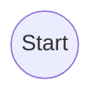

Every Activity Diagram begins here.

---

# ⚙ Activity

Represents

an action.

Example

```text
Login

Validate User

Generate Token

Send Email
```

Mermaid

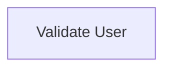

---

# 🔀 Decision Node

Represents

a condition.

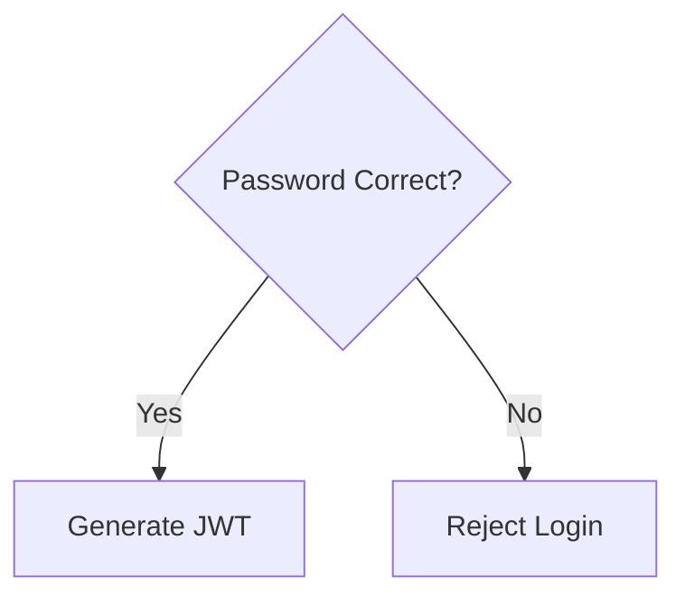

---

# 🔄 Merge Node

After decision branches,

merge back.

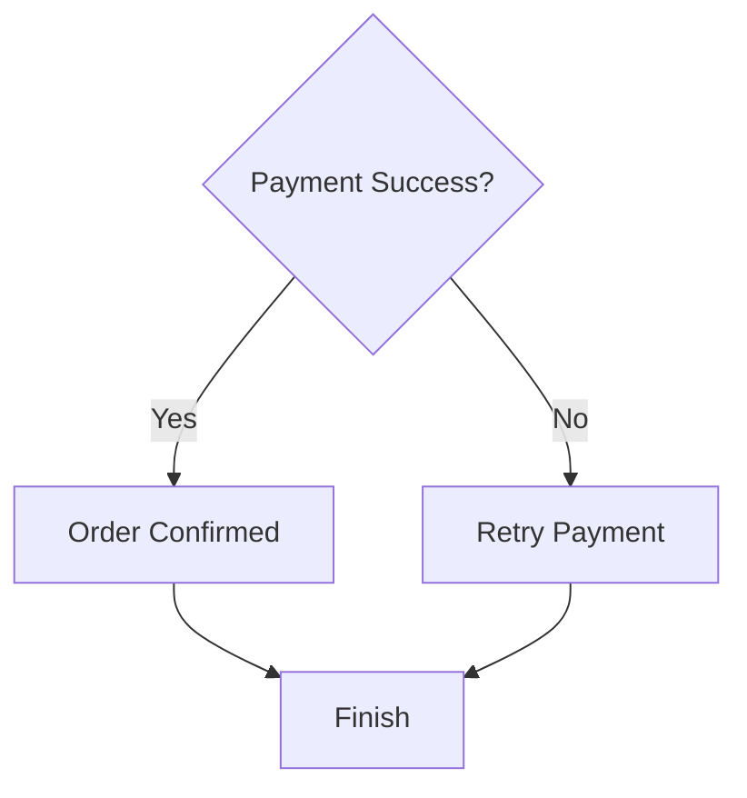

---

# ⚡ Fork

Fork creates

parallel execution.

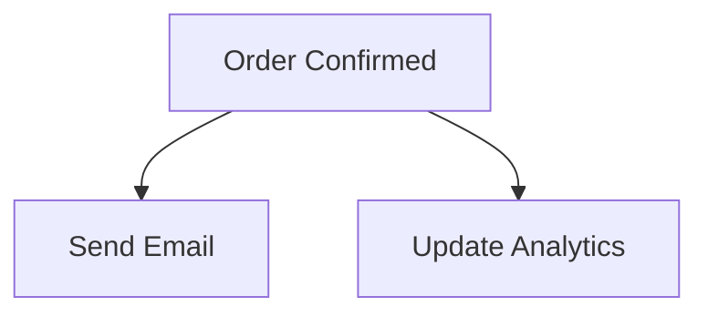

Both execute simultaneously.

---

# ⚡ Join

Join waits

until all parallel tasks complete.

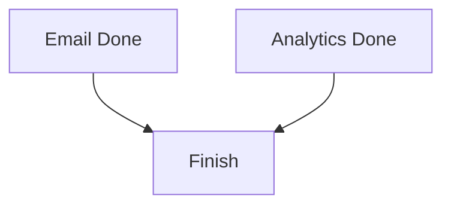

---

# 🏊 Swimlanes

Swimlanes divide responsibilities.

Example

```text
Customer

↓

Order Service

↓

Payment Service

↓

Inventory
```

They show

who performs each activity.

---

# 🌍 Example

## User Login Workflow

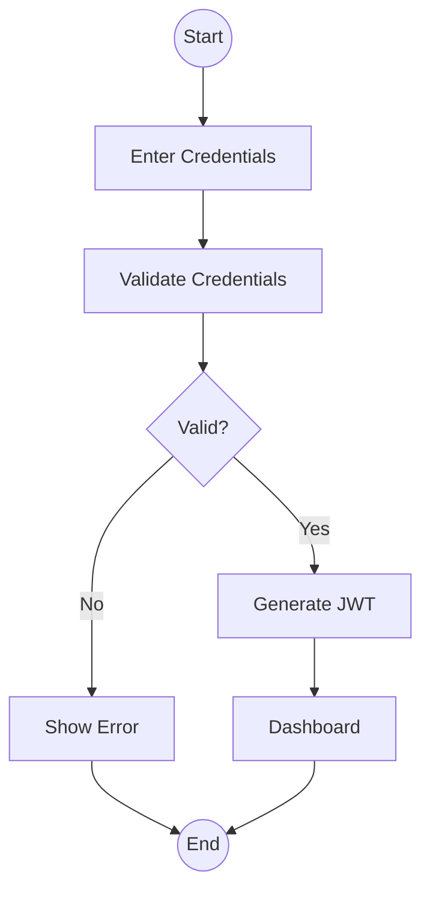

Notice

No classes.

No API.

No objects.

Only

Workflow.

---

# 💡 Interview Tips

> [!TIP]
>
> Activity Diagrams focus on
>
> **business workflow**,
>
> not
>
> software architecture.

---

> [!IMPORTANT]
>
> If the interviewer asks
>
> "Explain the process"
>
> think
>
> **Activity Diagram**
>
> not
>
> **Class Diagram**

---

# ⚡ 30-Second Revision

| Symbol | Meaning |
|---------|----------|
| ● | Start |
| ◎ | End |
| Rectangle | Activity |
| Diamond | Decision |
| Diamond Merge | Merge |
| Fork | Parallel Start |
| Join | Parallel End |
| Swimlane | Responsibility |

---

# 📌 What's Next?

In **Part 2**, we'll model complete business workflows:

- 🛒 E-Commerce Checkout
- 💳 Payment Processing
- 📦 Order Fulfillment
- 🔐 User Registration
- 📧 Email Verification
- 🏦 ATM Withdrawal
- 🍕 Food Delivery Workflow
- ⚡ Parallel Processing (Fork & Join)

These are the most common Activity Diagram scenarios discussed in interviews.

➡️ Continue with **04-Activity-Diagram.md (Part 2)**.

# ⚙ UML Activity Diagram (Part 2)

> Continue from **04-Activity-Diagram.md (Part 1)**

---

# 📖 Table of Contents

- 🛒 E-Commerce Checkout
- 💳 Payment Processing
- 📦 Order Fulfillment
- 🔐 User Registration
- 🏦 ATM Withdrawal
- 🍕 Food Delivery Workflow
- 🏊 Swimlane Example
- ⚡ Parallel Execution (Fork & Join)
- 🧠 Interview Tips

---

# 🛒 Example 1 — E-Commerce Checkout

## Workflow

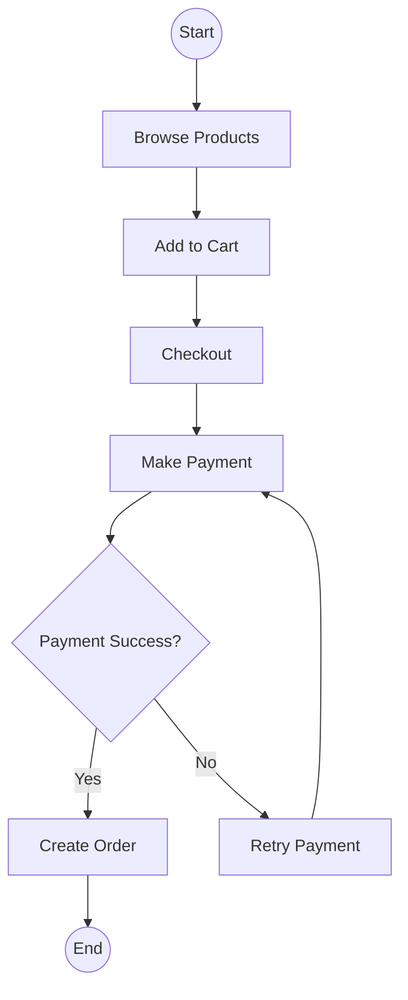

---

## 🧠 Interview Discussion

Notice

The Activity Diagram focuses on

workflow,

not

objects.

No

```text
OrderService

PaymentService

Database
```

appear here.

---

# 💳 Example 2 — Payment Processing

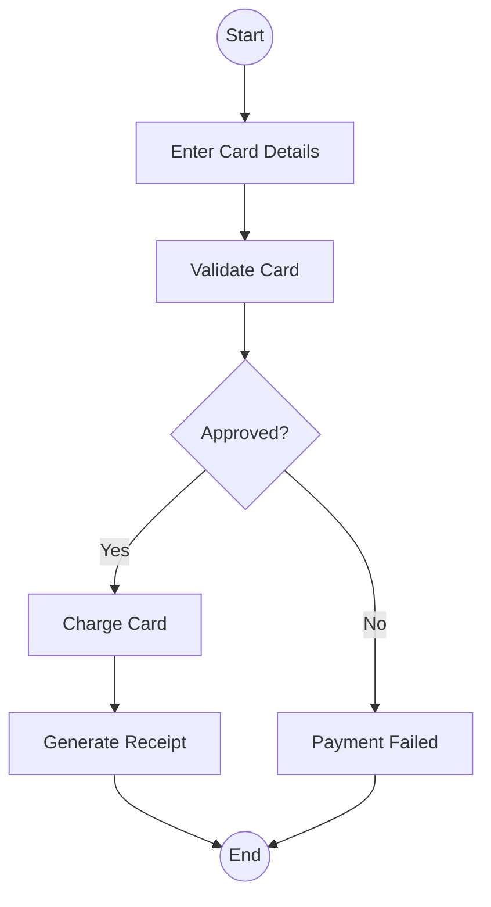

---

## Why Activity Diagram?

Because we care about

```text
Process
```

instead of

```text
Who talks to whom?
```

---

# 📦 Example 3 — Order Fulfillment

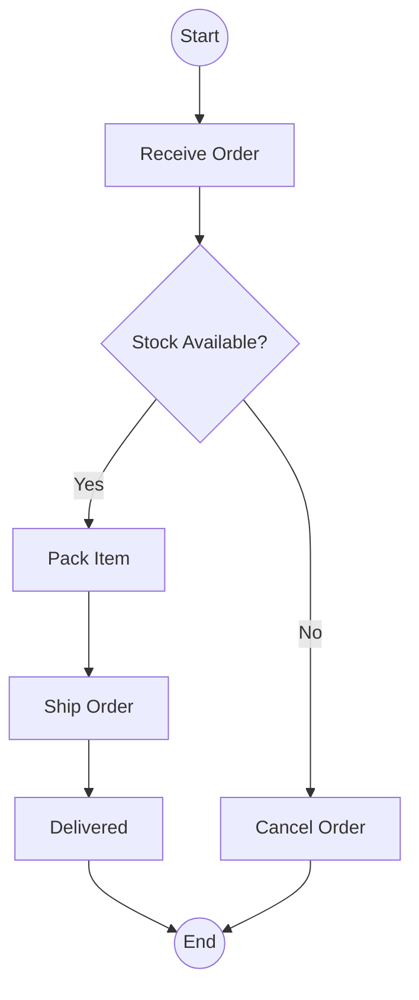

---

# 🔐 Example 4 — User Registration

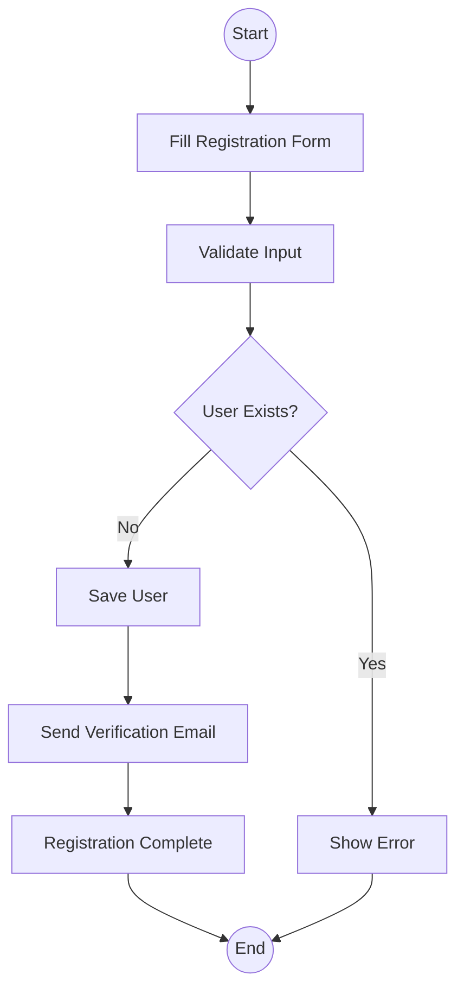

---

# 🏦 Example 5 — ATM Withdrawal

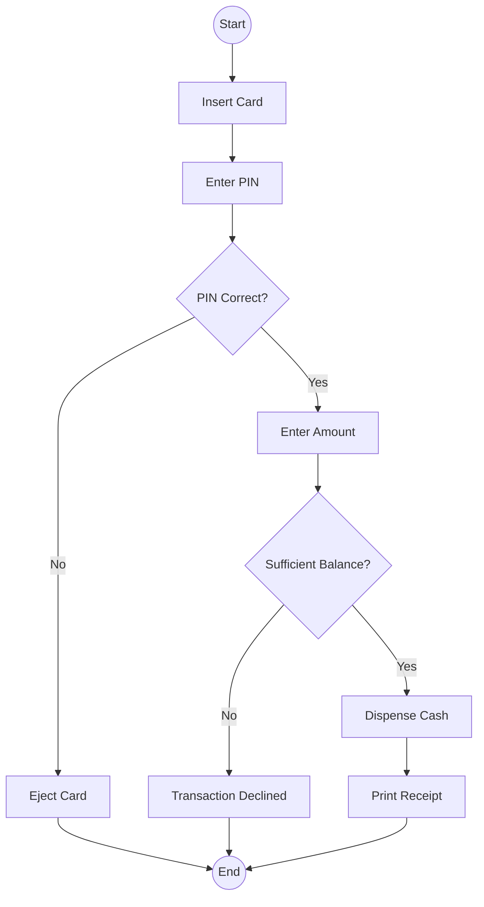

---

# 🍕 Example 6 — Food Delivery Workflow

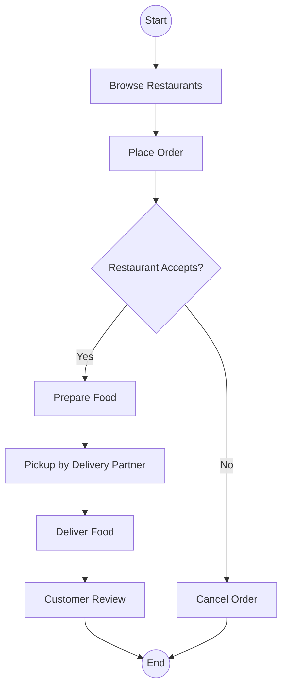

---

# 🏊 Swimlane Example

Swimlanes divide the workflow by responsibility.

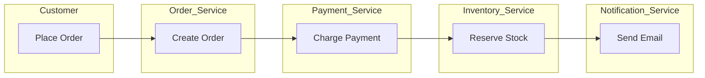

---

## Why Swimlanes?

Without swimlanes,

it's difficult to know

who performs each activity.

With swimlanes,

ownership becomes obvious.

---

# ⚡ Parallel Execution (Fork & Join)

After payment succeeds,

multiple independent tasks can run together.

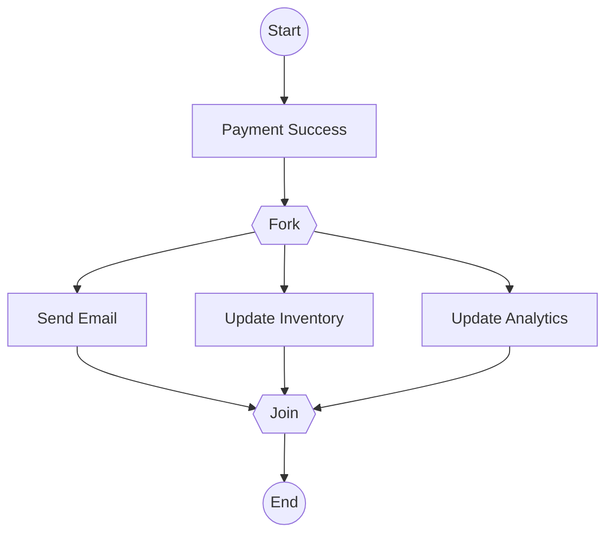

---

## 🧠 Interview Discussion

Notice

Sending email

Updating analytics

Updating inventory

do not depend on each other.

Therefore,

they can execute in parallel.

---

# 🌍 Real-World Example

Suppose an order is placed on Amazon.

Instead of doing everything one by one,

multiple services work simultaneously.

```text
Payment Success

↓

Send Email

↓

Update Inventory

↓

Generate Invoice

↓

Notify Warehouse
```

Parallel execution reduces latency.

---

# ⚠️ Common Interview Mistakes

## ❌ Using Activity Diagram for Class Relationships

Wrong

```text
Customer

↓

Order

↓

Product
```

These belong in a

Class Diagram.

---

## ❌ Forgetting Decision Conditions

Wrong

```text
Validate

↓

Generate JWT
```

Correct

```text
Validate

↓

Valid?

↓

Generate JWT
```

---

## ❌ Ignoring Parallel Activities

Many tasks don't depend on each other.

Think

```text
Email

Analytics

Inventory
```

These usually run together.

---

## ❌ Mixing Sequence Concepts

Don't draw

API

Database

Messages

Lifelines

Those belong to

Sequence Diagrams.

---

# 🎯 Interview Tip

If the interviewer asks

> "Explain the checkout process."

Don't immediately draw APIs.

Draw

workflow.

Then,

if asked,

move to

Sequence Diagram.

---

# 📊 Workflow vs Runtime

| Question | Diagram |
|-----------|----------|
| Explain Checkout Process | Activity Diagram |
| Explain Login Process | Activity Diagram |
| Explain Payment Workflow | Activity Diagram |
| Explain API Calls | Sequence Diagram |
| Explain Service Communication | Sequence Diagram |

---

# 🧠 Memory Tricks

Think

Activity Diagram

=

```text
Business Workflow
```

Sequence Diagram

=

```text
Runtime Communication
```

Class Diagram

=

```text
Static Structure
```

---

# ⚡ 30-Second Revision

Remember

```text
Start

↓

Activity

↓

Decision

↓

Merge

↓

Fork

↓

Join

↓

End
```

---

# 📌 What's Next?

In **Part 3**, we'll cover:

- 🎤 FAANG Interview Questions
- 🏗 Best Practices
- ⚠️ Common Mistakes
- 🌍 Activity Diagram vs BPMN
- 🧠 Decision Tree
- 🚀 One-Page Revision
- 📝 Practice Problems

➡️ Continue with **04-Activity-Diagram.md (Part 3)**.

# ⚙ UML Activity Diagram (Part 3)

> Continue from **04-Activity-Diagram.md (Part 2)**

---

# 📖 Table of Contents

- 🎯 Advanced UML Concepts
- 🔀 Guard Conditions
- 🛑 Control Nodes
- 📦 Object Nodes & Object Flow
- 📡 Signal Events
- ❌ Exception Flow
- ⏹ Interruptible Activity Region
- ⚡ Best Practices
- 🔄 Activity vs Sequence vs State Diagram
- 🎤 FAANG Interview Scenarios
- 🧠 Decision Tree
- 📋 Interview Checklist
- ⚡ One-Page Revision

---

# 🎯 Advanced UML Concepts

Most tutorials stop after explaining:

- Activity
- Decision
- Merge
- Fork
- Join

However, interviewers may also ask about:

- Guard Conditions
- Flow Final
- Object Flow
- Signals
- Interruptible Activities

Understanding these concepts helps you create production-quality Activity Diagrams.

---

# 🔀 Guard Conditions

A **Guard Condition** is a Boolean expression written on an outgoing branch from a Decision Node.

Only the branch whose condition evaluates to **true** is executed.

## Example

```mermaid
flowchart TD

A[Validate Payment]

-->

B{Payment Status}

B -->|[Success]| C[Create Order]

B -->|[Failure]| D[Retry Payment]

B -->|[Timeout]| E[Cancel Order]
```

Notice:

```text
[Success]

[Failure]

[Timeout]
```

These are **Guard Conditions**.

---

## 💡 Interview Tip

If the interviewer asks:

> What is the text written on a decision branch?

Answer:

> **Guard Condition**

---

# 🛑 Control Nodes

Control Nodes control the flow of execution.

| Node | Purpose |
|------|----------|
| Initial Node | Start workflow |
| Activity Final | End entire workflow |
| Flow Final | End only one branch |
| Decision | Conditional branching |
| Merge | Merge conditional branches |
| Fork | Start parallel execution |
| Join | Synchronize parallel execution |

---

## Initial Node

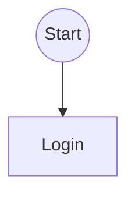

Every workflow begins here.

---

## Activity Final Node

Ends the **entire workflow**.

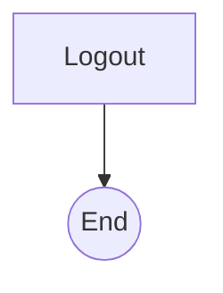

Once reached,

everything stops.

---

## Flow Final Node

Stops **only one execution path**.

Other parallel branches continue.

```text
Branch A

↓

Stop

Branch B

↓

Continue
```

This is useful in parallel workflows.

---

# 📦 Object Nodes & Object Flow

Activity Diagrams can also represent **data moving between activities**, not just actions.

Example:

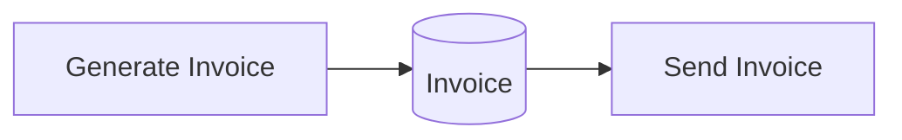

Here,

the **Invoice** object flows between activities.

---

## Why Object Flow Matters

It answers:

> **What data moves through the workflow?**

instead of only

> **What activity executes next?**

---

# 📡 Signal Events

A **Signal** represents an event that is sent or received.

Unlike synchronous method calls,

signals are usually asynchronous.

Example:

```text
Payment Completed

↓

Notification Service
```

---

Example workflow:

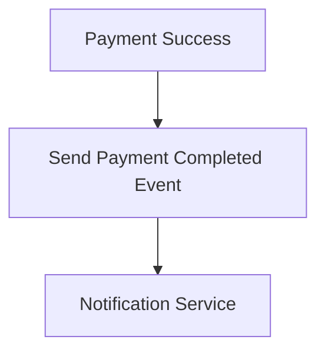

Signals are common in:

- RabbitMQ
- Kafka
- Azure Service Bus
- AWS SNS/SQS

---

# ❌ Exception Flow

Production systems always include failure scenarios.

Don't model only the happy path.

---

Example

```mermaid
flowchart TD

Start((Start))

-->

Pay[Process Payment]

-->

Success{Payment Successful?}

Success -->|Yes| Order[Create Order]

Success -->|No| Retry[Retry Payment]

Retry --> Again{Retry Successful?}

Again -->|Yes| Order

Again -->|No| Cancel[Cancel Order]

Order --> End((End))

Cancel --> End
```

---

## Interview Tip

Always ask:

> **"What happens if this step fails?"**

Showing exception paths demonstrates mature design thinking.

---

# ⏹ Interruptible Activity Region

Some workflows can be interrupted.

Example:

Order Processing.

While processing,

the customer cancels the order.

Workflow immediately stops.

```mermaid
flowchart TD

Start((Start))

-->

Processing[Process Order]

-->

Packing[Pack Item]

-->

Shipping[Ship Item]

Processing -. Cancel Request .-> Cancel[Cancel Order]

Cancel --> End((End))

Shipping --> End
```

---

## Real Examples

- User cancels ride
- User cancels order
- Payment timeout
- Session expiration

---

# ⚡ Best Practices

## ✅ Focus on Workflow

Good

```text
Checkout

↓

Payment

↓

Invoice
```

Bad

```text
OrderService

↓

PaymentService

↓

Repository

↓

Controller
```

Those belong in a Sequence Diagram.

---

## ✅ One Activity = One Action

Good

```text
Validate Payment
```

Bad

```text
Validate Payment and Update Database and Send Email
```

Split activities.

---

## ✅ Always Label Decisions

Instead of

```text
Yes

No
```

Prefer

```text
[Payment Success]

[Payment Failed]
```

The workflow becomes self-explanatory.

---

## ✅ Use Fork Only for True Parallelism

Good candidates identify tasks that don't depend on each other.

Example:

```text
Payment Success

↓

Send Email

Update Inventory

Generate Invoice

Notify Warehouse
```

These can execute together.

---

## ✅ Show Failure Paths

Every important decision should answer:

> What if this fails?

---

# 🔄 Activity vs Sequence vs State Diagram

| Question | Diagram |
|-----------|----------|
| What is the business process? | ✅ Activity |
| Which object calls which object? | ✅ Sequence |
| How does an object's state change? | ✅ State |
| What classes exist? | ✅ Class |

---

## Example

Design Online Shopping.

Activity

```text
Browse

↓

Checkout

↓

Payment
```

Sequence

```text
Frontend

↓

API

↓

Payment Service
```

State

```text
Pending

↓

Paid

↓

Shipped

↓

Delivered
```

---

# 🎤 FAANG Interview Scenarios

## Scenario 1

> Explain ATM Withdrawal.

Draw:

✅ Activity Diagram

---

## Scenario 2

> Explain Login API.

Draw:

✅ Sequence Diagram

---

## Scenario 3

> Design Parking Lot.

Draw:

✅ Class Diagram

---

## Scenario 4

> Explain Order Lifecycle.

Draw:

✅ State Diagram

---

## Scenario 5

> Explain Checkout Workflow.

Draw:

✅ Activity Diagram

---

# 🧠 Which UML Diagram Should I Draw?

```mermaid
flowchart TD

A["Interview Question"]

-->

B{"Need Static Structure?"}

B -->|Yes| C["📦 Class Diagram"]

B -->|No| D{"Need Runtime Calls?"}

D -->|Yes| E["🔄 Sequence Diagram"]

D -->|No| F{"Need Business Workflow?"}

F -->|Yes| G["⚙ Activity Diagram"]

F -->|No| H{"Need Object Lifecycle?"}

H -->|Yes| I["🔄 State Diagram"]

H -->|No| J["🧩 Component Diagram"]
```

---

# 📋 Interview Checklist

Before finishing an Activity Diagram, verify:

- ✅ Start Node present
- ✅ End Node present
- ✅ Every activity has one responsibility
- ✅ Decisions have guard conditions
- ✅ Failure paths included
- ✅ Parallel tasks use Fork & Join
- ✅ Workflow is easy to read
- ✅ Responsibilities are clear (Swimlanes if needed)

---

# ⚡ One-Page Revision

## Remember

```text
Start

↓

Activities

↓

Decision

↓

Merge

↓

Fork

↓

Join

↓

End
```

---

## Decision Rule

```text
Need Workflow?

↓

Activity Diagram
```

---

## Golden Rules

✔ Think in **business steps**, not classes.

✔ Show **failure paths**.

✔ Use **parallel execution** only when tasks are independent.

✔ Keep one activity focused on one responsibility.

✔ If you're explaining **how work flows**, Activity Diagram is usually the correct choice.

---

# 📚 Next Chapter

➡️ **05-State-Diagram.md**

You'll learn:

- State
- Transition
- Events
- Guards
- Entry / Exit Actions
- Composite States
- State Machines
- Real-world examples:
  - Order Lifecycle
  - ATM
  - Vending Machine
  - Traffic Signal
  - Media Player
  - TCP Connection

The State Diagram is one of the most underrated UML diagrams and is frequently used in LLD interviews for lifecycle-based systems.
