# 🔄 UML State Diagram

> **Part 5 of the UML Handbook**  
> **Difficulty:** ⭐⭐⭐⭐☆  
> **Interview Importance:** ⭐⭐⭐⭐☆

---

# 📚 UML Handbook Navigation

| Previous | Current | Next |
|----------|----------|------|
| ⬅️ 04-Activity Diagram | **05-State Diagram** | ➡️ 06-Component Diagram |

---

# 📖 Table of Contents

- 🎯 What is a State Diagram?
- 🤔 Why State Diagrams Exist
- 🆚 State vs Activity Diagram
- 🆚 State vs Sequence Diagram
- 🧠 When Should You Draw One?
- 🏗 Core Components
- 🔵 Initial State
- 🟢 Final State
- 📦 State
- ➡ Transition
- ⚡ Events
- 🔀 Guard Conditions
- 🎬 Entry / Exit Actions
- 📱 First Example
- ⚡ Quick Revision

---

# 🎯 What is a State Diagram?

A **State Diagram** is a **Behavioral UML Diagram** that describes

> **how a single object changes its state during its lifetime.**

Unlike other UML diagrams,

it focuses on

```text
ONE OBJECT

↓

MULTIPLE STATES
```

Think of it as

> **Object Lifecycle**

---

# 🤔 Why State Diagram Exists

Suppose someone asks

> Explain the lifecycle of an Order.

They're not asking

- Which classes exist
- Which APIs communicate
- What workflow is followed

They're asking

```text
Pending

↓

Paid

↓

Packed

↓

Shipped

↓

Delivered
```

That's exactly what a State Diagram models.

---

# 🆚 State Diagram vs Activity Diagram

Many candidates confuse these two.

| State Diagram | Activity Diagram |
|---------------|------------------|
| Object Lifecycle | Business Workflow |
| State Changes | Activities |
| One Object | Entire Process |
| Event Driven | Flow Driven |

---

## Example

Order

State Diagram

```text
Pending

↓

Paid

↓

Shipped
```

Activity Diagram

```text
Browse

↓

Checkout

↓

Payment

↓

Confirmation
```

One is

object state.

The other is

business workflow.

---

# 🆚 State Diagram vs Sequence Diagram

| State Diagram | Sequence Diagram |
|---------------|------------------|
| State Changes | Object Communication |
| Event Driven | Message Driven |
| One Object | Many Objects |

---

Example

Sequence Diagram

```text
Frontend

↓

API

↓

Database
```

State Diagram

```text
Pending

↓

Processing

↓

Completed
```

---

# 🧠 When Should You Draw One?

Draw a State Diagram when

the interviewer asks

- Explain Order Status
- Ride Lifecycle
- ATM Machine
- Media Player
- Vending Machine
- TCP Connection
- Ticket Status
- Issue Tracking
- Workflow Status

Don't use it for

- API Calls
- Relationships
- Class Structure

---

# 🏗 Core Components

Every State Diagram contains

- 🔵 Initial State
- 📦 States
- ➡ Transitions
- ⚡ Events
- 🔀 Guard Conditions
- 🎬 Entry / Exit Actions
- 🟢 Final State

---

# 🔵 Initial State

Represents

where the object starts.

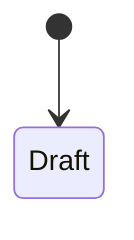

Every object starts here.

---

# 📦 State

A **State** represents

the current condition

of an object.

Examples

```text
Draft

Pending

Paid

Cancelled

Delivered
```

---

Example

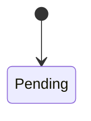

---

# ➡ Transition

A transition moves

the object

from one state

to another.

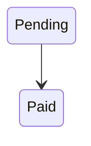

---

Transitions always happen

because of

an

Event.

---

# ⚡ Events

Events trigger transitions.

Example

```text
Pay()

Cancel()

Ship()

Deliver()
```

---

Mermaid

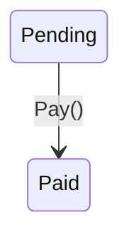

---

# 🔀 Guard Conditions

Sometimes

a transition only happens

if a condition is true.

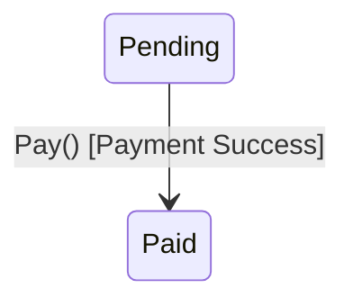

Guard

```text
[Payment Success]
```

---

Another example

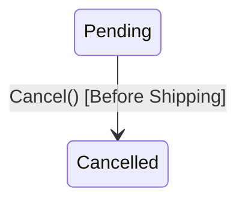

---

# 🎬 Entry / Exit Actions

A state may execute actions

when entered

or exited.

Example

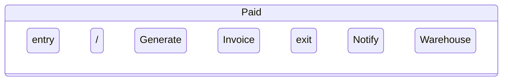

---

Entry Action

Runs once

when entering.

Exit Action

Runs once

before leaving.

---

# 🌍 First Example

## Online Order Lifecycle


---

## 🧠 Interview Discussion

Notice

This diagram

doesn't show

classes,

methods,

or APIs.

It only answers

> **What state is the Order currently in?**

---

# 💡 Interview Tips

> [!TIP]
>
> A State Diagram always focuses on
>
> **one object.**
>
> If you're drawing multiple unrelated objects,
> you're probably using the wrong UML diagram.

---

> [!IMPORTANT]
>
> Ask yourself:
>
> **Can this object change its condition over time?**
>
> If the answer is **Yes**,
> a State Diagram may be the right choice.

---

# ⚡ 30-Second Revision

| Component | Purpose |
|-----------|----------|
| Initial State | Start |
| State | Current condition |
| Transition | Move between states |
| Event | Triggers transition |
| Guard | Condition |
| Entry | Execute on enter |
| Exit | Execute on leave |
| Final State | End |

---

# 📌 What's Next?

In **Part 2**, we'll model real production state machines:

- 🛒 E-Commerce Order
- 🚕 Uber Ride Lifecycle
- 🏦 ATM Card
- 🥤 Vending Machine
- ▶ Media Player
- 🌐 TCP Connection
- 📦 GitHub Pull Request
- 🐞 Bug Lifecycle

These are among the most common State Diagram examples used in LLD interviews.

➡️ Continue with **05-State-Diagram.md (Part 2)**.

# 🔄 UML State Diagram (Part 2)

> Continue from **05-State-Diagram.md (Part 1)**

---

# 📖 Table of Contents

- 🛒 Order Lifecycle
- 🚕 Uber Ride Lifecycle
- 🏦 ATM Card Lifecycle
- ▶ Media Player
- 🥤 Vending Machine
- 🐞 Bug Lifecycle
- 📦 GitHub Pull Request
- 🌐 TCP Connection
- 🎯 State Machine Best Practices

---

# 🛒 Example 1 — E-Commerce Order Lifecycle

Probably the **most common interview example**.

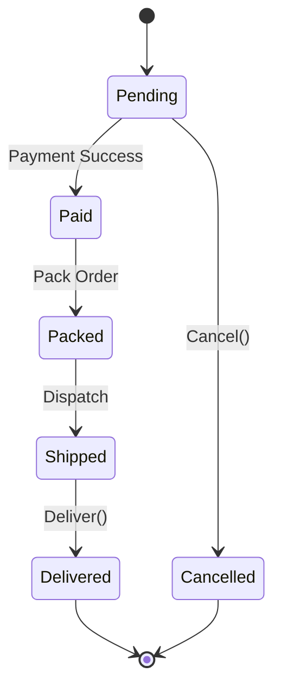

---

## 🧠 State Explanation

| State | Meaning |
|--------|---------|
| Pending | Order created |
| Paid | Payment completed |
| Packed | Warehouse packed items |
| Shipped | Courier picked package |
| Delivered | Customer received order |
| Cancelled | Order terminated |

---

## Interview Discussion

Question:

> Can a Delivered order become Pending again?

Answer:

No.

State transitions should represent valid business rules.

---

# 🚕 Example 2 — Uber Ride Lifecycle

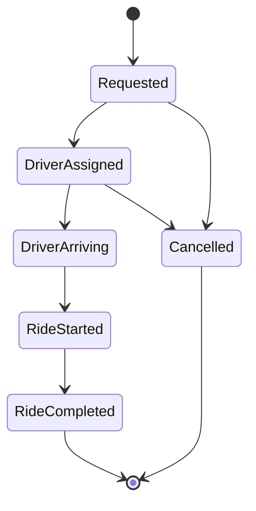

---

## Discussion

Notice

Cancellation is allowed

before

RideStarted.

After RideStarted,

business rules usually change.

---

# 🏦 Example 3 — ATM Card Lifecycle

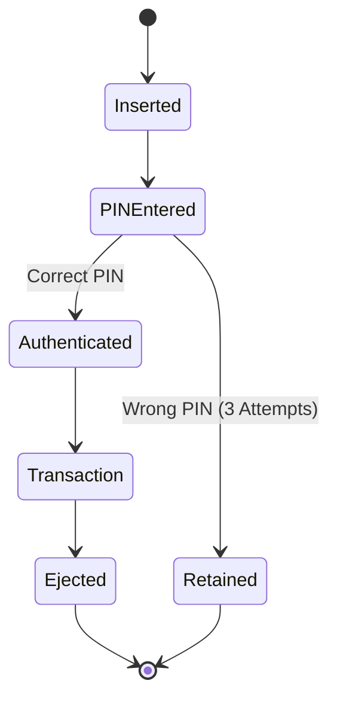

---

## Interview Tip

Notice

The card changes

its own state.

The ATM does not.

State Diagram models

one object's lifecycle.

---

# ▶ Example 4 — Media Player

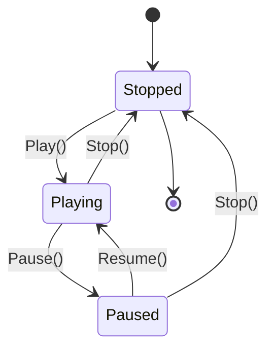

---

This is one of the oldest and most common UML interview questions.

---

# 🥤 Example 5 — Vending Machine

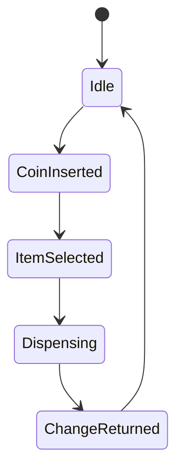

---

## Possible Extension

```text
Out Of Stock

↓

Refund

↓

Idle
```

Interviewers appreciate discussing exceptional states.

---

# 🐞 Example 6 — Bug Lifecycle

Very common in enterprise systems.

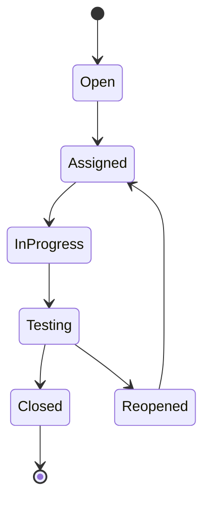

---

## Real Examples

- Jira
- Azure DevOps
- GitHub Issues

All use similar state machines.

---

# 📦 Example 7 — GitHub Pull Request

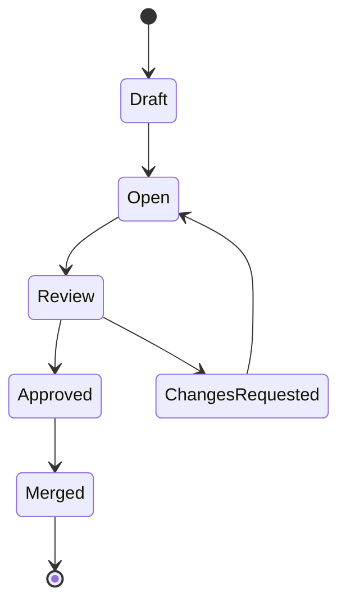

---

Interview Discussion

Question

Can Draft become Merged directly?

Answer

No.

Business rules require review.

---

# 🌐 Example 8 — TCP Connection

Popular system design interview topic.

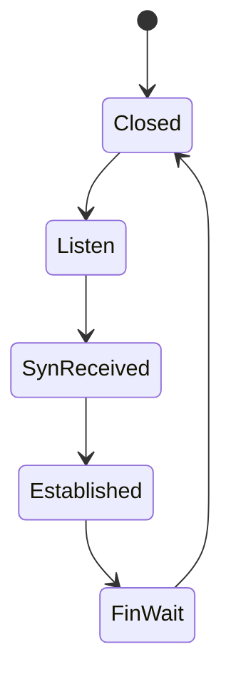

---

You don't need to memorize every TCP state.

Just understand

that protocols are state machines.

---

# 🔄 Comparing Real Systems

| System | States |
|----------|---------|
| Amazon Order | Pending → Paid → Delivered |
| Uber Ride | Requested → Started → Completed |
| ATM | Inserted → Authenticated → Transaction |
| Media Player | Playing → Paused → Stopped |
| GitHub PR | Draft → Review → Merged |
| Jira Ticket | Open → In Progress → Closed |

---

# ⚡ Events Trigger State Changes

Remember

States **never change automatically.**

An event triggers every transition.

Examples

| Event | Transition |
|---------|------------|
| Pay() | Pending → Paid |
| Ship() | Packed → Shipped |
| Pause() | Playing → Paused |
| Resume() | Paused → Playing |
| Merge() | Approved → Merged |

---

# 🧠 Business Rules

Interviewers often ask

> "Can this transition happen?"

Example

```text
Delivered

↓

Cancelled
```

Usually

❌ Invalid

---

```text
Pending

↓

Cancelled
```

Usually

✅ Valid

---

Business rules define

which transitions are legal.

---

# 🎯 State Machine Best Practices

## ✅ Every Transition Needs an Event

Good

```text
Pending

↓

Pay()

↓

Paid
```

Bad

```text
Pending

↓

Paid
```

(No reason)

---

## ✅ Avoid Dead States

Every state should either

- transition somewhere

or

- terminate.

---

## ✅ Think About Failure States

Don't model only success.

Example

```text
Payment Failed

↓

Retry

↓

Cancelled
```

---

## ✅ Keep States Meaningful

Good

```text
Pending

Paid

Delivered
```

Bad

```text
State1

State2

State3
```

---

# 💡 Interview Tip

Whenever you hear

- Lifecycle
- Status
- State
- Transition
- Workflow Status
- Ticket Status
- Order Status

Think

```
State Diagram
```

---

# 📊 State vs Workflow

Order Lifecycle

```
Pending

↓

Paid

↓

Delivered
```

Activity Diagram

```
Browse

↓

Checkout

↓

Payment
```

Sequence Diagram

```
Frontend

↓

API

↓

Database
```

Class Diagram

```
Order

Customer

Payment
```

Each UML diagram answers a different question.

---

# 📌 What's Next?

In **Part 3**, we'll cover:

- 🎤 FAANG Interview Questions
- 🧩 Composite States
- ⏳ History States
- 🚪 Entry / Exit Actions (Advanced)
- ⚠️ Common Mistakes
- 🧠 Decision Tree
- 📋 Interview Checklist
- ⚡ One-Page Revision

➡️ Continue with **05-State-Diagram.md (Part 3)**.

# 🔄 UML State Diagram (Part 3)

> Continue from **05-State-Diagram.md (Part 2)**

---

# 📖 Table of Contents

- 🎯 Advanced State Machine Concepts
- 🧩 Composite States
- 🕒 History States
- 🎬 Entry / Exit / Do Activities
- 🔁 Self Transition
- 📥 Deferred Events
- ⚡ Internal Transition
- 🏗 State Machine Best Practices
- 🔄 State Diagram vs Activity Diagram vs Sequence Diagram
- 🎤 FAANG Interview Scenarios
- 🧠 Decision Tree
- 📋 Interview Checklist
- ⚡ One-Page Revision

---

# 🎯 Advanced State Machine Concepts

Most interview questions stop at:

- States
- Events
- Transitions

However, production systems often use more advanced concepts such as:

- Composite States
- History States
- Entry / Exit Actions
- Internal Transitions
- Deferred Events

Understanding these concepts makes your designs much more robust.

---

# 🧩 Composite States

Sometimes a state itself contains multiple substates.

Instead of creating one huge diagram,

group related states together.

## Example

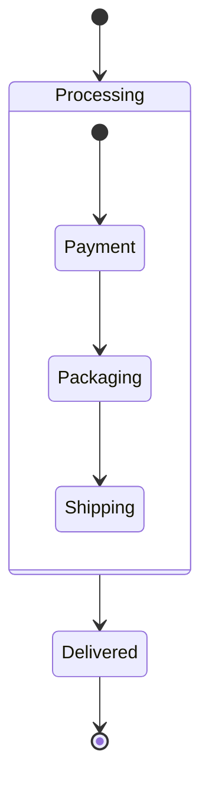

---

## Why Composite States?

Without grouping:

```
10-15 states
```

Diagram becomes difficult to understand.

Composite states improve readability.

---

## Real Examples

- Order Processing
- Video Encoding
- File Upload
- Payment Processing

---

# 🕒 History States

Suppose a workflow is interrupted.

Later,

it should resume

from the last active state.

Instead of starting again.

History State remembers

the previous state.

---

Example

```text
Playing

↓

Pause

↓

Resume

↓

Playing
```

instead of

```
Stopped
```

---

Conceptual Diagram

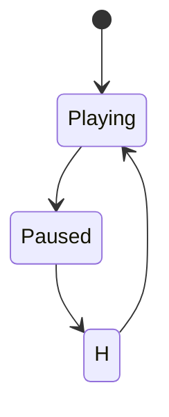

---

## Real Examples

- Media Player
- Video Streaming
- Download Manager
- IDE Session Restore

---

# 🎬 Entry / Exit / Do Activities

A state may execute actions.

### Entry

Runs once

when entering a state.

### Exit

Runs once

before leaving a state.

### Do

Runs continuously

while remaining inside the state.

---

Example

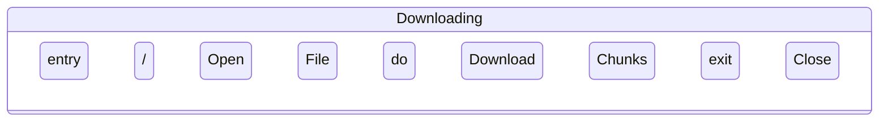

---

## Real Example

Downloading File

Entry

```
Create Temp File
```

Do

```
Download Data
```

Exit

```
Rename File
```

---

# 🔁 Self Transition

Sometimes

an object changes internally

without changing to another state.

Example

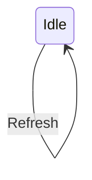

---

Real Examples

- Refresh Dashboard
- Retry Download
- Refresh Token
- Poll Queue

---

# 📥 Deferred Events

Some events should not be processed immediately.

Instead,

they are postponed.

Example

```
Printer Busy

↓

Print Request

↓

Queue Request

↓

Process Later
```

---

Real Examples

- Job Queues
- RabbitMQ
- Kafka
- Batch Processing

---

# ⚡ Internal Transition

Unlike a Self Transition,

the object does **not leave and re-enter** the state.

Only an internal action executes.

Conceptually

```
Downloading

↓

Progress Updated

↓

Still Downloading
```

State remains unchanged.

---

# 🌍 Real Production Example

## File Upload

```mermaid
stateDiagram-v2

[*] --> Uploading

Uploading --> Uploading : Retry Chunk

Uploading --> Paused : Pause

Paused --> Uploading : Resume

Uploading --> Completed : Upload Finished

Completed --> [*]
```

---

Notice

Retry

doesn't create a new state.

Only repeats work.

---

# 🏗 State Machine Best Practices

## ✅ Every State Should Have Meaning

Good

```
Pending

Paid

Cancelled
```

Bad

```
State1

State2

State3
```

---

## ✅ Every Transition Needs an Event

Good

```
Pending

↓

Pay()

↓

Paid
```

Bad

```
Pending

↓

Paid
```

(No explanation)

---

## ✅ Think About Invalid Transitions

Can this happen?

```
Delivered

↓

Pending
```

Usually

❌ No

---

## ✅ Handle Failure States

Instead of

```
Payment

↓

Success
```

Think

```
Success

Failure

Timeout

Retry

Cancelled
```

---

## ✅ Keep State Count Reasonable

If you have

30+

states,

consider

Composite States.

---

# 🔄 State vs Activity vs Sequence

| Question | Diagram |
|----------|----------|
| How does the object change? | ✅ State |
| What is the workflow? | ✅ Activity |
| Who talks to whom? | ✅ Sequence |
| What classes exist? | ✅ Class |

---

## Example

### Online Shopping

State Diagram

```
Pending

↓

Paid

↓

Delivered
```

Activity Diagram

```
Browse

↓

Checkout

↓

Payment
```

Sequence Diagram

```
Frontend

↓

API

↓

Database
```

Class Diagram

```
Order

Customer

Payment
```

---

# 🎤 FAANG Interview Scenarios

## Scenario 1

Design an ATM.

Need

```
Card Lifecycle
```

Use

✅ State Diagram

---

## Scenario 2

Design Uber.

Need

```
Ride Status
```

Use

✅ State Diagram

---

## Scenario 3

Design Spotify.

Need

```
Player States
```

Use

✅ State Diagram

---

## Scenario 4

Design GitHub.

Need

```
PR Status
```

Use

✅ State Diagram

---

# 🧠 Which UML Diagram Should I Draw?

```mermaid
flowchart TD

A["Interview Question"]

-->

B{"Need Static Structure?"}

B -->|Yes| C["📦 Class Diagram"]

B -->|No| D{"Need Runtime Communication?"}

D -->|Yes| E["🔄 Sequence Diagram"]

D -->|No| F{"Need Business Workflow?"}

F -->|Yes| G["⚙ Activity Diagram"]

F -->|No| H{"Need Object Lifecycle?"}

H -->|Yes| I["🔄 State Diagram"]

H -->|No| J["🧩 Component Diagram"]
```

---

# 📋 Interview Checklist

Before finishing a State Diagram, verify:

- ✅ One object only
- ✅ Every state has a clear meaning
- ✅ Every transition has an event
- ✅ Guard conditions where required
- ✅ Failure states considered
- ✅ Invalid transitions avoided
- ✅ Initial and Final states present

---

# 💡 Memory Tricks

Think

```
State Diagram

=

Lifecycle
```

---

Activity Diagram

```
=

Workflow
```

---

Sequence Diagram

```
=

Communication
```

---

Class Diagram

```
=

Blueprint
```

---

# ⚡ One-Page Revision

Remember

```
Start

↓

State

↓

Event

↓

Transition

↓

Guard

↓

Next State

↓

End
```

---

## Golden Rules

✔ One diagram models **one object's lifecycle**.

✔ Events trigger transitions.

✔ States represent conditions, not actions.

✔ Activities belong in **Activity Diagrams**, not State Diagrams.

✔ API calls belong in **Sequence Diagrams**, not State Diagrams.

---

# 📚 Next Chapter

➡️ **06-Component-Diagram.md**

You'll learn:

- Components
- Interfaces
- Dependencies
- Layered Architecture
- Microservices
- Monolith vs Microservices
- Clean Architecture
- Hexagonal Architecture
- Backend System Design
- Production Architecture Diagrams

The Component Diagram is the bridge between **LLD** and **High-Level Design (HLD)** and is one of the most useful UML diagrams for discussing software architecture.
