# 🧩 UML Component Diagram

> **Part 6 of the UML Handbook**  
> **Difficulty:** ⭐⭐⭐⭐☆  
> **Interview Importance:** ⭐⭐⭐⭐⭐

---

# 📚 UML Handbook Navigation

| Previous | Current | Next |
|----------|----------|------|
| ⬅️ 05-State Diagram | **06-Component Diagram** | ➡️ 07-UML-in-LLD-Interviews |

---

# 📖 Table of Contents

- 🎯 What is a Component Diagram?
- 🤔 Why Component Diagrams Exist
- 🆚 Component Diagram vs Class Diagram
- 🆚 Component Diagram vs Deployment Diagram
- 🆚 Component Diagram vs Package Diagram
- 🧠 When Should You Draw One?
- 🏗 Core Components
- 📦 Components
- 🔌 Interfaces
- 🔗 Dependencies
- 🧠 First Backend Architecture
- ⚡ Revision

---

# 🎯 What is a Component Diagram?

A **Component Diagram** is a **Structural UML Diagram** that represents the **high-level architecture** of a software system.

Instead of showing

```text
Classes
```

it shows

```text
Modules

Services

Libraries

Applications

Databases

External Systems
```

Think of it as

> **Architecture Blueprint**

---

# 🤔 Why Component Diagrams Exist

Suppose the interviewer asks

> Explain the architecture of your project.

You don't want to draw

```
50 Classes
```

Instead

draw

```
Frontend

↓

Backend

↓

Database

↓

Redis

↓

RabbitMQ
```

This is exactly

what Component Diagrams represent.

---

# 🆚 Component Diagram vs Class Diagram

| Component Diagram | Class Diagram |
|-------------------|---------------|
| High-Level | Low-Level |
| Modules | Classes |
| Services | Objects |
| Architecture | OOP Design |

---

Example

Component

```
Authentication Service
```

Class Diagram

```
User

Role

Permission

TokenService

JWTGenerator
```

---

# 🆚 Component Diagram vs Deployment Diagram

Many candidates confuse these.

| Component Diagram | Deployment Diagram |
|-------------------|--------------------|
| Logical Architecture | Physical Infrastructure |
| Software Components | Servers & Machines |
| Services | Nodes |
| Code Organization | Runtime Deployment |

---

Component

```
Order Service

↓

Payment Service
```

Deployment

```
AWS EC2

↓

Docker

↓

Kubernetes
```

---

# 🆚 Component Diagram vs Package Diagram

Package

```
Authentication

Controllers

Repositories
```

Component

```
Authentication Service

↓

Database

↓

Redis
```

Packages organize code.

Components organize architecture.

---

# 🧠 When Should You Draw One?

Draw a Component Diagram when

the interviewer asks

- Explain your architecture
- Explain backend design
- Explain microservices
- Explain Clean Architecture
- Explain modules
- Explain dependencies
- Explain APIs

Don't use it for

- Relationships between classes
- Runtime API calls
- Object lifecycle

---

# 🏗 Core Components

Every Component Diagram contains

- 📦 Components
- 🔌 Interfaces
- 🔗 Dependencies
- 📚 External Systems
- 🗄 Databases
- ☁ Cloud Services

---

# 📦 Components

A Component represents

a deployable

or replaceable

software module.

Examples

```
Frontend

Authentication Service

Order Service

Payment Service

Inventory Service
```

---

# 🔌 Interfaces

Components communicate

through interfaces.

Example

```
Payment Service

↓

IPaymentGateway

↓

Stripe
```

Interfaces reduce coupling.

---

# 🔗 Dependencies

Components depend

on

other components.

Example

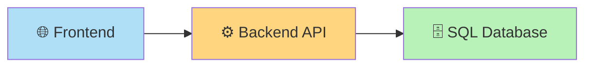

---

Notice

Frontend

doesn't communicate

with Database.

---

# 🌍 First Backend Architecture

Suppose

you built

an e-commerce application.

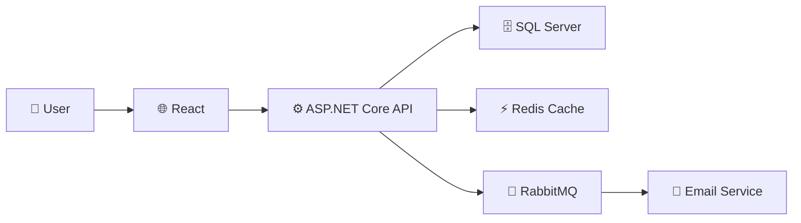

---

## 🧠 Interview Discussion

Notice

The API

is the central component.

Email

doesn't communicate

directly

with the client.

RabbitMQ

decouples

Email Service

from

API.

---

# 💡 Component Granularity

One common interview question is:

> **How big should a component be?**

A good component should represent a **cohesive responsibility**.

✅ Good:

- Authentication Service
- Payment Service
- Inventory Service

❌ Bad:

- Utility Component
- Common Service
- EverythingManager

Each component should have a clear purpose.

---

# 🎯 Component Responsibilities

| Component | Responsibility |
|------------|----------------|
| Frontend | UI & User Interaction |
| API Gateway | Routing & Authentication |
| Auth Service | Login & JWT |
| Order Service | Order Management |
| Payment Service | Payments |
| Inventory Service | Stock |
| Notification Service | Email & SMS |

---

# 💡 Interview Tips

> [!TIP]
>
> Think in terms of **modules**, not classes.

---

> [!IMPORTANT]
>
> Component Diagrams answer
>
> **"How is the application organized?"**
>
> not
>
> **"How do objects interact?"**

---

# ⚡ 30-Second Revision

| Item | Remember |
|------|----------|
| Component | Module / Service |
| Interface | Communication Contract |
| Dependency | Uses another component |
| Database | Separate component |
| Queue | Separate component |
| Cache | Separate component |

---

# 📌 What's Next?

In **Part 2**, we'll build real production architectures:

- 🛒 E-Commerce
- 💬 Chat Application
- 🏦 Banking System
- 🚕 Uber
- 🎵 Spotify
- 🏛 Layered Architecture
- 🧅 Clean Architecture
- ⬡ Hexagonal Architecture
- ☁ Microservices

These are the exact architectures you'll discuss in backend and system design interviews.

➡️ Continue with **06-Component-Diagram.md (Part 2)**.

# 🧩 UML Component Diagram (Part 2)

> Continue from **06-Component-Diagram.md (Part 1)**

---

# 📖 Table of Contents

- 🛒 E-Commerce Architecture
- 💬 Chat Application
- 🏦 Banking System
- 🏛 Layered Architecture
- 🧅 Clean Architecture
- ⬡ Hexagonal Architecture
- ☁ Microservices Architecture
- 🔄 Monolith vs Microservices
- 🎯 Interview Tips

---

# 🛒 Example 1 — E-Commerce Architecture

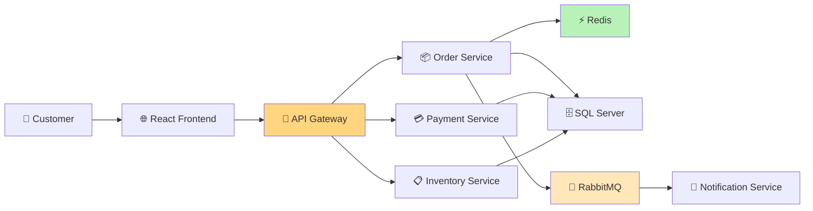

---

## 🏛 Architecture Mapping

| UML Component | Real Technology |
|---------------|-----------------|
| Frontend | React |
| API Gateway | ASP.NET Core Gateway / YARP / Ocelot |
| Order Service | ASP.NET Core |
| Payment | ASP.NET Core |
| Inventory | ASP.NET Core |
| Queue | RabbitMQ |
| Cache | Redis |
| Database | SQL Server |

---

## 🧠 Interview Discussion

Why RabbitMQ?

Because

```
Email

SMS

Invoice
```

shouldn't block checkout.

---

# 💬 Example 2 — Chat Application

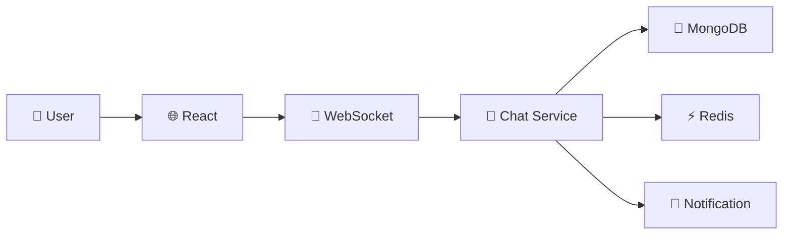

---

## 🏛 Architecture Mapping

| Component | Technology |
|------------|------------|
| UI | React |
| Realtime | Socket.IO |
| Cache | Redis |
| Storage | MongoDB |
| Notifications | Firebase / Email |

---

## Why Redis?

- Online users
- Presence
- Session storage
- Pub/Sub

---

# 🏦 Example 3 — Banking System

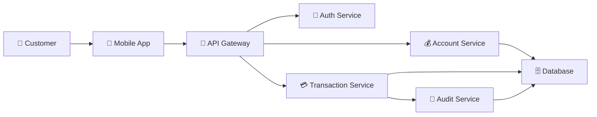

---

## Important Discussion

Audit Service

should be independent.

Every transaction

must be logged.

---

# 🏛 Layered Architecture

Classic enterprise architecture.

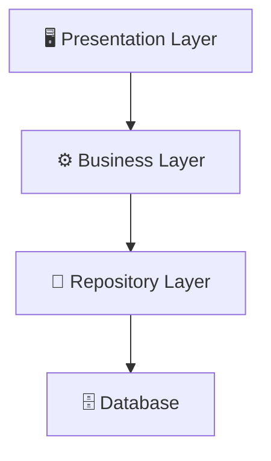

---

## Responsibilities

| Layer | Responsibility |
|--------|----------------|
| Presentation | UI |
| Business | Business Logic |
| Repository | Data Access |
| Database | Storage |

---

# 🧅 Clean Architecture

Popularized by

Robert C. Martin (Uncle Bob).

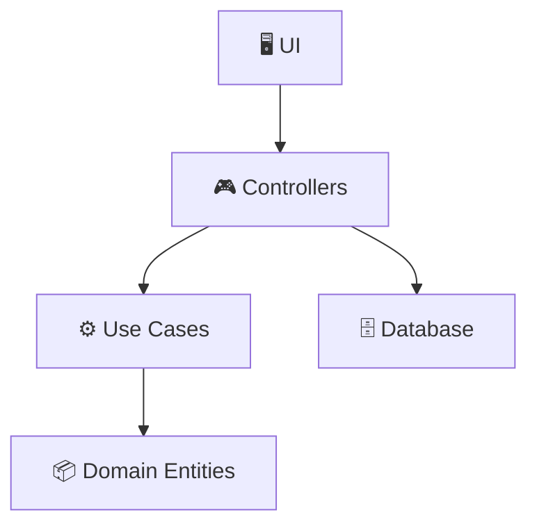

---

## Dependency Rule

Dependencies always point inward.

Outer layers

depend on

inner layers.

Never the opposite.

---

# ⬡ Hexagonal Architecture

Also called

Ports & Adapters.

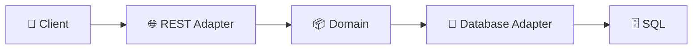

---

## Why Hexagonal?

Business logic

doesn't know

whether data comes from

SQL,

MongoDB,

or an API.

Everything communicates through ports.

---

# ☁ Microservices Architecture

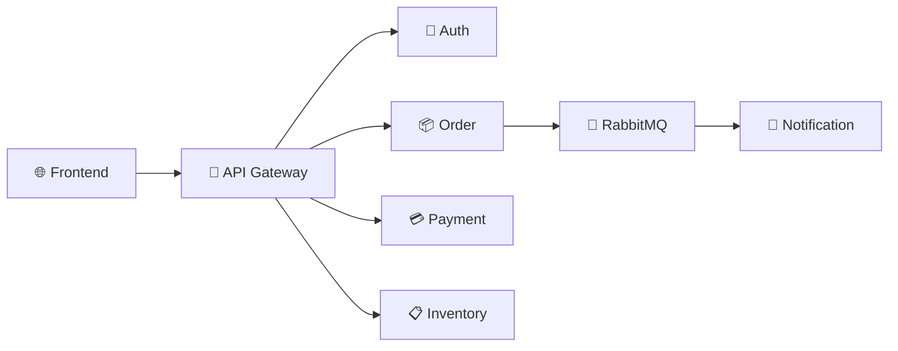

---

## Characteristics

- Independent deployment
- Independent scaling
- Independent databases
- Fault isolation

---

# 🔄 Monolith vs Microservices

| Monolith | Microservices |
|-----------|---------------|
| One Application | Multiple Services |
| Shared Database | Independent Databases |
| Easier Start | Better Scaling |
| Simpler Deployment | More Complex Infrastructure |

---

## When to Choose Monolith?

- Startup
- Small Team
- MVP

---

## When to Choose Microservices?

- Large Team
- Independent Scaling
- High Traffic
- Complex Domain

---

# 💡 Interview Tips

> [!TIP]
>
> Don't draw 30 services.
>
> Focus on the **major business components**.

---

> [!IMPORTANT]
>
> Every component should have a **single responsibility**.
>
> If one component performs authentication, payment, notifications, reporting, and analytics,
> your design is probably too coupled.

---

# ⚠️ Common Mistakes

## ❌ Components = Classes

Wrong.

A component is

```
Order Service
```

not

```
OrderController
```

---

## ❌ Shared Database for Every Service

Bad microservice design.

Prefer

```
Order DB

Payment DB

Inventory DB
```

---

## ❌ Frontend Talking Directly to Database

Always

```
Frontend

↓

Backend

↓

Database
```

---

## ❌ Ignoring External Systems

Real systems often include:

- Stripe
- Razorpay
- Firebase
- Amazon S3
- Elasticsearch

These should appear as separate components.

---

# 📊 Architecture Recognition

| Requirement | Architecture |
|--------------|--------------|
| Small CRUD App | Layered |
| Enterprise App | Clean |
| Flexible Integrations | Hexagonal |
| Distributed System | Microservices |

---

# 📌 What's Next?

In **Part 3**, we'll cover:

- 🎯 Advanced Component Concepts
- 🔌 Provided vs Required Interfaces
- 📦 Ports & Adapters
- 🔄 Dependency Inversion
- 🎤 FAANG Interview Questions
- 🧠 Component Decision Tree
- 📋 Architecture Checklist
- ⚡ One-Page Revision

➡️ Continue with **06-Component-Diagram.md (Part 3)**.

# 🧩 UML Component Diagram (Part 3)

> Continue from **06-Component-Diagram.md (Part 2)**

---

# 📖 Table of Contents

- 🎯 Advanced Component Concepts
- 🔌 Provided vs Required Interfaces
- 🏛 Ports & Adapters (Hexagonal Architecture)
- 🔄 Dependency Inversion Principle
- 📦 Component Granularity
- 🔗 Coupling vs Cohesion
- 🚨 Architecture Smells
- 🌍 Reading an Architecture Diagram
- 🎤 FAANG Interview Questions
- 🧠 Component Decision Tree
- 📋 Architecture Review Checklist
- ⚡ One-Page Revision

---

# 🎯 Advanced Component Concepts

A Component Diagram isn't simply a collection of services.

It communicates:

- Responsibilities
- Dependencies
- Interfaces
- Boundaries
- Contracts
- Architecture Decisions

A good architecture should answer:

> **Can I replace this component without affecting the rest of the system?**

If the answer is **Yes**,

your architecture is likely well designed.

---

# 🔌 Provided vs Required Interfaces

One of the most commonly ignored UML topics.

## ✅ Provided Interface

A component offers functionality.

Think

> "I provide this service."

Example

```
Payment Service

↓

ProcessPayment()
```

---

## ✅ Required Interface

A component depends on another component.

Think

> "I need this service."

Example

```
Order Service

↓

Needs Payment Service
```

---

## Mermaid Representation (Conceptual)

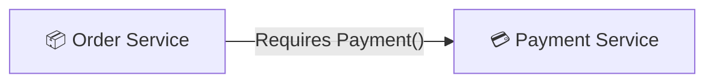

---

## Real Example

```
Order Service

↓

IPaymentGateway

↓

Stripe
```

Order Service

requires

Payment.

Stripe

provides

Payment.

---

# 🏛 Ports & Adapters (Hexagonal Architecture)

Business Logic should never know

how data arrives.

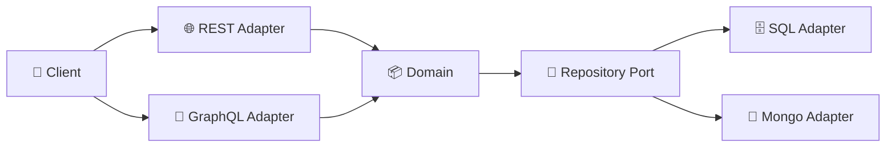

---

## Benefits

- Easy testing
- Replace databases
- Replace APIs
- Replace UI

Business Logic remains unchanged.

---

# 🔄 Dependency Inversion Principle

A Component Diagram should naturally follow DIP.

Bad

```text
Order Service

↓

Stripe Service
```

Good

```text
Order Service

↓

IPaymentGateway

↓

Stripe

↓

Razorpay

↓

PayPal
```

Now adding a new gateway

requires

no Order Service changes.

---

# 📦 Component Granularity

A common interview question:

> "How big should a component be?"

There is no fixed size,

but a component should represent

one cohesive responsibility.

---

## Good Components

```
Authentication

Orders

Payments

Inventory

Notifications
```

---

## Bad Components

```
Utility

Common

EverythingManager

GeneralService
```

If you can't explain a component in one sentence,

it's probably too large.

---

# 🔗 Coupling vs Cohesion

One of the favorite interview topics.

---

## Cohesion

How closely related the responsibilities inside a component are.

High Cohesion

```
Payment Service

↓

Validate Payment

↓

Charge Payment

↓

Refund Payment
```

Everything belongs together.

---

## Coupling

How much one component depends on another.

Good

```
Order

↓

Payment
```

Bad

```
Order

↓

Payment

↓

Inventory

↓

Notification

↓

Analytics

↓

Reporting

↓

Shipping

↓

Tax

↓

CRM
```

Too many dependencies.

---

# 📊 High Cohesion + Low Coupling

This is the architecture goal.

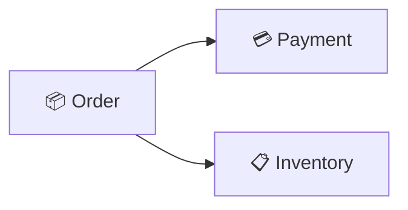

Minimal dependencies.

Clearly defined responsibilities.

---

# 🚨 Architecture Smells

Senior engineers quickly recognize poor architecture.

---

## ❌ God Service

```text
Order Service

↓

Payment

Inventory

Notification

Analytics

Invoice

Shipping

Reports

Authentication
```

Everything is inside one service.

Very difficult to maintain.

---

## ❌ Shared Database

```
Auth

↓

Shared Database

↓

Orders

↓

Inventory
```

One schema change

can break multiple services.

---

## ❌ Cyclic Dependencies

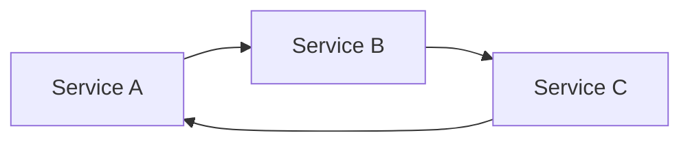

Circular dependencies increase complexity.

Avoid them.

---

## ❌ Chatty Architecture

```
Frontend

↓

API

↓

Service A

↓

Service B

↓

Service C

↓

Service D

↓

Database
```

Too many network calls.

Higher latency.

---

# 🌍 How to Read an Architecture Diagram

Whenever you see a diagram,

ask these questions:

### 1️⃣ What are the major components?

---

### 2️⃣ Who depends on whom?

---

### 3️⃣ Where is the business logic?

---

### 4️⃣ Where is the data stored?

---

### 5️⃣ Which components communicate asynchronously?

---

### 6️⃣ Which components can fail independently?

---

### 7️⃣ Which component is the bottleneck?

---

This thought process impresses interviewers.

---

# 🎤 FAANG Interview Questions

### Why shouldn't Frontend access Database?

Because:

- Security
- Business Rules
- Validation
- Authorization

must happen in Backend.

---

### Why use API Gateway?

- Authentication
- Routing
- Rate Limiting
- Logging

---

### Why separate Notification Service?

Because

Email

SMS

Push Notifications

are background tasks.

---

### Why use Redis?

- Cache
- Sessions
- Rate Limiting
- Pub/Sub

---

### Why use RabbitMQ?

- Async Processing
- Retry
- Loose Coupling
- Scalability

---

# 🧠 Component Decision Tree

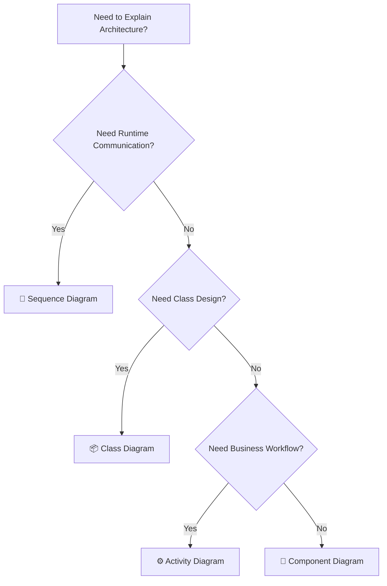

---

# 📋 Architecture Review Checklist

Before finalizing your Component Diagram, verify:

- ✅ Components have a single responsibility
- ✅ Clear service boundaries
- ✅ Low coupling
- ✅ High cohesion
- ✅ External systems represented
- ✅ Databases shown explicitly
- ✅ Queues and caches separated
- ✅ Interfaces abstract dependencies
- ✅ No cyclic dependencies

---

# 💡 Memory Tricks

Think

```
Class Diagram

↓

Classes
```

---

```
Sequence Diagram

↓

Communication
```

---

```
Activity Diagram

↓

Workflow
```

---

```
State Diagram

↓

Lifecycle
```

---

```
Component Diagram

↓

Architecture
```

---

# ⚡ One-Page Revision

Remember

```
Modules

↓

Interfaces

↓

Dependencies

↓

Architecture
```

---

Golden Rules

✔ One component = One responsibility

✔ Communicate through interfaces

✔ High Cohesion

✔ Low Coupling

✔ Use queues for asynchronous work

✔ Avoid cyclic dependencies

✔ Show external systems explicitly

---

# 🎓 UML Handbook Completed (Core)

Congratulations!

You now understand the five UML diagrams that cover the majority of LLD interview discussions:

| Diagram | Answers |
|----------|---------|
| 📦 Class Diagram | What are the classes and relationships? |
| 🔄 Sequence Diagram | Who talks to whom? |
| ⚙ Activity Diagram | What is the workflow? |
| 🔄 State Diagram | How does an object change over time? |
| 🧩 Component Diagram | How is the application architected? |

---

# 📚 Recommended Next Files

To make this repository even stronger, I recommend adding these final UML reference files:

### 📄 07-UML-in-LLD-Interviews.md

A practical guide on choosing the right UML diagram during interviews, with complete case studies (Parking Lot, BookMyShow, Uber, WhatsApp, ATM).

---

### 📄 08-UML-Cheat-Sheet.md

A 2–3 page visual quick-reference containing:

- UML symbols
- Relationship cheat sheet
- Multiplicity table
- Decision trees
- Diagram selection flow
- Interview keywords
- One-page revision

This should become your **last-minute revision file** before any LLD interview.
