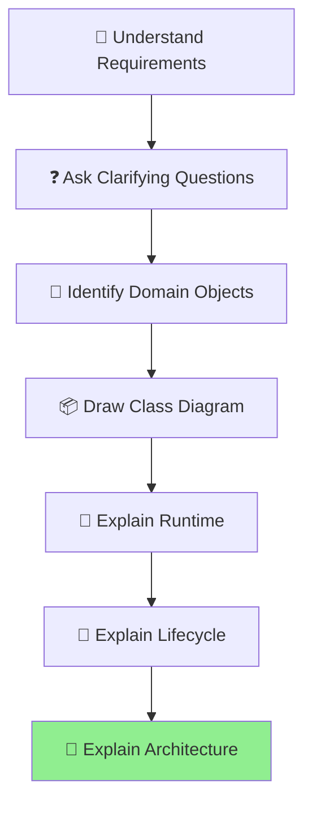
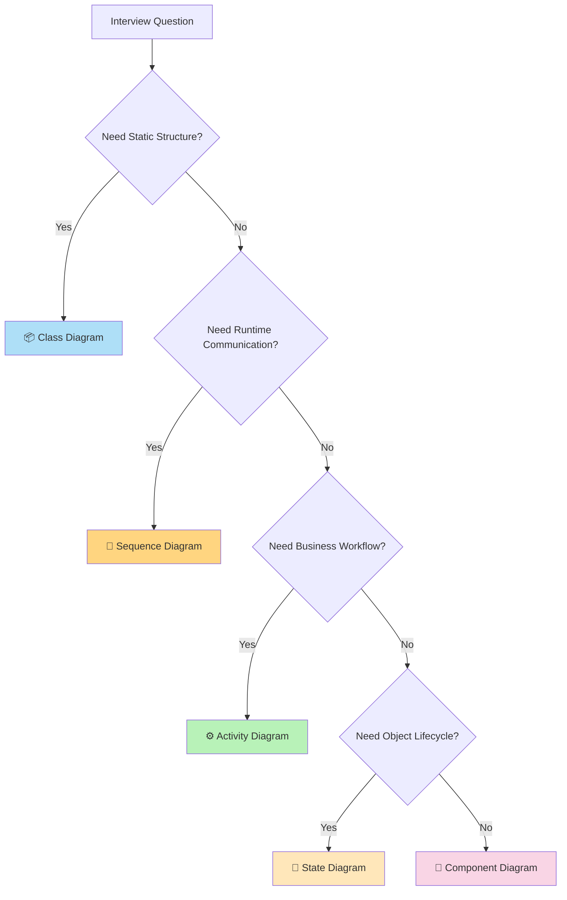
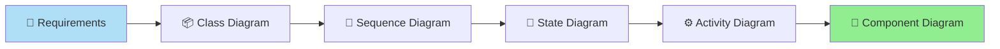

# 🎯 UML in LLD Interviews

> **Part 7 of the UML Handbook**  
> **Difficulty:** ⭐⭐⭐⭐☆  
> **Interview Importance:** ⭐⭐⭐⭐⭐

---

# 📚 UML Handbook Navigation

| Previous | Current | Next |
|----------|----------|------|
| ⬅️ 06-Component Diagram | **07-UML in LLD Interviews** | ➡️ 08-UML Cheat Sheet |

---

# 📖 Table of Contents

- 🎯 Why Interviewers Ask UML
- 🧠 Interview Thought Process
- 🗺 UML Decision Tree
- 🎨 Which Diagram Should I Draw?
- 🏗 Complete LLD Design Flow
- 🌍 Real Interview Problems
- ❌ Common Candidate Mistakes
- 💡 Pro Interview Tips
- 📋 Final Checklist
- ⚡ One-Page Revision

---

# 🎯 Why Interviewers Ask UML

Interviewers don't ask UML to test whether you remember symbols.

They want to know whether you can:

- Break a problem into smaller parts
- Think using Object-Oriented Design
- Communicate your ideas clearly
- Build maintainable software
- Explain trade-offs

Remember:

> **UML is a communication tool, not the goal.**

---

# 🧠 Interview Thought Process

Most candidates think:

```text
Requirement

↓

Start Drawing
```

Good candidates think:



---

# 🗺 Which UML Diagram Should I Draw?



---

# 🎨 What Each Diagram Answers

| Question | UML Diagram |
|-----------|-------------|
| What classes exist? | 📦 Class Diagram |
| How do objects communicate? | 🔄 Sequence Diagram |
| What is the business workflow? | ⚙ Activity Diagram |
| How does an object change over time? | 🔄 State Diagram |
| How is the application architected? | 🧩 Component Diagram |

---

# 🏗 Complete LLD Design Flow

Most good interview solutions naturally follow this order.



---

# 🌍 Example 1 — Parking Lot

## Interview Question

> Design a Parking Lot System.

### Step 1

Draw

✅ Class Diagram

Classes

- ParkingLot
- ParkingFloor
- ParkingSpot
- Vehicle
- Ticket

---

### Step 2

Explain parking flow

✅ Sequence Diagram

```text
Vehicle

↓

Parking Spot

↓

Ticket

↓

Payment
```

---

### Step 3

Vehicle lifecycle

(Optional)

State Diagram

```text
Available

↓

Occupied

↓

Available
```

---

### Step 4

Overall architecture

Component Diagram

```text
Frontend

↓

Parking API

↓

Payment

↓

Database
```

---

# 🌍 Example 2 — ATM

Interview asks

> Design ATM.

Recommended diagrams

| Diagram | Why |
|----------|-----|
| Class | ATM, Card, Account |
| Sequence | Withdraw Cash |
| State | Card Lifecycle |
| Component | Banking Architecture |

---

# 🌍 Example 3 — Food Delivery

Question

> Design Swiggy.

Recommended

Class Diagram

```
Customer

Restaurant

Order

DeliveryPartner
```

---

Sequence Diagram

```
Place Order

↓

Restaurant

↓

Delivery Partner
```

---

Activity Diagram

```
Browse

↓

Checkout

↓

Payment
```

---

State Diagram

```
Pending

↓

Preparing

↓

Delivered
```

---

Component Diagram

```
Frontend

↓

Order Service

↓

Notification

↓

Payment
```

---

# 🌍 Example 4 — BookMyShow

Recommended diagrams

| Diagram | Purpose |
|----------|---------|
| Class | Movies, Theatre, Seat |
| Sequence | Book Ticket |
| Activity | Booking Workflow |
| State | Seat Availability |
| Component | Backend Services |

---

# 🌍 Example 5 — Uber

Recommended

Class Diagram

```
Driver

Passenger

Ride
```

Sequence

```
Book Ride

↓

Driver Assigned
```

State

```
Requested

↓

Accepted

↓

Started

↓

Completed
```

Component

```
Ride Service

↓

Payment

↓

Maps
```

---

# 🌍 Example 6 — WhatsApp

Recommended

Class

```
User

Chat

Message
```

Sequence

```
Send Message

↓

Server

↓

Receiver
```

State

```
Sent

↓

Delivered

↓

Read
```

Component

```
Gateway

↓

Message Service

↓

Storage
```

---

# 🌍 Example 7 — Amazon Checkout

Class

```
Customer

Cart

Order

Product
```

Sequence

```
Checkout

↓

Inventory

↓

Payment
```

Activity

```
Browse

↓

Cart

↓

Payment
```

State

```
Pending

↓

Paid

↓

Delivered
```

Component

```
Frontend

↓

Gateway

↓

Order

↓

Inventory

↓

Payment
```

---

# ❌ Common Candidate Mistakes

## Mistake 1

Drawing Class Diagram

when interviewer asked

workflow.

---

## Mistake 2

Drawing Sequence Diagram

for object lifecycle.

---

## Mistake 3

Using Component Diagram

to explain OOP.

---

## Mistake 4

Trying to draw every UML diagram.

Draw only those that add value.

---

# 💡 Pro Interview Tips

### Start Small

Never begin with

50 classes.

Start with

5–8 important ones.

---

### Explain While Drawing

Say

```
"I'm choosing Composition because
ParkingSpot cannot exist
without ParkingFloor."
```

---

### Clarify Assumptions

Example

```
I'm assuming one vehicle
occupies one parking spot.
```

Interviewers appreciate explicit assumptions.

---

### Use Multiple Diagrams

A strong answer often combines:

- Class Diagram
- Sequence Diagram
- Component Diagram

rather than relying on only one.

---

# 📋 Final Interview Checklist

Before finishing your design, ask yourself:

- ✅ Did I understand the requirements?
- ✅ Did I identify the core domain objects?
- ✅ Did I choose the correct UML diagram?
- ✅ Did I explain my reasoning?
- ✅ Did I mention assumptions?
- ✅ Did I consider edge cases?
- ✅ Did I discuss scalability (if needed)?

---

# 🧠 Memory Tricks

Need...

```
Structure

↓

Class Diagram
```

Need...

```
Communication

↓

Sequence Diagram
```

Need...

```
Workflow

↓

Activity Diagram
```

Need...

```
Lifecycle

↓

State Diagram
```

Need...

```
Architecture

↓

Component Diagram
```

---

# ⚡ One-Page Revision

| Need to Explain | Draw |
|-----------------|------|
| Classes | 📦 Class Diagram |
| Runtime | 🔄 Sequence Diagram |
| Workflow | ⚙ Activity Diagram |
| Lifecycle | 🔄 State Diagram |
| Architecture | 🧩 Component Diagram |

---

## Golden Interview Rule

> **Don't ask yourself "Which UML diagram do I remember?"**

Ask yourself:

> **"What question is the interviewer asking?"**

The question determines the diagram.

---

# 📚 What's Next?

➡️ **08-UML-Cheat-Sheet.md**

The final chapter contains:

- UML Symbols
- Relationship Cheat Sheet
- Multiplicity Table
- Message Types
- Decision Trees
- Diagram Selection Guide
- Interview Keywords
- One-Page Revision

This will become your **last-minute interview revision sheet** before any Low-Level Design interview.

---

# 📚 UML Handbook Navigation

| Previous | Current | Next |
|----------|----------|------|
| ⬅️ 06-Component Diagram | ✅ 07-UML in LLD Interviews | ➡️ 08-UML Cheat Sheet |
