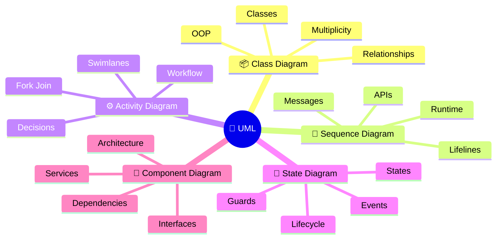
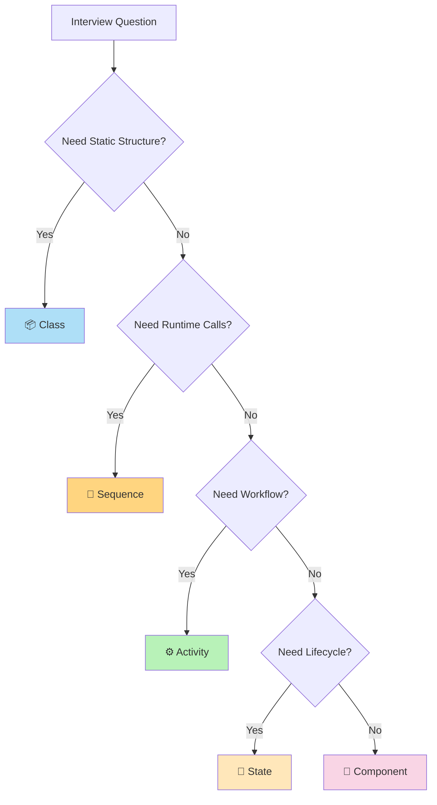
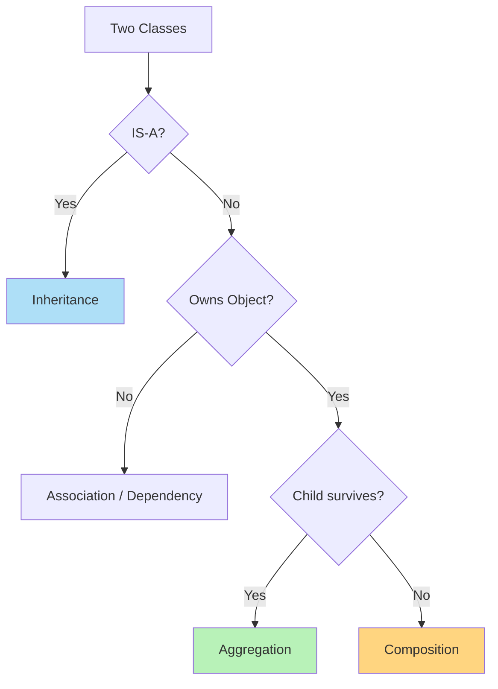
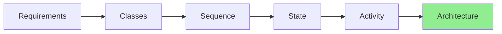
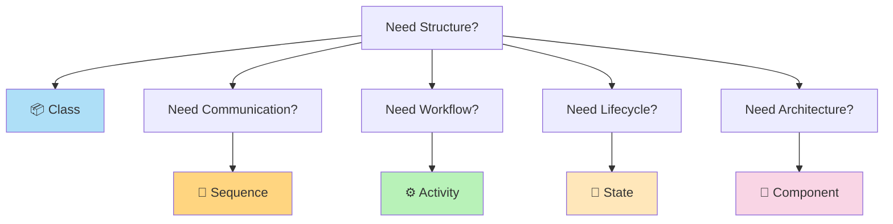

# 🚀 UML Cheat Sheet (10-Minute Interview Revision)

> **Part 8 of the UML Handbook**  
> **Difficulty:** ⭐⭐☆☆☆  
> **Interview Importance:** ⭐⭐⭐⭐⭐

---

# 📚 UML Handbook Navigation

| Previous | Current |
|----------|----------|
| ⬅️ 07-UML in LLD Interviews | ✅ 08-UML Cheat Sheet |

---

# ⚡ 1. UML Mind Map



---

# ⚡ 2. Which UML Diagram Should I Draw?



---

# ⚡ 3. UML Diagram Summary

| UML | Purpose | Think |
|------|----------|--------|
| 📦 Class | Static Structure | Blueprint |
| 🔄 Sequence | Runtime | Communication |
| ⚙ Activity | Workflow | Business Process |
| 🔄 State | Lifecycle | State Machine |
| 🧩 Component | Architecture | Modules |

---

# ⚡ 4. One-Line Memory Tricks

| Diagram | Memory Trick |
|----------|--------------|
| 📦 Class | **Nouns** become Classes |
| 🔄 Sequence | **Who talks to whom?** |
| ⚙ Activity | **What happens next?** |
| 🔄 State | **How does it change?** |
| 🧩 Component | **How is the app organized?** |

---

# ⚡ 5. Class Diagram Relationships

| Symbol | Relationship | Keyword |
|----------|--------------|----------|
| → | Association | Knows |
| o-- | Aggregation | Has-A (Weak) |
| *-- | Composition | Part-Of (Strong) |
| ..> | Dependency | Uses |
| <\|-- | Inheritance | Is-A |
| <\|.. | Interface Realization | Implements |

---

# ⚡ 6. Relationship Decision Tree



---

# ⚡ 7. Multiplicity Cheat Sheet

| Symbol | Meaning |
|---------|----------|
| 1 | Exactly One |
| 0..1 | Zero or One |
| * | Many |
| 1..* | One or Many |
| 0..* | Zero or Many |

---

# ⚡ 8. Visibility Symbols

| Symbol | Meaning |
|----------|----------|
| + | Public |
| - | Private |
| # | Protected |
| ~ | Package/Internal |

---

# ⚡ 9. Sequence Messages

| Symbol | Meaning |
|----------|----------|
| →> | Synchronous |
| -)>> | Asynchronous |
| -->> | Return |
| Self | Internal Call |

---

# ⚡ 10. Activity Diagram Symbols

| Symbol | Meaning |
|----------|----------|
| ● | Start |
| ◎ | End |
| □ | Activity |
| ◇ | Decision |
| Fork | Parallel Start |
| Join | Parallel End |
| Swimlane | Responsibility |

---

# ⚡ 11. State Diagram Symbols

| Symbol | Meaning |
|----------|----------|
| [*] | Initial / Final |
| → | Transition |
| Event | Trigger |
| Guard | Condition |
| Entry | On Enter |
| Exit | On Exit |

---

# ⚡ 12. Component Diagram

Remember

```text
Modules

↓

Interfaces

↓

Dependencies

↓

Architecture
```

---

# ⚡ 13. Diagram Comparison

| Feature | Class | Sequence | Activity | State | Component |
|----------|-------|----------|----------|--------|------------|
| Static | ✅ | ❌ | ❌ | ❌ | ✅ |
| Runtime | ❌ | ✅ | ❌ | ❌ | ❌ |
| Workflow | ❌ | ❌ | ✅ | ❌ | ❌ |
| Lifecycle | ❌ | ❌ | ❌ | ✅ | ❌ |
| Architecture | ❌ | ❌ | ❌ | ❌ | ✅ |

---

# ⚡ 14. Which Diagram For...

| Interview Question | UML |
|--------------------|-----|
| Design Parking Lot | 📦 Class |
| Explain Login API | 🔄 Sequence |
| Explain Checkout Process | ⚙ Activity |
| Explain Order Status | 🔄 State |
| Explain Backend Architecture | 🧩 Component |

---

# ⚡ 15. FAANG Favorites

| Company | Frequently Discussed |
|----------|----------------------|
| Amazon | Class, Sequence |
| Microsoft | Class, Component |
| Google | Sequence, Component |
| Uber | Component, Sequence |
| Atlassian | Class, State |
| Walmart | Activity, Component |

---

# ⚡ 16. UML Mapping

| Requirement | Diagram |
|--------------|----------|
| Structure | 📦 |
| Communication | 🔄 |
| Workflow | ⚙ |
| Lifecycle | 🔄 |
| Architecture | 🧩 |

---

# ⚡ 17. Interview Thinking Process



---

# ⚡ 18. Real Project Mapping

## 🛒 Amazon

| Question | UML |
|-----------|-----|
| Product | 📦 |
| Checkout | ⚙ |
| Payment | 🔄 |
| Order Status | 🔄 |
| Backend | 🧩 |

---

## 🚕

Uber

| Question | UML |
|-----------|-----|
| Driver | 📦 |
| Book Ride | 🔄 |
| Ride Status | 🔄 |
| Ride Workflow | ⚙ |
| Backend | 🧩 |

---

## 💬 WhatsApp

| Question | UML |
|-----------|-----|
| User & Chat | 📦 |
| Send Message | 🔄 |
| Message Status | 🔄 |
| Architecture | 🧩 |

---

# ⚡ 19. Most Common Interview Mistakes

❌ Everything becomes a Class

❌ Activity Diagram for API Calls

❌ Sequence Diagram for Workflow

❌ Deep Inheritance

❌ God Classes

❌ Shared Database in Microservices

❌ Ignoring Failure Paths

❌ No Multiplicity

❌ No Interfaces

---

# ⚡ 20. 60-Second UML Revision

```text
📦 Class

↓

Structure

↓

Classes

↓

Relationships

----------------------------

🔄 Sequence

↓

Runtime

↓

Objects

↓

Messages

----------------------------

⚙ Activity

↓

Workflow

↓

Business Process

----------------------------

🔄 State

↓

Lifecycle

↓

State Machine

----------------------------

🧩 Component

↓

Architecture

↓

Modules
```

---

# ⚡ 21. Golden Interview Rules

✅ Start with Requirements

✅ Ask Clarifying Questions

✅ Identify Domain Objects

✅ Explain While Drawing

✅ Mention Assumptions

✅ Use Correct UML

✅ Think SOLID

✅ Prefer Composition

✅ Keep Responsibilities Clear

---

# ⚡ 22. Ultimate Memory Trick



---

# 🏆 Final Interview Formula

```text
Understand Requirements

↓

Ask Questions

↓

Identify Classes

↓

Draw Class Diagram

↓

Explain Runtime

↓

Explain Workflow

↓

Explain State Changes

↓

Explain Architecture

↓

Discuss SOLID

↓

Discuss Scalability

↓

Done ✅
```

---

# 🎉 Congratulations!

You have completed the **UML Handbook**.

You now have interview-ready knowledge of:

✅ UML Fundamentals

✅ Class Diagram

✅ Sequence Diagram

✅ Activity Diagram

✅ State Diagram

✅ Component Diagram

✅ UML Interview Strategy

✅ UML Cheat Sheet

---

# 🚀 Final Advice

> **Don't memorize diagrams.**
>
> Memorize the **question each diagram answers**.
>
> Once you know the question, choosing the correct UML diagram becomes almost automatic.

Happy Designing! 🚀
